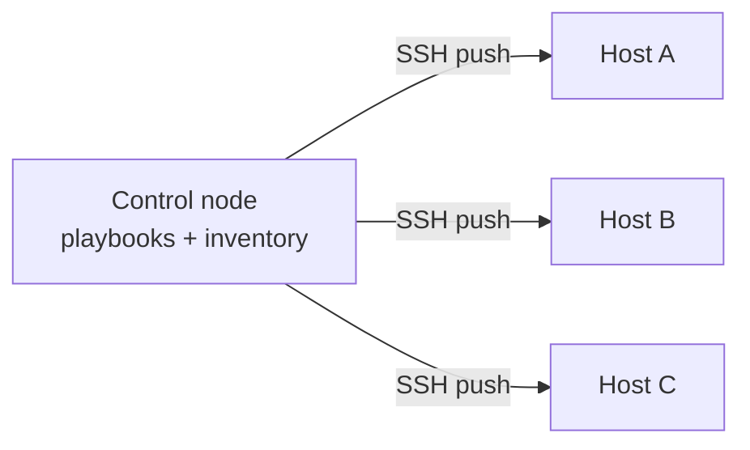

# Ansible: Agentless Configuration Management

Ansible is a **configuration management** tool (now maintained by Red Hat) that brings
already-running hosts to a described state: install these packages, write these config
files, start these services, in this order. Where a provisioning tool like
[Terraform](terraform.md) *creates* servers, Ansible *configures what's inside them*. It
is a cornerstone of [infrastructure as code](infrastructure-as-code.md) applied to the
software layer of a machine.

Two properties define its character: it is **agentless** and it uses a **push** model.

## The model

- **Agentless over SSH** — Ansible needs no daemon installed on managed hosts. The control
  node connects over plain SSH (WinRM for Windows), copies small modules, runs them, and
  removes them. The only prerequisites on a target are SSH access and a Python
  interpreter. This is a deliberate contrast to pull-based agents (Puppet, Chef) that run a
  persistent daemon polling a central server.
- **Push model** — you run Ansible *at* the hosts from a control node (a laptop or CI
  runner); it pushes changes out on demand, rather than nodes pulling their own config on a
  schedule.
- **YAML playbooks** — the desired state is written in [YAML](yaml.md), readable enough
  that the playbook doubles as documentation of how a host is built.

## Building blocks

- **Inventory** — the list of managed hosts, arranged into groups (`webservers`,
  `dbservers`) with per-host and per-group variables. Can be static (a file) or *dynamic*
  (queried live from a cloud provider).
- **Tasks** — the unit of work. Each task invokes a **module** (`apt`, `copy`, `service`,
  `template`, …) with parameters. Modules are written to be idempotent.
- **Playbooks** — ordered lists of tasks (in *plays*) mapping groups of hosts to the tasks
  applied to them. Playbooks run top-to-bottom, so ordering is explicit.
- **Roles** — the reusable, shareable unit: a directory convention bundling tasks,
  templates, files, and default variables for one responsibility (e.g. an `nginx` role).
  Roles are Ansible's answer to composition and DRY, and are shared via Ansible Galaxy.
- **Handlers** — tasks triggered only when something changed (e.g. "restart nginx" fires
  only if the config file was actually modified).

## Idempotence

The central discipline: running the same playbook repeatedly converges to the same state
and reports *changed* only when it actually altered something. Well-written tasks describe
a desired end state ("this line is present in this file," "this package is installed"), not
imperative steps ("append this line") — so re-runs are safe and a `--check` dry-run can
report drift without applying it. Idempotence is what lets Ansible be run routinely
rather than as a one-shot script.

## Conventions and anti-patterns

- **Prefer declarative modules over `command`/`shell`.** Shelling out breaks idempotence
  and the change-reporting Ansible depends on; use the purpose-built module when one
  exists.
- **Factor into roles.** A single ever-growing playbook is the config-management version
  of the giant monolith; roles keep responsibilities composable and testable.
- **Keep inventory and secrets separate.** Encrypt secrets (Ansible Vault); don't inline
  credentials in playbooks.
- **Pin versions** of roles and collections for reproducible runs.

## Ansible vs Terraform, and immutable infra

The clean division of labor: [Terraform](terraform.md) provisions the boxes; Ansible
configures the software on them. Terraform is declarative with a state file it reconciles;
Ansible is an ordered list of idempotent tasks with no persistent state of its own.

Ansible belongs to the *mutable* infrastructure tradition — it changes long-lived hosts in
place. That is philosophically opposite to **immutable infrastructure**, where you never
touch a running host and instead bake a fresh image and replace the fleet. The two coexist
in practice: Ansible is often used to *build* those images (configure once, then freeze),
which pushes its idempotent convergence into the build step rather than into production
runtime.

## Why it matters

Ansible's low barrier — no agents, SSH-only, human-readable YAML — made "configure servers
as code" accessible, and it remains the default for taming heterogeneous fleets, one-off
runbook automation, and image-baking pipelines.

## References

- [Ansible documentation — docs.ansible.com](https://docs.ansible.com/)
