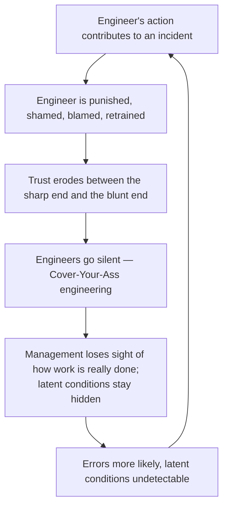

John Allspaw's 2012 Etsy essay argues that how an organization *reacts* to
failure determines whether it gets safer. The choice is between blaming
individuals and learning from the situation — and only the second one compounds.

## What "blameless" actually means

A blameless post-mortem lets the engineers whose actions contributed to an
incident give a full account — what they did and when, what they observed, what
they expected, what they assumed, their read of the timeline — **without fear of
punishment or retribution.** It is not "everyone gets off the hook." The point is
that fear of reprisal makes people withhold exactly the detail you need to
understand how the failure worked, which guarantees the failure recurs.

## The name / blame / shame cycle

Blame rests on the belief that *individuals*, not situations, cause errors, and
that deterrence (fear of punishment) makes people careful. Allspaw traces where
that leads:

- **Sharp end** — the practitioners doing the work at the point of failure.
- **Blunt end** — management and the organization further from the work.

## Second stories

Investigating means looking past the "first story" (human error caused the
failure; people should have been more careful) to the **second story** (human
error is a *symptom* of systemic vulnerabilities deeper in the organization).
Drawn from Woods et al., *Behind Human Error*:

| First story | Second story |
| --- | --- |
| Human error is the *cause* of failure | Human error is the *effect* of systemic weakness |
| "They should have done X" is a satisfying explanation | "They should have done X" never explains why their action made sense to them at the time |
| Telling people to be careful fixes it | Only continuously hunting for vulnerabilities makes the system safer |

## Owning your own story

When engineers feel safe describing a mistake, they become *enthusiastic* about
helping the rest of the company avoid it — they are the world's foremost expert
on their own error. So they are still very much on the hook: given the authority
to explain what happened, they become the ones who educate everyone else. A Just
Culture deliberately balances safety against accountability rather than trading
one away for the other.

Etsy's practices: hold blameless post-mortems on outages; ask *how* an accident
could happen; seek second stories from multiple perspectives; don't punish
mistakes; treat [hindsight bias](http://en.wikipedia.org/wiki/Hindsight) and the
[fundamental attribution error](http://en.wikipedia.org/wiki/Fundamental_attribution_error)
as forces to fight, focusing on the environment people worked in rather than the
person.

This is the organizational counterpart to [How Complex Systems
Fail](../systems-thinking/how-complex-systems-fail.md) — Cook's observations about latent failure and
the sharp/blunt end are the theory this practice operationalizes. It also
complements the automation-trust concerns in [The Ironies of
Automation](../systems-thinking/ironies-of-automation.md).

## References

- [Blameless PostMortems and a Just Culture — John Allspaw, Etsy Code as Craft](https://www.etsy.com/codeascraft/blameless-postmortems/)
