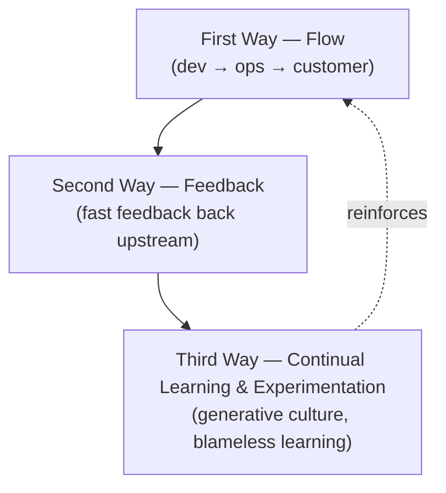

# The DevOps Handbook

Gene Kim, Jez Humble, Patrick Debois, and John Willis (with Nicole Forsgren joining the
2nd edition) turn the story of [The Phoenix Project](phoenix-project.md) into a
practitioner's manual. It is the how-to companion: the concrete practices that let
organizations achieve fast, safe, high-quality flow from development to operations. The
whole book is organized around the **Three Ways**.

## The Three Ways

- **The First Way — Flow.** Optimize the flow of work left to right, from development to
  operations to the customer. Make work visible, reduce batch sizes, limit work in
  progress, and relentlessly remove constraints. This is the
  [Lean](../process-and-teams/lean-thinking.md) / theory-of-constraints lineage applied to IT.
- **The Second Way — Feedback.** Create fast, constant feedback flowing right to left at
  every stage, so problems are seen and fixed while they're cheap. Amplify feedback loops,
  swarm on failures, and push quality toward the source.
- **The Third Way — Continual Learning and Experimentation.** Build a high-trust,
  **generative culture** that treats failure as a learning opportunity, institutionalizes
  the improvement of daily work, and injects controlled experiments. This is the
  [blameless post-mortem](blameless-post-mortems.md) mindset.

## Deployment pipelines

The book's central technical mechanism is the automated **deployment pipeline** — every
change flows through automated build, test, and deploy stages, giving a fast, repeatable,
low-risk path to production. This is the operational backbone shared with
[Continuous Delivery](continuous-delivery.md), and small batch sizes plus fast pipelines
are the practices [Accelerate](accelerate.md) shows statistically drive elite
performance.

## Telemetry

You cannot improve flow or feedback without seeing your system. The handbook pushes
pervasive **telemetry** across application and infrastructure — metrics, logs, and events
that make normal and abnormal behavior legible, enabling teams to detect and diagnose
problems fast. This is the ancestor of the wide-event thinking in
[Observability Engineering](observability-engineering.md).

## Generative culture

Drawing on Westrum's typology, the authors argue that **generative** cultures (high
cooperation, messengers welcomed, failure means inquiry) outperform bureaucratic and
pathological ones. Culture is not soft decoration here — it is a measured predictor of
delivery and reliability outcomes, complementing [Effective DevOps](effective-devops.md)
and the reliability discipline of
[Site Reliability Engineering](site-reliability-engineering.md).

## References

- [The DevOps Handbook, 2nd Edition — IT Revolution](https://itrevolution.com/product/the-devops-handbook-second-edition/)
