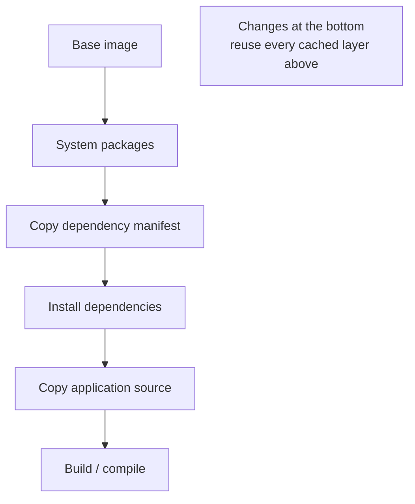

# Docker: Container Conventions & Patterns

Docker popularized the *container*: a packaged unit that bundles an application with
its runtime dependencies and runs as an isolated process on a shared host kernel.
Under the hood a container is just Linux
[namespaces and cgroups](../linux/containers-and-namespaces.md) — Docker's contribution
was the *ergonomics*: a build format (the Dockerfile), a distributable artifact (the
image), and a workflow that made containers cheap enough to become the default unit of
deployment. This note is about the **conventions and patterns** that make Docker usage
sane — the mental model and the idioms — not command reference.

## The mental model: images are immutable artifacts

The central discipline is to treat a container **image** as a build artifact, exactly
like a compiled binary or a versioned package. An image is:

- **Immutable** — once built, it never changes. You do not patch a running container;
  you build a new image and replace the container. This is the container-native form of
  the immutable / phoenix-server pattern from
  [infrastructure as code](infrastructure-as-code.md): a running instance is a disposable,
  exact product of its definition, never a hand-tuned snowflake.
- **Layered and content-addressable** — an image is a stack of read-only filesystem
  layers plus metadata. Layers are cached and shared across images, which is what makes
  builds and pulls fast — if you understand the caching model.
- **Portable** — "build once, run anywhere the kernel is compatible." The same artifact
  moves unchanged from a laptop through CI to production.

Because the artifact is immutable and self-contained, it maps directly onto the
[Twelve-Factor App](../distributed-systems/twelve-factor-app.md) ideals: strict
separation of *build*, *release*, and *run* stages; treating the running app as a
stateless, disposable process; and injecting all config from the environment.

## The Dockerfile: build order is a design decision

A Dockerfile is a recipe read top-to-bottom, each instruction producing a layer. The
conventions all flow from the **layer cache**: a layer is rebuilt only if it or any layer
before it changed. Two idioms follow directly.

**Order from least- to most-frequently-changing.** Install system packages and
dependencies (which change rarely) *before* copying application source (which changes on
every commit). Copy the dependency manifest and install dependencies as their own step,
then copy the rest of the source — so an edit to source code doesn't invalidate the
expensive dependency-install layer.

**Multi-stage builds** separate the *build environment* from the *runtime environment*.
An early stage carries compilers, dev headers, and toolchains; a final stage copies only
the resulting binary or bundled assets into a minimal base. The build tools — and their
attack surface — never ship. This is the standard way to get a small, secure runtime
image without sacrificing a rich build.

## Small, minimal base images

Prefer the smallest base that runs your app: a slim variant, Alpine where its musl libc
is acceptable, or a **distroless** image that contains only the app and its runtime
dependencies — no shell, no package manager. Smaller images pull faster, have a smaller
attack surface, and force build-vs-runtime discipline. Alignment with
[execution sandboxing](../ai-platform/execution-sandboxing.md): the less that's in the
image, the less an attacker (or a misbehaving process) can do.

## One concern per container

A container should run **one primary process** doing **one job** — an app server, a
worker, a database. This is the Unix philosophy applied to deployment. It is what makes
containers independently scalable (run more of the busy one),
independently restartable, and legible in logs and metrics. Bundling nginx + app + cron
+ a database into one image (a "fat" container) throws all of that away and recreates the
snowflake VM the container was supposed to replace. When you genuinely need helper
processes, that's an orchestration concern — sidecars in a
[Kubernetes](kubernetes.md) pod — not a reason to stuff one image.

## Configuration: from the environment, not baked in

Config that varies between environments (dev/staging/prod) — endpoints, credentials,
feature flags — is injected at **run** time via environment variables, per
[Twelve-Factor](../distributed-systems/twelve-factor-app.md) config. The image stays
identical across every environment; only the injected config differs. This is what makes
"build once, promote the same artifact" possible. Corollary: **never bake secrets into
image layers.** Layers are immutable and inspectable — a secret `COPY`ed or `ENV`d into an
early layer persists in the image history forever even if a later layer "removes" it. Use
build secrets, runtime env injection, or a secrets manager.

## `.dockerignore`, tags, and digests

- **`.dockerignore`** keeps build context lean: exclude `.git`, `node_modules`, local
  env files, and build output so they neither slow the build nor accidentally land in an
  image layer (a common secret-leak vector).
- **Tagging** — a tag is a mutable pointer. `latest` is the classic anti-pattern: it means
  a different thing over time, so "it worked yesterday" becomes unreproducible. Tag with
  meaningful, immutable identifiers (semantic version, git SHA).
- **Digests** — for true reproducibility, pin by content **digest** (`@sha256:…`), which
  names an exact immutable image regardless of what a tag later points to.

## OCI: the standard underneath

Docker's image and runtime formats were standardized by the **Open Container Initiative
(OCI)**. Image spec, runtime spec, and distribution spec are vendor-neutral, so an image
built by Docker runs under containerd, CRI-O, Podman, and any OCI-compliant runtime,
including the ones [Kubernetes](kubernetes.md) drives. Thinking in terms of "OCI images"
rather than "Docker images" is the more accurate model.

## Local development with Compose

Docker Compose declares a multi-container local stack (app + database + cache + queue) in
one file, so a developer gets the whole environment with a single command. Its proper
scope is **local development and simple single-host setups**; production multi-host
orchestration is [Kubernetes](kubernetes.md)' job. Compose is the on-ramp: it teaches the
one-concern-per-container and config-from-environment habits that transfer directly to a
cluster.

## Anti-patterns, collected

| Anti-pattern | Why it hurts | Convention |
|---|---|---|
| Fat images (many concerns) | Not independently scalable/observable; snowflake redux | One concern per container |
| Secrets in layers | Persist in history; inspectable forever | Runtime injection / build secrets |
| `latest` tag | Non-reproducible deploys | Version/SHA tags; pin by digest |
| Huge base images | Slow pulls, large attack surface | Slim/distroless + multi-stage |
| Source copied before deps | Cache-busts every build | Least- to most-frequently-changing order |
| Mutating running containers | Recreates the snowflake | Rebuild image, replace container |

## References

- [Dockerfile / build best practices — docs.docker.com](https://docs.docker.com/build/building/best-practices/)
- [The Twelve-Factor App — 12factor.net](https://12factor.net/)
- [Open Container Initiative — opencontainers.org](https://opencontainers.org/)
