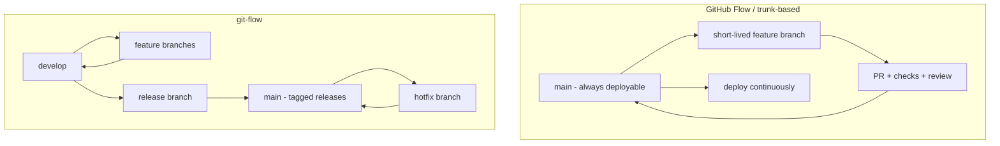
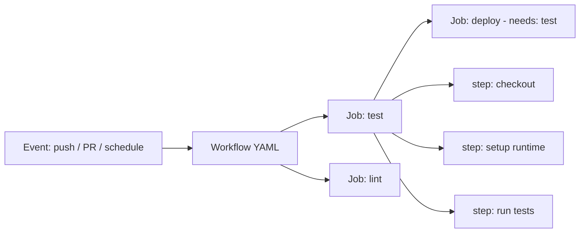

# GitHub as the SDLC Control Plane

GitHub began as a place to host git repositories, but its center of gravity has moved:
today it is the **control plane for the whole software delivery lifecycle**. Source
hosting is the smallest part. Around the repository sit the pull-request review workflow,
a CI/CD engine (Actions), release and deployment machinery, supply-chain security
tooling, and planning surfaces (Issues, Projects, Discussions). Understanding GitHub as a
platform means understanding the *conventions and patterns* that hold across these
surfaces — not the button-by-button API, which the docs cover.

The through-line: **the repository is the unit of record, and everything of consequence
is expressed as a change to it** — a commit, a pull request, a workflow file, a release
tag. This is the same instinct as [continuous-delivery.md](continuous-delivery.md)
("everything in version control") and [infrastructure-as-code.md](infrastructure-as-code.md)
extended past infrastructure to the delivery process itself.

## The pull-request review workflow

The pull request (PR) is GitHub's core collaboration primitive. A contributor pushes a
branch, opens a PR proposing to merge it into a target branch, and the PR becomes the
locus of everything that must happen before the change lands: **review, discussion,
automated checks, and the merge decision**. This is the socio-technical embodiment of
small, reviewable batches — the delivery-scale version of the same instinct in
[accelerate.md](accelerate.md), which found small batch size and code review among the
practices that predict high performance.

Conventions that make PRs work well:

- **Small, focused PRs.** A PR should do one thing. Large PRs get rubber-stamped because
  no reviewer can hold them in their head. Stacked/incremental PRs (see
  [../agentic-coding/graphite-ai-outer-loop.md](../agentic-coding/graphite-ai-outer-loop.md))
  exist precisely to keep each reviewable unit small while still shipping larger arcs.
- **Draft PRs** signal work-in-progress and invite early feedback without requesting a
  formal review.
- **Squash vs. merge vs. rebase.** Squash-merge collapses a messy branch into one clean
  commit on the mainline (tidy history, one revert target); merge commits preserve the
  branch's individual commits; rebase replays them linearly. Pick one convention per repo
  and enforce it — mixing them muddies history and `git bisect`.
- **Conventional review etiquette:** request changes vs. approve vs. comment; resolve
  conversations before merge; keep the PR description as the durable record of *why*.

## Branching strategy: GitHub Flow / trunk-based vs. git-flow

Three families of branching convention recur, and the platform is opinionated toward the
first two.

- **GitHub Flow** is deliberately minimal: `main` is always deployable, all work happens
  on short-lived branches, and every branch merges back to `main` through a reviewed PR.
  It is essentially **trunk-based development** with a PR gate. It suits teams practicing
  [continuous-delivery.md](continuous-delivery.md) where deploys are frequent and the
  mainline is the release.
- **git-flow** adds long-lived `develop` and `release` branches plus a hotfix path. It
  fits software with discrete, versioned releases and slower cadence (installed products,
  firmware), but its long-lived branches accumulate merge debt and are an anti-pattern for
  teams that ship continuously — the long branches *are* the batch size Accelerate warns
  against.

The dominant convention for web software on GitHub is short-lived branches off `main`.
git-flow persists mainly where a versioned artifact ships to users who upgrade on their
own schedule.

## Branch protection and required checks

A branching strategy is only real if the platform enforces it. **Branch protection rules**
(and the newer **rulesets**) turn convention into a gate on the target branch:

- **Require a pull request before merging** — no direct pushes to `main`.
- **Require status checks to pass** — the PR cannot merge until named CI checks are green.
  This is where the deployment pipeline's fast stages become a hard gate.
- **Require review** — one or more approvals, optionally from code owners; optionally
  dismiss stale approvals when new commits land.
- **Require branches up to date** / linear history / signed commits, as the team's rigor
  demands.

The pattern: **automated checks + human review, both mandatory, before anything reaches
the protected mainline.** This is the technical enforcement of the reviewed-small-batch
discipline above.

## GitHub Actions: workflows, jobs, steps

Actions is GitHub's built-in automation engine and the platform's CI/CD implementation.
Its model is a small hierarchy:

- A **workflow** is a YAML file in `.github/workflows/` triggered by events (`push`,
  `pull_request`, `schedule`, `workflow_dispatch`, release published, etc.).
- A workflow contains **jobs**, which run on **runners** (GitHub-hosted or self-hosted).
  Jobs run in parallel by default; `needs:` expresses dependencies to serialize them.
- A job contains **steps**, run sequentially in one runner environment. A step either runs
  a shell command or *uses* an **action** — a reusable unit published by GitHub, a vendor,
  or the community.

Patterns worth internalizing:

- **CI on PR.** The canonical use: on `pull_request`, run the build, tests, and static
  analysis; expose them as required status checks (above). This is the commit stage of the
  [continuous-delivery.md](continuous-delivery.md) pipeline living inside the platform.
- **Matrix builds.** A `strategy.matrix` fans one job out across combinations — Ruby
  3.2/3.3/3.4, or Linux/macOS/Windows, or several dependency versions — so you test the
  support surface in parallel rather than serially. This is how a library
  ([../languages-and-frameworks/ruby.md](../languages-and-frameworks/ruby.md),
  [../languages-and-frameworks/python.md](../languages-and-frameworks/python.md),
  [../languages-and-frameworks/javascript.md](../languages-and-frameworks/javascript.md))
  proves it works across the versions it claims to support.
- **Reusable and composite actions.** A *composite action* bundles several steps into one
  reusable step; a *reusable workflow* (`workflow_call`) lets one workflow call another.
  Both fight copy-paste sprawl across many repos — DRY applied to pipelines.
- **OIDC for secrets.** The modern pattern for cloud deploys is **not** long-lived cloud
  credentials stored as secrets, but **OpenID Connect**: the workflow mints a short-lived
  token that the cloud provider trusts for the duration of the job. No standing secret to
  leak. This is the supply-chain-hardening answer to "how does CI get into AWS/GCP."

## Releases, tags, and versioning

A **git tag** marks a commit; a **GitHub Release** attaches human-readable notes and
downloadable artifacts (binaries, checksums) to a tag. The conventions:

- **Tag with semantic versioning** (`v1.4.2`) so consumers can reason about compatibility
  — see [software-distribution.md](software-distribution.md) for how those versions carry
  meaning downstream.
- **Auto-generate release notes** from merged PRs, and keep a curated changelog for humans.
- **Publish on release.** A release event commonly triggers a workflow that builds and
  ships the artifact to a registry or deploy target — the release *is* the trigger.

## Environments and deployments (with approvals)

**Environments** (`production`, `staging`) are named deploy targets with their own
protection rules and scoped secrets. The important patterns:

- **Required reviewers / approval gates** — a job targeting `production` pauses until a
  human approves, giving CD a manual promotion step without leaving the platform (the
  push-button release of [continuous-delivery.md](continuous-delivery.md)).
- **Deployment protection rules** — wait timers, allowed branches, scoped secrets so a PR
  from a fork can never read production credentials.

GitHub thus becomes the **deploy control plane**: the pipeline builds, the environment
gate promotes, and the deployment history is recorded against the environment.

## Supply-chain security: Dependabot, CodeQL, secret scanning

GitHub folds supply-chain hardening into the repo (broader context in
[../security/index.md](../security/index.md)):

- **Dependabot** watches dependencies for known vulnerabilities and opens PRs that bump
  them — turning "we're on a CVE-affected version" into a reviewable change.
- **CodeQL** is static analysis (SAST) run as a workflow; findings surface in the
  Security tab and can gate PRs.
- **Secret scanning** detects committed credentials and (with push protection) blocks the
  push before the secret lands.
- **Provenance / attestations** tie a built artifact back to the workflow that produced
  it (the SLSA idea; see [software-distribution.md](software-distribution.md)).

## Planning surfaces: Issues, Projects, Discussions, CODEOWNERS

- **Issues** are the unit of work and the anchor for traceability — PRs close issues,
  commits reference them.
- **Projects** are the planning board layered over issues/PRs.
- **Discussions** hold Q&A and design conversation that isn't a work item.
- **CODEOWNERS** (`.github/CODEOWNERS`) maps path patterns to owning individuals/teams;
  matching a path auto-requests those owners' review and, combined with branch protection,
  makes their approval *required*. This routes review to the people who know the code and
  encodes ownership as a checked-in file rather than tribal knowledge.

## Anti-patterns

- **Secrets in logs.** Echoing a secret, or passing it where the runner prints it,
  defeats masking and leaks it into build logs. Never `echo` secrets; use masked secret
  contexts and OIDC over stored credentials.
- **Unpinned actions.** `uses: some/action@main` (or a mutable tag) runs *whatever that
  reference points to today* — a compromised or retagged action then runs with your
  workflow's permissions. Pin third-party actions to a **full commit SHA**.
- **Over-broad workflow permissions.** Grant the workflow's `GITHUB_TOKEN` the least
  privilege it needs (`permissions: contents: read`), not the default write-everything.
- **Untrusted input on `pull_request_target`.** This trigger runs with repo secrets in the
  context of a fork's code — a classic privilege-escalation footgun.
- **Long-lived feature branches** that turn every merge into an integration battle — the
  batch-size anti-pattern from [accelerate.md](accelerate.md).
- **PRs so large no one truly reviews them** — the review becomes theater.

## Relation to other notes

- The PR gate + required checks is how [continuous-delivery.md](continuous-delivery.md)'s
  commit stage and [accelerate.md](accelerate.md)'s small-batch/review findings become
  enforceable on a real platform.
- Workflows-as-code is [infrastructure-as-code.md](infrastructure-as-code.md) applied to
  the delivery process; the automate-the-painful ethos is from
  [devops-handbook.md](devops-handbook.md).
- Releases and tags feed [software-distribution.md](software-distribution.md), where those
  versions and artifacts reach users.
- The *why* behind branching/merge/release decisions belongs in an ADR — see
  [../software-architecture/documenting-architecture-decisions.md](../software-architecture/documenting-architecture-decisions.md).

## References

- [GitHub Actions documentation](https://docs.github.com/en/actions)
- [GitHub flow](https://docs.github.com/en/get-started/using-github/github-flow)
- [Security hardening for GitHub Actions](https://docs.github.com/en/actions/security-guides/security-hardening-for-github-actions)
- [About code owners (CODEOWNERS)](https://docs.github.com/en/repositories/managing-your-repositorys-settings-and-features/customizing-your-repository/about-code-owners)
- [Semantic Versioning 2.0.0](https://semver.org/)
