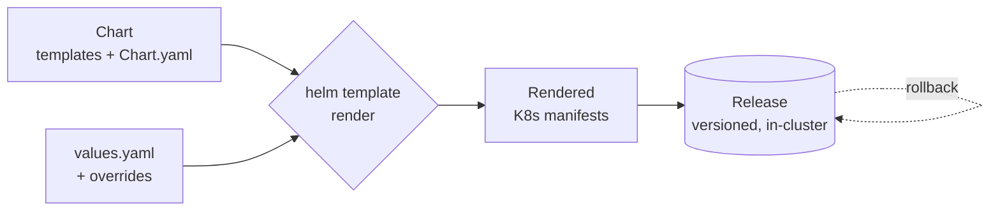

# Helm: The Kubernetes Package Manager

Helm is the **package manager for [Kubernetes](kubernetes.md)** — the `apt`/`brew` of the
cluster. A real application is rarely one Kubernetes object; it's a Deployment plus a
Service plus a ConfigMap plus an Ingress plus RBAC, all of which must agree on names,
labels, and image tags. Helm bundles that whole set into a single installable,
versioned, parameterized unit called a **chart**, so you can install, upgrade, and roll
back an application as one atomic thing.

## The model

- **Chart** — the package: a directory of templated Kubernetes manifests plus metadata
  (`Chart.yaml`) and default configuration (`values.yaml`). A chart can declare
  dependencies on other charts (subcharts), so a stack composes.
- **Templates** — the manifests, written as **Go templates over [YAML](yaml.md)**. Instead
  of hard-coding values, you write `{{ .Values.image.tag }}` and Helm renders the final
  manifests at install time.
- **Values** — the configuration inputs. `values.yaml` holds defaults; the operator
  overrides them per environment (`--set`, or `-f prod-values.yaml`). One chart, many
  environments, driven by values.
- **Release** — a named, versioned *installation* of a chart into a cluster. Helm records
  the release history as secrets in the cluster, which is what makes `helm rollback` to a
  previous revision possible.
- **Repository** — an indexed HTTP location (or OCI registry) that hosts packaged charts
  for others to pull, exactly like a package repo.

## What Helm buys you

- **Distribution** — publish a chart once, and anyone can install a whole app with one
  command. This is how most third-party software (ingress controllers, databases,
  monitoring stacks) is shipped for Kubernetes.
- **Parameterization** — the same chart serves dev, staging, and prod by swapping values,
  instead of maintaining divergent copies of manifests.
- **Lifecycle** — install/upgrade/rollback as atomic, revision-tracked operations, so a
  bad upgrade is one command to undo.

## The templating tradeoff

Helm's power and its pain both come from **string templating YAML**. Go templates operate
on text, not on the YAML structure, so a misplaced indent or a value that isn't quoted can
produce YAML that's syntactically valid but semantically wrong — Helm can't fully catch
these because it isn't manipulating a typed object graph. Complex charts become dense
webs of `{{ if }}`/`{{ range }}` that are hard to read and hard to debug.

The main alternatives sit on either side of that tradeoff:

| Approach | How it works | Tradeoff |
|---|---|---|
| Raw YAML | Hand-written manifests | Simple, no abstraction, lots of duplication |
| **Helm** | Go templating + values + packaging | Powerful, distributable; string-templating fragility |
| Kustomize | Overlays that patch a base | No templating language; structural, but no packaging/params story |

Many teams use both: Helm for third-party charts, Kustomize (or plain manifests) for their
own apps — or Kustomize layered *on top of* rendered Helm output.

## Conventions and anti-patterns

- **Keep templates thin; push variability into `values.yaml`.** If a template is a maze of
  conditionals, the chart is doing too much.
- **Lint and render before applying** (`helm lint`, `helm template`) — inspect the actual
  YAML your values produce rather than trusting the templating blindly.
- **Version charts and pin dependencies** so a release is reproducible; treat the chart
  like any other versioned artifact.
- **Don't hand-edit the resources a release owns** — the next `helm upgrade` will overwrite
  them, the same drift trap as any declarative tool.

## Why it matters

Kubernetes manifests don't compose or distribute on their own; Helm gave the ecosystem a
common packaging format, which is why "there's a Helm chart for it" is the default way to
run off-the-shelf software on a cluster. It is a standard piece of the
[cloud-native and Kubernetes](../cloud-computing/cloud-native-and-kubernetes.md) toolchain.

## References

- [Helm documentation — helm.sh/docs](https://helm.sh/docs/)
