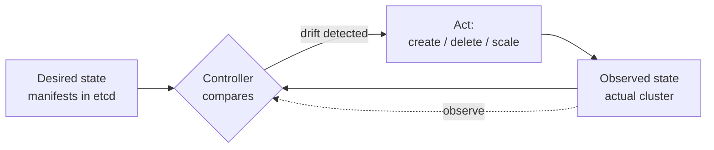

# Kubernetes: Orchestration Conventions & Patterns

Kubernetes is a container orchestrator: given a fleet of machines and a pile of
[container images](docker.md), it decides where each container runs, keeps the right
number alive, wires up networking, and heals the system when things fail. Its power comes
less from any single feature than from a **consistent mental model** applied everywhere.
This note captures that model, the conventions built on it, and the anti-patterns that
signal you're fighting it — not manifest reference (see [*Kubernetes: Up and
Running*](../distributed-systems/kubernetes-up-and-running.md) and the docs for that).

## Declarative desired state

You do not tell Kubernetes *how* to do things ("start this container on that node"). You
declare *what* you want — "5 replicas of this image, exposed on this port, with these
resource limits" — as a set of objects, and the system's job is to make reality match.
This is the same shift as [infrastructure as code](infrastructure-as-code.md): the
declaration is versioned, reviewable, and idempotent. Applying the same manifest twice
converges to the same state; there is no separate "update" verb to get wrong.

## The reconciliation loop

The engine behind the declarative model is a control loop. For every kind of object a
**controller** runs an endless cycle: observe actual state, compare it to desired state,
act to close the gap, repeat.

This is textbook [cybernetics](../systems-thinking/cybernetics.md) — a negative-feedback
controller driving a system toward a setpoint and rejecting disturbance. A node dies and
takes pods with it; the observed replica count drops below desired; the controller
schedules replacements. No human paged, no imperative script. Self-healing is not a
feature bolted on — it *is* the reconciliation loop. Understanding this loop is the single
biggest lever for reasoning about Kubernetes behavior, and it's how the platform delivers
the [fault tolerance](../distributed-systems/fault-tolerance-and-failure.md) that
distributed systems demand.

## The core object model

A small vocabulary composes into everything:

- **Pod** — the smallest deployable unit: one or more tightly-coupled containers sharing
  a network namespace and storage. Usually one app container plus optional sidecars.
  Pods are cattle, not pets — disposable, fungible, expected to die and be replaced.
- **Deployment** — declares a desired number of replicas of a pod template and manages
  rollouts (and rollbacks) by gradually reconciling old pods to new. This is where you
  express "5 of these, upgraded safely."
- **Service** — a stable virtual address and load balancer in front of an ever-changing
  set of pods. Because pods are ephemeral, you never talk to a pod directly; the Service
  gives clients a name that survives pod churn.

## Labels and selectors: the loose-coupling glue

Objects don't reference each other by hard identity; they're tagged with **labels**
(key/value pairs) and connected by **selectors** ("all pods where `app=api`"). A Service
finds its pods by selector; a Deployment owns its pods by selector. This indirection is
what lets pods come and go freely and lets you re-target, canary, or blue/green by
changing labels rather than rewiring. Consistent, well-designed labels
(app, component, environment, version) are a genuine architectural decision, not
bookkeeping.

## Resources, probes, and config

- **Requests and limits** — each container declares the CPU/memory it *requests* (used
  for scheduling) and its *limit* (a hard cap). Requests let the scheduler bin-pack
  honestly; limits prevent one greedy pod from starving its neighbors. **Running without
  limits is a top anti-pattern**: a single leak can take down a whole node.
- **Health probes** — *liveness* ("is it wedged? restart it"), *readiness* ("can it take
  traffic yet? hold the Service until yes"), and *startup* (grace for slow boots). Probes
  are how the reconciliation loop knows what "healthy" means; without them Kubernetes
  routes traffic to broken pods and can't self-heal.
- **ConfigMaps and Secrets** — externalized configuration and credentials, mounted as env
  vars or files. This is [Twelve-Factor](../distributed-systems/twelve-factor-app.md)
  config on Kubernetes: the same image runs in every environment, and only the injected
  ConfigMap/Secret differs. (Note that Secrets are base64-encoded, not encrypted at rest
  by default — treat encryption and RBAC as part of the setup.)
- **Namespaces** — soft partitions of a cluster for isolating teams, environments, or
  tenants, and a scope for quotas and policy.

## The operator pattern

You can extend Kubernetes with your own object kinds via **Custom Resource Definitions
(CRDs)** and pair each with a custom controller — an **operator**. The operator runs the
same observe-compare-act loop for a domain concept ("a PostgreSQL cluster with 3
replicas and nightly backups"), encoding operational expertise as software. This is
Kubernetes eating its own model: it generalizes the reconciliation loop from built-in
objects to *anything*, turning runbooks into controllers.

## GitOps: Git as the source of desired state

Since desired state is declarative text, the natural convention is to keep it in Git and
have an in-cluster agent continuously reconcile the live cluster to the repo. Git becomes
the single source of truth; deploys are pull requests; rollback is `git revert`; drift is
detected and corrected automatically. GitOps is the reconciliation loop extended across
the deployment boundary, and it composes with a
[continuous delivery](continuous-delivery.md) pipeline and
[infrastructure as code](infrastructure-as-code.md) end to end.

## Twelve-factor apps on Kubernetes

Kubernetes rewards apps built to the
[Twelve-Factor](../distributed-systems/twelve-factor-app.md) principles and punishes those
that aren't. Stateless, disposable processes reschedule cleanly; config-from-environment
maps to ConfigMaps/Secrets; fast startup and graceful shutdown make rollouts and
self-healing smooth; treating logs as event streams to stdout fits the platform's log
collection. An app that stores session state on local disk or takes minutes to boot
fights the reconciliation loop at every turn.

## Anti-patterns, collected

| Anti-pattern | Why it hurts | Convention |
|---|---|---|
| Snowflake clusters | Hand-tuned, unreproducible; drift accumulates | Declarative manifests in Git (GitOps) |
| No resource limits | One pod can starve/kill a node | Requests + limits on every container |
| No health probes | Traffic to broken pods; no self-heal | Liveness + readiness + startup probes |
| Treating pods as pets | Fights the disposable-pod model | Pods are cattle; own them via controllers |
| Hard-coded config in image | Breaks build-once, promote-everywhere | ConfigMaps/Secrets injected at runtime |
| `kubectl edit` by hand in prod | Immediately drifts from Git | Change the repo; let reconciliation apply it |

## References

- [Kubernetes production best practices — kubernetes.io](https://kubernetes.io/docs/setup/best-practices/)
- [Configuration best practices — kubernetes.io](https://kubernetes.io/docs/concepts/configuration/overview/)
- [Labels and selectors — kubernetes.io](https://kubernetes.io/docs/concepts/overview/working-with-objects/labels/)
- [The Twelve-Factor App — 12factor.net](https://12factor.net/)
