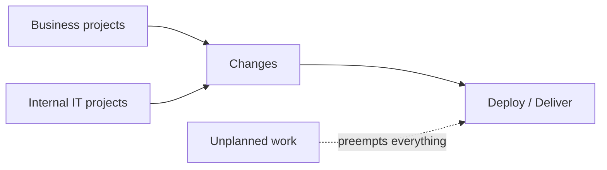

# The Phoenix Project

Gene Kim (with Kevin Behr and George Spafford) teaches DevOps as a **business novel**.
Bill Palmer is unexpectedly promoted to VP of IT Operations at Parts Unlimited, a
struggling manufacturer whose survival hangs on a doomed initiative called Phoenix.
Guided by a Socratic board-member figure named Erik, Bill learns to see IT work the way
a plant manager sees a factory floor. The fiction is the point: it makes the ideas stick
by dramatizing the dysfunction most IT organizations actually live in.

## The theory-of-constraints lineage (the plant / Goldratt parallel)

The book is an explicit homage to Eliyahu Goldratt's *The Goal*, which used a novel to
teach the Theory of Constraints in manufacturing. Erik keeps sending Bill to the factory
floor to learn that **IT is a value stream like any other plant**, and that global
throughput is governed by the system's constraint (bottleneck), not by keeping every
resource busy. The lineage the book claims runs Shewhart → Deming → Ohno → Goldratt →
DevOps — the same [Lean](../process-and-teams/lean-thinking.md) roots that feed
[The DevOps Handbook](devops-handbook.md).

## The four types of work

Erik teaches Bill to make work visible by naming its four kinds — because unseen work
(especially the last one) is what silently destroys flow:

1. **Business projects** — the initiatives the business asks for (e.g., Phoenix).
2. **Internal IT projects** — infrastructure, automation, and IT-initiated changes.
3. **Changes** — the stream of changes generated by the first two.
4. **Unplanned work** — firefighting and recovery from incidents; it is *anti-work*
   because it preempts and destroys the other three.

## The Three Ways

The novel introduces the [Three Ways](devops-handbook.md) that the DevOps Handbook later
formalizes — flow (left to right), feedback (fast, right to left), and continual
learning and experimentation (a culture of improving daily work). Bill's arc is
essentially learning to apply each Way to rescue Phoenix.

The systems-thinking behind all of this connects to
[Thinking in Systems](../systems-thinking/thinking-in-systems.md) and to why incidents cascade the way
[How Complex Systems Fail](../systems-thinking/how-complex-systems-fail.md) describes.

## References

- [The Phoenix Project — IT Revolution](https://itrevolution.com/product/the-phoenix-project/)
