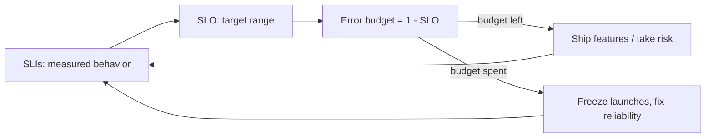

# Site Reliability Engineering (SRE Book + Workbook)

Google's two-volume account of how it runs production. *Site Reliability
Engineering* (Beyer, Jones, Petoff, Murphy, eds., 2016) lays out the principles;
*The Site Reliability Workbook* (2018) is the companion of concrete practices and
worked examples. Both are free to read online at Google's SRE site. SRE is
Google's answer to the question "what happens when you ask a software engineer to
design an operations function" — treat operations as a software problem, and hold
the line with error budgets rather than heroics.

## Core ideas

### Reliability is a feature, and 100% is the wrong target

Past a point, extra nines cost more than users can perceive or value. The right
reliability target is a deliberate business decision, expressed as an objective —
not "as reliable as possible." Everything else follows from choosing that number
honestly.

### SLI, SLO, SLA

- **SLI** (Service Level *Indicator*) — a measured quantity of how the service is
  doing: request latency, error rate, availability, throughput.
- **SLO** (Service Level *Objective*) — the target range for an SLI (e.g. 99.9% of
  requests succeed over 28 days). The internal promise the team manages to.
- **SLA** (Service Level *Agreement*) — the SLO plus consequences: what you owe the
  customer (credits, penalties) if you miss. SLAs are looser than SLOs on purpose,
  so you notice you're in trouble before you breach a contract.

### Error budgets

If the SLO is 99.9% availability, the **error budget** is the remaining 0.1% — the
allowed amount of unreliability over the window. This turns the perennial
dev-vs-ops fight into arithmetic. Budget remaining → ship features, take risks,
move fast. Budget exhausted → freeze feature launches and spend on reliability
until you're back in budget. Both sides now share one number and the same
incentive, which is the whole point.

### Toil, and eliminating it

**Toil** is operational work that is manual, repetitive, automatable, tactical,
devoid of enduring value, and scales linearly with the service. It is not
"work I dislike" — it has a precise definition. Google caps toil (target: under
50% of an SRE's time) so engineers keep enough slack to build the automation that
removes the toil. Left unchecked, toil grows until the team is pure operations and
the service can't scale.

### On-call, done sustainably

On-call is engineered, not endured: bounded event rates per shift, blameless
postmortems that fix systems rather than people, and a hard rule that recurring
incidents get automated away instead of re-handled. The workbook adds staffing
math, escalation design, and the incident-response structure Google uses.

## Why it matters

SRE gives operations the same rigor DevOps brought to the dev/ops divide — see
[Effective DevOps](effective-devops.md) — and its error-budget mechanism is the
cultural counterpart to the delivery metrics in
[Accelerate](accelerate.md) and
[Software Development Metrics](../process-and-teams/software-development-metrics.md). The SLO/SLI
discipline also underpins the operational chapters of
[Production-Ready Microservices](../software-architecture/production-ready-microservices.md).

## References

- [Google SRE Books (free online)](https://sre.google/books/)
