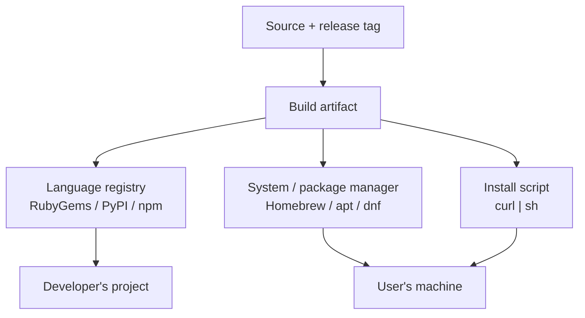

# Software Distribution and Publishing

Writing software is only half the job; getting it onto other people's machines reliably,
repeatably, and safely is the other half. **Software distribution** is the discipline of
publishing artifacts through channels that consumers trust and tools can automate. The
channels differ by ecosystem, but a small set of *conventions* — versioning, changelogs,
lockfiles, signing, namespacing, yanking — recurs across all of them, and one recurring
*anti-pattern* (`curl | sh`) trades those guarantees away for convenience.

This note is about the conventions and their tradeoffs, not the per-tool commands (the
docs cover those). It sits downstream of [github.md](github.md), where a release/tag is
the trigger that pushes an artifact into these channels.

## The landscape of channels

**1. Language / ecosystem registries.** Each language has a canonical registry where
libraries are published and resolved by the language's package manager:

- **RubyGems** for Ruby gems — see [../languages-and-frameworks/ruby.md](../languages-and-frameworks/ruby.md).
- **PyPI** for Python packages — see [../languages-and-frameworks/python.md](../languages-and-frameworks/python.md).
- **npm** for JavaScript/Node packages — see [../languages-and-frameworks/javascript.md](../languages-and-frameworks/javascript.md).

These are the primary channel for **libraries** — dependencies pulled into other projects
— and are tightly coupled to the language's dependency resolver and lockfile.

**2. System / OS package managers.** These distribute **applications and system software**
to end-user or server machines, integrated with the OS's own package database. The Linux
side (apt/dpkg, dnf/rpm, distro repos, signing) is covered in
[../linux/package-management-and-distributions.md](../linux/package-management-and-distributions.md).
On macOS, **Homebrew** fills the same role for developer tooling: formulae describe how to
install a package, and taps extend the set of available formulae. System package managers
give you OS-level integration, dependency resolution against what's already installed, and
a trusted, signed repository.

**3. The `curl | sh` install script.** The pattern
`curl -fsSL https://example.com/install.sh | sh` — pipe a remote script straight into a
shell. It is ubiquitous for developer tools that want a one-line, cross-platform install
without asking users to add a package repo. It is the *most convenient* and the *least
safe* channel; see the security section.

## Conventions that hold across channels

### Semantic versioning

**Semantic Versioning (SemVer)** gives version numbers meaning so consumers and resolvers
can reason about compatibility. `MAJOR.MINOR.PATCH`:

- **MAJOR** — incompatible (breaking) API changes.
- **MINOR** — backward-compatible new functionality.
- **PATCH** — backward-compatible bug fixes.

Pre-release (`1.0.0-rc.1`) and build metadata suffixes are defined too. SemVer is the
contract that makes version *ranges* safe: a consumer pinning `^1.2` is asserting "any
1.x is compatible with me," which only holds if publishers honor SemVer. Every major
ecosystem builds its resolver on this convention (npm's caret/tilde ranges, RubyGems'
pessimistic `~>`, Python's compatible-release `~=`). Break SemVer and you break everyone
who trusted the range.

### Changelogs

A machine-generated `git log` is not a changelog. The **Keep a Changelog** convention
writes changes *for humans*, grouped by release and by kind (Added, Changed, Deprecated,
Removed, Fixed, Security), newest first, with an `Unreleased` section that fills up between
releases. Paired with SemVer, the changelog tells a consumer not just *that* the version
changed but *what* changed and whether it affects them.

### Lockfiles

A manifest (`Gemfile`, `pyproject.toml`/`requirements.txt`, `package.json`) declares the
*ranges* you accept; a **lockfile** (`Gemfile.lock`, `poetry.lock`/`uv.lock`,
`package-lock.json`) records the *exact resolved versions* — often with content hashes —
that were actually installed. Committing the lockfile makes installs **reproducible**:
everyone and every CI runner gets the identical dependency graph. This is the
distribution-side counterpart to [continuous-delivery.md](continuous-delivery.md)'s
"build the binary once" — you also want "resolve the dependencies once."

### Namespacing

Registries prevent name collisions and clarify ownership through namespaces: npm **scopes**
(`@myorg/pkg`), Python's flat-but-normalized names, RubyGems' flat namespace (first-come),
Homebrew taps. Namespacing also mitigates **typosquatting** and **dependency-confusion**
attacks (a public package masquerading as an internal one), though it does not eliminate
them.

### Signing and provenance

The integrity question is *"is this artifact really from who it claims, unmodified?"* Two
mechanisms answer it:

- **Signing** — the publisher signs the artifact; the consumer verifies the signature
  against a trusted key (GPG-signed distro packages, signed gems).
- **Provenance / attestation** — a verifiable record of *how and where* the artifact was
  built. The **SLSA** framework formalizes levels of build-integrity guarantee, and
  registries increasingly support provenance tied to the CI workflow that produced the
  artifact (the [github.md](github.md) OIDC + attestation pattern). This raises the bar
  from "I trust the publisher's key" to "I can verify the build pipeline."

### Yanking / withdrawal

When a published version is broken or malicious, publishers can **yank** it — RubyGems
`yank`, PyPI yank, npm `deprecate`/`unpublish`. The convention is nuanced: yanking usually
makes a version *unselectable for new resolutions* but leaves it installable for anyone
whose lockfile already pinned it, so you don't break existing builds retroactively.
(npm's 72-hour unpublish window and the historical `left-pad` incident are the cautionary
tale for why registries restrict outright deletion.)

## The security tradeoff: `curl | sh` vs. signed packages

The channels are not security-equivalent. This is the sharpest tradeoff in distribution.

| Property | Signed package (registry / OS pkg mgr) | `curl \| sh` |
|---|---|---|
| Integrity check | Signature / hash verified before install | None — you run whatever bytes arrived |
| What runs | A declared, inspectable artifact | Arbitrary shell as your user (or root) |
| TLS is the *only* guard | No — signature is independent of transport | Yes — a MITM or compromised host = arbitrary code execution |
| Reproducible / auditable | Versioned, yankable, logged | The script can change silently between two runs |
| Uninstall / manifest | Package DB tracks files | Usually none |
| Pinning | Pin a version + hash | Rarely pinned |

`curl | sh` fails on **integrity** and **auditability**: there is no verification step, the
piped script runs with the user's privileges immediately, and the remote script can differ
from run to run (or be swapped by whoever controls the URL or intercepts the connection).
Even over HTTPS, TLS only proves you reached *a* server — it says nothing about whether the
script is benign or unchanged since you last looked. Broader supply-chain framing lives in
[../security/index.md](../security/index.md).

Practical mitigations when a project only ships an install script:

- **Read before you run** — `curl` to a file, inspect it, *then* execute.
- **Pin a version and verify a published checksum/signature** out of band when offered.
- **Prefer the packaged channel** (registry, Homebrew formula, OS package) when one exists
  — you inherit its signing and provenance for free.

The rule of thumb: convenience scales inversely with verifiability. A signed package in a
registry is auditable, pinnable, and yankable; a piped install script is none of those.
Choose the strongest channel the situation allows, and reserve `curl | sh` for cases where
you've inspected the script and accept running it.

## Relation to other notes

- [github.md](github.md) is where a release/tag triggers publishing to these channels, and
  where OIDC + attestations produce the provenance discussed here.
- [../linux/package-management-and-distributions.md](../linux/package-management-and-distributions.md)
  is the OS-package-manager deep dive (repos, signing, dpkg/rpm).
- Reproducible installs via lockfiles mirror [continuous-delivery.md](continuous-delivery.md)'s
  "build once, promote the same artifact."
- Language-specific registry conventions live in the language notes:
  [../languages-and-frameworks/ruby.md](../languages-and-frameworks/ruby.md),
  [../languages-and-frameworks/python.md](../languages-and-frameworks/python.md),
  [../languages-and-frameworks/javascript.md](../languages-and-frameworks/javascript.md).

## References

- [Semantic Versioning 2.0.0](https://semver.org/)
- [Keep a Changelog](https://keepachangelog.com/en/1.1.0/)
- [SLSA — Supply-chain Levels for Software Artifacts](https://slsa.dev/)
- [RubyGems — Publishing your gem](https://guides.rubygems.org/publishing/)
- [PyPI user documentation](https://docs.pypi.org/)
- [npm — About semantic versioning](https://docs.npmjs.com/about-semantic-versioning)
- [Homebrew documentation](https://docs.brew.sh/)
