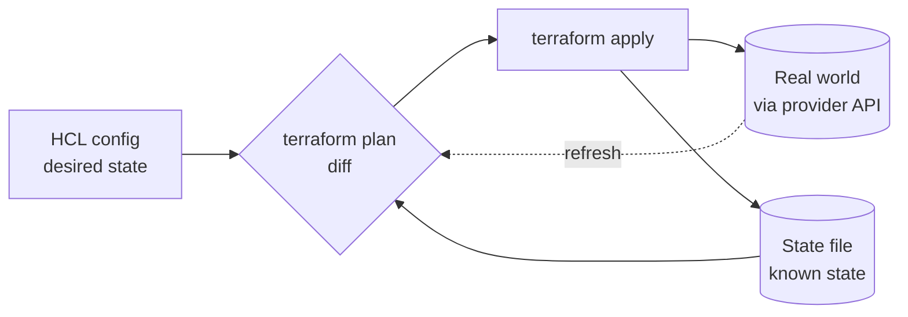

# Terraform: Declarative Provisioning & State

Terraform is HashiCorp's tool for **provisioning** infrastructure declaratively. You
describe the *desired* set of cloud resources — VMs, networks, DNS records, IAM roles,
managed databases — in configuration files, and Terraform figures out the create/update/
delete operations needed to make reality match. It is the archetypal
[infrastructure as code](infrastructure-as-code.md) tool: the config is versioned,
reviewed, and applied by automation, never clicked together by hand in a console.

The mental model has three moving parts: **configuration** (what you want), **state**
(what Terraform believes exists), and the **real world** (what the provider's API actually
has). Every operation is a reconciliation between these three.

## The model

- **HCL** (HashiCorp Configuration Language) — the declarative language you write. It is
  not a general-purpose programming language; it describes resources and their
  relationships, with just enough expressiveness (variables, loops via `for_each`,
  conditionals, functions) to stay DRY.
- **Providers** — plugins that translate HCL resources into API calls for a specific
  platform (AWS, GCP, Azure, Cloudflare, Kubernetes, Datadog, …). Terraform itself knows
  nothing about any cloud; providers supply that knowledge. See
  [the major cloud providers](../cloud-computing/index.md).
- **Resources** — the things Terraform manages and owns (an `aws_instance`, a
  `google_sql_database`). **Data sources** are read-only lookups of things Terraform does
  *not* own (an existing AMI, a current account ID) used as inputs.
- **The dependency graph** — Terraform parses references between resources into a DAG and
  applies them in the correct order, parallelizing independent branches.

## State is the crux

Terraform keeps a **state file** — a JSON snapshot mapping each resource in your config to
its real-world identity and last-known attributes. State is what makes the declarative
model work: without it, Terraform could not tell "create a new server" apart from "this
server already exists, leave it alone." Everything hard about Terraform traces back to
state.

- **Remote state** — store state in a shared backend (S3, GCS, Terraform Cloud) rather
  than a laptop, so a team and CI share one source of truth.
- **Locking** — the backend takes a lock during `apply` so two people can't mutate the
  same infrastructure concurrently and corrupt state.
- **Drift** — when someone changes a resource out-of-band (a console click, another tool),
  reality diverges from state. `plan` surfaces drift by refreshing against the real world;
  `apply` reconciles it back to the declared config.
- State can contain **secrets** (generated passwords, keys) in plaintext, so the backend
  must be encrypted and access-controlled.

## The workflow

`plan` computes the diff between desired config and known state and shows exactly what
will change — the review gate. `apply` executes that plan. `destroy` tears the managed
resources down. The **plan/apply loop** is the whole discipline: you never mutate
infrastructure directly; you change the code, review the plan, and apply.

## Modules and immutable infra

**Modules** are reusable, parameterized bundles of resources — the unit of composition and
sharing (a "VPC module," a "web service module"). They let you standardize patterns and
avoid copy-paste.

Terraform embodies the **immutable infrastructure** philosophy: to change a server's
configuration you typically replace it (build a new image, roll the fleet) rather than
mutate it in place. This is the opposite instinct from configuration-management tools.

## Conventions and anti-patterns

- **Never commit state to version control.** It holds secrets and creates lock/merge
  hazards; use a remote, locked, encrypted backend instead.
- **Split large configs.** One giant monolithic state for the whole org makes every
  `apply` slow, risky, and blast-radius-huge. Slice by environment and by
  bounded-ownership domain, wiring them together with remote-state outputs or data sources.
- **Don't make manual changes** to Terraform-managed resources — that creates drift the
  next `plan` will try to undo. If it's managed by Terraform, change it *in* Terraform.
- **Pin provider and module versions** so an `apply` months later is reproducible.
- **Small, frequent changes** over big-bang applies — same batch-size logic as
  [continuous delivery](continuous-delivery.md).

## Terraform vs Ansible

Terraform *provisions* — it stands up and tears down infrastructure and owns its lifecycle
via state. [Ansible](ansible.md) does *configuration management* — it converges the
software and settings *inside* already-running hosts. They are complementary: a common
pattern is Terraform to create the servers, then Ansible to configure them — though in an
immutable-infra world the "configure" step moves into baking an image instead. The key
distinction is that Terraform is declarative-with-state, while Ansible is procedural task
lists that happen to be idempotent.

## Why it matters

Terraform made cloud infrastructure diffable, reviewable, and reproducible across
providers. It is the default way teams express the *shape* of their cloud, and it
underpins the disposable, self-service environments that
[cloud computing](../cloud-computing/index.md) and platform teams depend on.

## References

- [Terraform — developer.hashicorp.com/terraform](https://developer.hashicorp.com/terraform)
