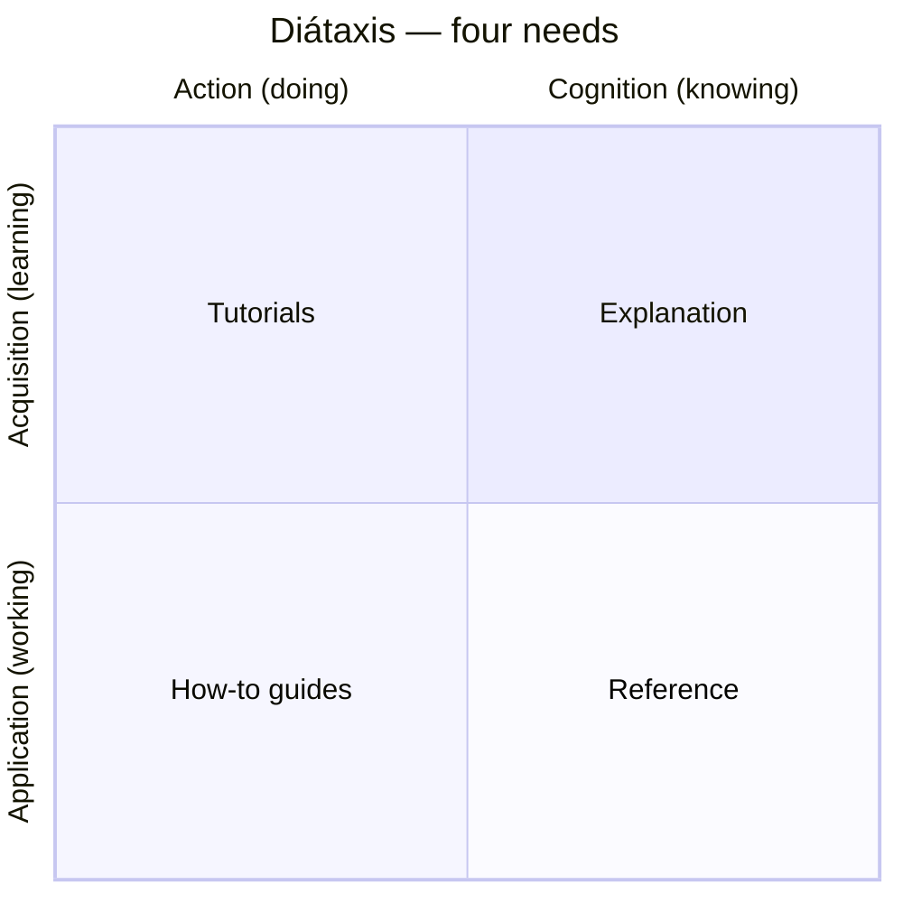

# Diátaxis

**Diátaxis** (from Ancient Greek *dia-* "across" + *taxis* "arrangement") is Daniele
Procida's systematic approach to technical documentation. Its central claim is that good
documentation is not one thing: it must serve **four distinct user needs**, each demanding a
different *kind* of content, a different writing style, and a different place in the structure.
Mixing them — the usual failure mode — produces docs that serve no need well.

## The four modes

The four types map onto two axes: whether the user is **acquiring skill** vs. **applying it**,
and whether they are in a mode of **action** (doing) vs. **cognition** (thinking/knowing).

|              | Action (doing)        | Cognition (knowing)     |
|--------------|-----------------------|-------------------------|
| **Acquisition** (learning) | **Tutorials**         | **Explanation**         |
| **Application** (working)  | **How-to guides**     | **Reference**           |

- **Tutorials** — *learning-oriented*. A lesson that takes a beginner by the hand through a
  meaningful experience. The author is responsible for what happens; the learner just follows.
  Goal: build confidence and competence, not to teach every option. Guaranteed to work.
- **How-to guides** — *task-oriented*. A recipe for an already-competent user with a specific
  goal ("how to configure X"). Assumes knowledge; focuses on getting a real-world job done.
- **Reference** — *information-oriented*. Dry, accurate, exhaustive technical description of the
  machinery (APIs, parameters, options). Structured to mirror the code; describes, does not
  explain or instruct.
- **Explanation** — *understanding-oriented*. Discussion that illuminates a topic, gives context,
  the "why," background, alternatives, design decisions. Read away from the code, at leisure.

## Why the separation matters

The four needs conflict. A tutorial that stops to explain design rationale loses the beginner;
a reference page that turns chatty stops being scannable; a how-to that teaches from scratch
wastes an expert's time. **Keep each document in exactly one mode.** When you feel the urge to
add explanation to a how-to, that's the signal to split it out into an explanation page and link
to it. Confusion in documentation is almost always two modes bleeding into one document.

## Applying it

- Diátaxis solves three problems at once: **content** (what to write), **style** (how to write
  it), and **architecture** (how to organise it).
- It is deliberately **lightweight** — no implementation constraints, easy to grasp, adopt
  incrementally. You can start by simply asking of any page: *which of the four is this?*
- It works iteratively: improve documentation continuously by nudging each piece toward its
  correct mode, rather than by a big up-front reorganisation. The map is a **compass**, not a
  rigid taxonomy — use it to orient, not to force artificial hierarchy.
- Proven across hundreds of documentation projects (Gatsby, Cloudflare, Vonage, Python, and more).

## Takeaways

- Documentation has **four irreducible modes**: learn-by-doing (tutorials), do-a-task
  (how-to), look-it-up (reference), understand-it (explanation).
- The commonest documentation defect is **mode-mixing**; the fix is to separate and cross-link.
- Ask two questions of any doc: *is the user acquiring or applying skill?* and *are they acting
  or thinking?* The answers place it in the grid.

Related notes in HAL: [Governance.md Guide](governance-md-guide.md),
[Writing a Great AGENTS.md](writing-a-great-agents-md.md),
[Documenting Architecture Decisions](documenting-architecture-decisions.md),
[The New Code: Specs as Source of Truth](the-new-code-specs-as-source-of-truth.md).

## References

- [Diátaxis — Daniele Procida](https://diataxis.fr)
