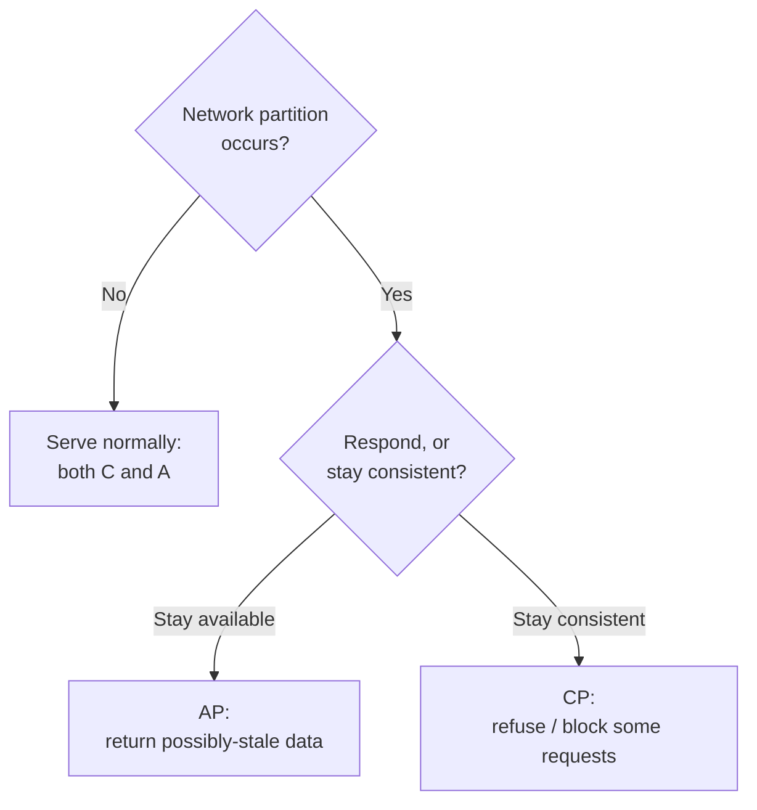

# CAP Theorem

The **CAP theorem** (Brewer's conjecture, proved by Gilbert and Lynch in 2002) states
that a distributed data store cannot simultaneously provide all three of the following
guarantees:

- **Consistency (C)** — every read returns the most recent write or an error; all nodes
  agree on a single up-to-date value. (This "C" is linearizability, the strongest model
  in [consistency-models](consistency-models.md) — not the "C" of ACID transactions.)
- **Availability (A)** — every request to a non-failing node receives a non-error
  response, though not necessarily the most recent value.
- **Partition tolerance (P)** — the system keeps operating even when the network drops or
  delays arbitrary messages between nodes, splitting them into groups that cannot
  communicate.

## Pick two — but the choice is really C vs A

The popular "pick two of three" phrasing is misleading. In any real distributed system,
**network partitions are not optional** — links fail, so P is a fact of life you cannot
design away (see [distributed-systems-fundamentals](distributed-systems-fundamentals.md)).
The theorem therefore reduces to a decision you must make *only while a partition is
happening*:

- **CP** — sacrifice availability to preserve consistency. During a partition, a node
  that cannot confirm it holds the latest value refuses to answer (returns an error or
  blocks). Nobody ever reads stale data, but some requests fail. Consensus-based systems
  (see [consensus](consensus.md)) and strongly-consistent databases behave this way.
- **AP** — sacrifice consistency to preserve availability. During a partition, every node
  keeps answering from its local copy, possibly returning stale or conflicting data,
  which is reconciled later (often via [eventual consistency](consistency-models.md)).
  Dynamo-style stores and many caches behave this way.

## PACELC: the fuller story

CAP describes only the partition case, but partitions are rare. The **PACELC** extension
(Abadi, 2012) captures the everyday tradeoff too:

> **If** there is a **P**artition, choose between **A**vailability and **C**onsistency;
> **E**lse (normal operation), choose between **L**atency and **C**onsistency.

The second clause is the one you pay every day: even with a healthy network, providing
strong consistency requires coordination round trips, which *cost latency*. So a system
is classified on two axes, e.g. **PA/EL** (favor availability and low latency — many
NoSQL stores) or **PC/EC** (favor consistency in both regimes — traditional strongly
consistent databases). PACELC explains why "just make it consistent" is never free even
when nothing is broken.

## Common misreadings

- **"Pick any two, freely."** No — P is forced, so the real menu is C-or-A, and only
  under partition. A system is not "CA"; a single-node store that has no partitions is
  simply not distributed.
- **CAP's "C" equals ACID's "C".** They are unrelated. CAP-C is about replica agreement
  (linearizability); ACID-C is about database invariants within a transaction. See
  [distributed-transactions](distributed-transactions.md).
- **A system is permanently CP or AP.** The choice can be made per operation, per data
  item, or even reconfigured at runtime. A single service can serve some data CP and
  other data AP.
- **"Consistent" means correct and "available" means fast.** Both are precise technical
  properties, not general praise.

## Why it matters

CAP forces designers to make the consistency-vs-availability tradeoff *explicitly* and up
front, rather than discovering it during an outage. It is the conceptual anchor for
[consistency-models](consistency-models.md), [replication](replication.md), and
[consensus](consensus.md), and it underlies operational reasoning about resilience in
[../systems-thinking/resilience-and-robustness.md](../systems-thinking/resilience-and-robustness.md)
and the day-to-day practices catalogued in [../devops-sre/index.md](../devops-sre/index.md).

## References

- [distributed-systems-tanenbaum-van-steen](distributed-systems-tanenbaum-van-steen.md) — situates CAP within the theory of replicated data.
- [designing-data-intensive-applications](designing-data-intensive-applications.md) — a pointed critique of the "two of three" framing and a clear PACELC-style treatment.
