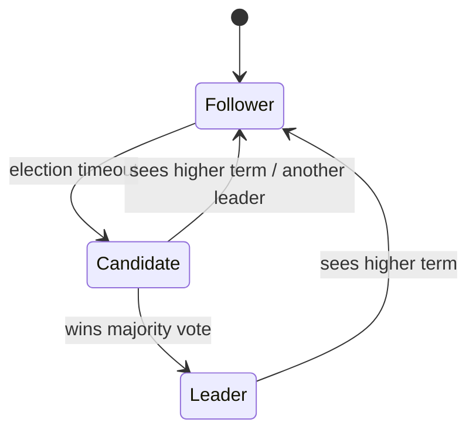

# Consensus

**Consensus** is the problem of getting a set of nodes to agree on a single value (or a
single ordered sequence of values) despite failures and unreliable messaging. It is the
foundational primitive of fault-tolerant distributed systems: leader election,
lock services, replicated state machines, distributed transaction commit, and strongly
consistent databases all reduce to "make these nodes agree." If you can solve consensus,
you can build almost anything with strong guarantees on top of it.

## The problem, precisely

A correct consensus protocol must satisfy three properties:

- **Agreement** — no two correct nodes decide different values.
- **Validity (integrity)** — the decided value was actually proposed by some node (no
  values invented out of thin air).
- **Termination** — every correct node eventually decides.

The difficulty is delivering all three when nodes can crash and messages can be lost,
delayed, reordered, or duplicated — the conditions from
[distributed-systems-fundamentals](distributed-systems-fundamentals.md).

## FLP impossibility

The **FLP result** (Fischer, Lynch, Paterson, 1985) proves that in a fully *asynchronous*
system — no bound on message delay or processing time — there is **no deterministic
protocol that guarantees consensus if even a single node may crash.** The reason: you can
never distinguish a crashed node from an arbitrarily slow one, so any protocol that would
decide can be forced to wait forever by a well-timed delay.

FLP is not a counsel of despair. Real protocols sidestep it by weakening one assumption:
they assume *partial synchrony* (the network is eventually well-behaved for long enough),
or they use timeouts and randomization. This preserves **safety (agreement/validity)
always** and gives up only **guaranteed liveness (termination) during pathological
periods** — a decision will happen once the network stabilizes. This is the practical
resolution every deployed system relies on.

## Paxos

**Paxos** (Lamport) is the classic crash-fault-tolerant consensus algorithm. It runs in
two phases driven by *proposers*, *acceptors*, and *learners*:

1. **Prepare/Promise** — a proposer picks a ballot number and asks a majority of
   acceptors to promise not to accept anything older; they reply with any value they have
   already accepted.
2. **Accept/Accepted** — the proposer asks the majority to accept a value (the highest
   previously-accepted one if any, else its own); once a majority accepts, the value is
   chosen.

Because any two majorities of an odd-sized cluster necessarily overlap in at least one
acceptor, a chosen value can never be lost or contradicted — that overlap is what
enforces agreement. Paxos is famously correct but hard to understand and to turn into
working code, which motivated Raft.

## Raft

**Raft** was designed explicitly for understandability while providing the same
guarantees as (multi-)Paxos. It decomposes consensus into three subproblems:

- **Leader election.** Time is divided into *terms*. Nodes are follower, candidate, or
  leader. A follower that hears nothing for a randomized election timeout becomes a
  candidate and requests votes; whoever wins a majority becomes leader for that term. At
  most one leader per term.
- **Log replication.** All client requests go to the leader, which appends them to its
  log and replicates entries to followers. An entry is **committed** once a majority has
  stored it; committed entries are applied to each node's state machine in the same
  order — a *replicated state machine*.
- **Safety.** Election restrictions guarantee a new leader always has all committed
  entries, so committed data is never lost or overwritten.

Raft (and Paxos) power systems like etcd, ZooKeeper (Zab, a close cousin), and Consul,
which in turn back the coordination layer of platforms such as
[kubernetes-up-and-running](kubernetes-up-and-running.md) and back model/artifact
[../ai-platform/registries.md](../ai-platform/registries.md).

## Quorums

The recurring mechanism is the **quorum**: require any decision to involve a majority
(more generally, any two quorums must intersect). With `2f + 1` nodes the system
tolerates `f` crash failures, because a majority can always be assembled from the
survivors and any new majority overlaps the last one — preserving agreement across
membership changes. Quorums also underpin quorum reads/writes in replicated stores (see
[replication](replication.md)): with `N` replicas, choosing read and write quorums such
that `R + W > N` guarantees a read overlaps the latest write.

## Byzantine fault tolerance

Paxos and Raft assume **crash faults** — a failed node simply stops; it never lies. The
harder **Byzantine** model allows nodes to behave arbitrarily: send conflicting messages,
forge data, collude maliciously (whether from bugs, compromise, or adversarial control).
**Byzantine fault-tolerant (BFT)** consensus, such as PBFT, tolerates up to `f`
Byzantine nodes but needs `3f + 1` total — you must out-vote both the failed *and* the
lying nodes. BFT is essential where participants are mutually distrusting (blockchains,
some aerospace and financial systems) and unnecessary — an expensive over-provision —
inside a single trusted data center.

## Why it matters

Consensus is the bedrock beneath every system that claims strong consistency
([consistency-models](consistency-models.md)) or atomic commit across nodes
([distributed-transactions](distributed-transactions.md)), and it is exactly the
guarantee a CP system in [cap-theorem](cap-theorem.md) buys with its availability. Its
liveness compromise is a distributed cousin of the retry-until-stable reasoning in
[../harness-engineering/hightower-the-retry.md](../harness-engineering/hightower-the-retry.md).

## References

- [raft-consensus-paper](raft-consensus-paper.md) — "In Search of an Understandable Consensus Algorithm" (Ongaro & Ousterhout); the definitive Raft description.
- [reliable-secure-distributed-programming-cachin](reliable-secure-distributed-programming-cachin.md) — rigorous treatment of consensus, quorums, and Byzantine models.
- [distributed-systems-tanenbaum-van-steen](distributed-systems-tanenbaum-van-steen.md) — textbook coverage of Paxos and fault models.
