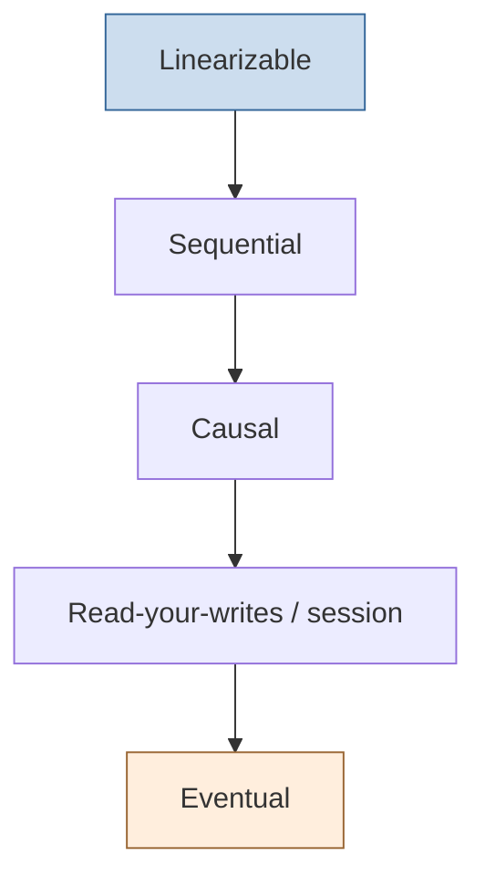

# Consistency Models

A **consistency model** is a contract between a data store and its clients specifying
what values a read is allowed to return, given the reads and writes that came before it.
Because [replication](replication.md) puts copies of data on many nodes and updates
propagate at network speed, at any instant those copies may disagree. A consistency
model is the precise rule that tells a programmer *which* disagreements they are allowed
to observe — and therefore how much reasoning the store handles versus how much the
application must handle itself.

The models form a spectrum. Stronger models are easier to program against but cost more
in latency and availability; weaker models are cheap and highly available but push
complexity onto the application. This tradeoff is the same one framed by
[cap-theorem](cap-theorem.md).

## The spectrum, strongest to weakest

- **Linearizability (atomic / strong consistency).** The system behaves as if there were
  a single copy of the data and every operation took effect instantaneously at some
  point between its invocation and its response, in a way consistent with real time.
  Once a write completes, every subsequent read (by anyone) sees it or a later value.
  This is the most intuitive model — it makes a distributed store look like a single
  variable — but it requires coordination on every operation, so it is the most
  expensive and, under a partition, forces a choice between blocking and returning stale
  data. Achieving it typically requires [consensus](consensus.md).
- **Sequential consistency.** All nodes agree on *one* total order of operations, and
  each client's own operations appear in that order — but the order need not respect
  real time. Two clients may see the effects of a write at different wall-clock moments
  as long as everyone agrees on the same relative ordering. Weaker than linearizability
  (it drops the real-time constraint), still strong enough to reason about simply.
- **Causal consistency.** Operations that are causally related (one could have
  influenced another) are seen in the same order by every node; operations with no
  causal link may be seen in different orders on different nodes. This is the strongest
  model that can remain available during a partition, which makes it a sweet spot for
  many systems. It is defined in terms of the happens-before relation from
  [time-clocks-and-causality](time-clocks-and-causality.md).
- **Read-your-writes (and session guarantees).** A client is guaranteed to see its own
  prior writes, even if other clients don't yet. Related session guarantees —
  monotonic reads (never see time go backwards), monotonic writes, writes-follow-reads —
  are practical, cheap promises scoped to a single client session rather than the whole
  system.
- **Eventual consistency.** The weakest useful model: if writes stop, all replicas will
  *eventually* converge to the same value; until then reads may return any past value and
  may even go backwards. It says nothing about *when* convergence happens. It is trivial
  to make highly available and partition-tolerant, which is why large-scale AP stores
  (Dynamo-style, DNS, many caches) adopt it — at the cost of the application having to
  tolerate and sometimes reconcile stale or conflicting reads (e.g. with conflict-free
  replicated data types or last-write-wins rules).

## The cost of each

| Model | Programmer effort | Latency / availability cost | Survives partition? |
|---|---|---|---|
| Linearizable | Lowest | Highest (coordinate every op) | No — must block or lose availability |
| Sequential | Low | High | No |
| Causal | Moderate | Moderate | Yes |
| Read-your-writes | Moderate | Low | Yes |
| Eventual | Highest | Lowest | Yes |

The rule of thumb: **buy the weakest model your application's correctness can tolerate.**
A bank ledger may demand linearizability for balance updates; a "likes" counter is fine
with eventual consistency. Mixing models per operation within one system is common and
sensible.

## Why it matters

Choosing a consistency model is one of the highest-leverage decisions in a distributed
design: it dictates the achievable latency, the behavior under failure, and the amount
of defensive logic in every client. Confusing the model you *have* with the model you
*wish you had* is a leading source of subtle data-corruption bugs. The concept sits at
the center of the field, tying together [replication](replication.md),
[consensus](consensus.md), [distributed-transactions](distributed-transactions.md), and
[cap-theorem](cap-theorem.md).

## References

- [designing-data-intensive-applications](designing-data-intensive-applications.md) — Chapter 5 (replication) and Chapter 9 (consistency and consensus) give the definitive practitioner treatment.
- [distributed-systems-tanenbaum-van-steen](distributed-systems-tanenbaum-van-steen.md) — formal definitions of each model.
- [reliable-secure-distributed-programming-cachin](reliable-secure-distributed-programming-cachin.md) — rigorous specifications of consistency abstractions.
