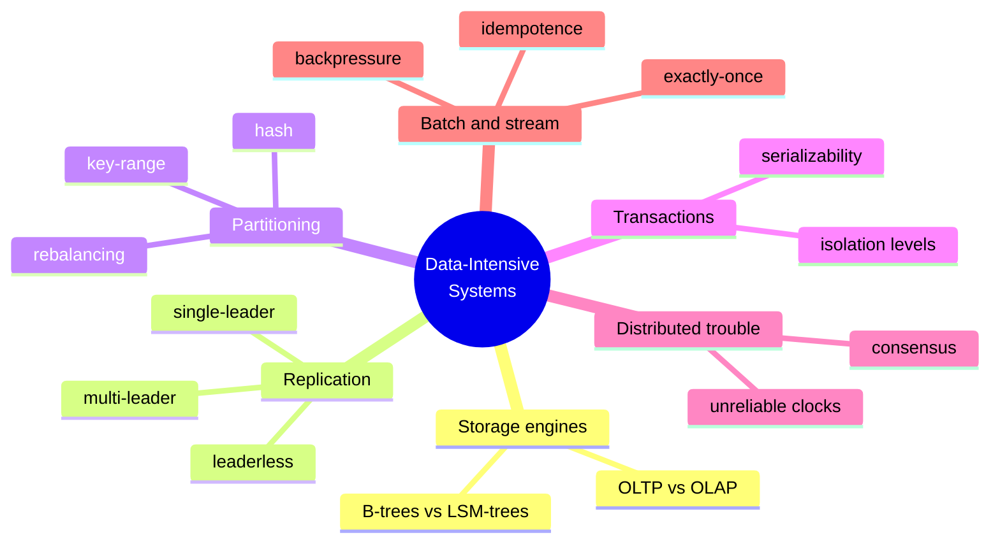

Martin Kleppmann's *Designing Data-Intensive Applications* (DDIA, "The Wild Boar
Book", O'Reilly) is the reference that bridges distributed-systems theory and
practical engineering. Its thesis: NoSQL, Big Data, CAP, eventual consistency,
and sharding are buzzwords until you understand *how the stuff actually works* and
the **trade-offs** behind each design choice. Engineers must build systems that
are reliable, scalable, and maintainable over the long run, which means digging
below the vocabulary to the mechanics.

## The three foundational goals

- **Reliability** — the system keeps working correctly (right function, right
  performance) even when faults occur; it is *fault-tolerant*, distinguishing a
  fault (a component deviating) from a failure (the system as a whole stopping).
- **Scalability** — the system copes with growth in load, described by concrete
  load parameters and measured by latency percentiles, not averages.
- **Maintainability** — operability, simplicity, and evolvability, so people can
  keep working productively on the system as it changes.

## Key mechanisms and trade-offs

- **Idempotence** — because networks give you at-least-once delivery, exactly-once
  semantics are built by making operations *idempotent*: applying the same message
  twice has the same effect as applying it once. This is the same discipline as
  the Idempotent Receiver in
  [Enterprise Integration Patterns](enterprise-integration-patterns.md).
- **At-least-once delivery** — the realistic delivery guarantee in distributed
  messaging; you cannot assume a message arrives exactly once, so you design
  around duplicates rather than wishing them away.
- **Backpressure (flow control)** — when a consumer cannot keep up with a
  producer, the system must slow the producer rather than drop data or exhaust
  memory. Bounded queues and blocking are how a pipeline stays stable under load.
- **Durability** — the promise that committed data survives crashes, via
  write-ahead logs, replication, and fsync — always a cost/safety trade-off.

## The landscape it maps

The book compares the tools and approaches in each area — storage engines,
replication, partitioning, transactions, the failure modes of distributed
systems, and batch vs. stream processing — so a designer can choose deliberately.

## Where it connects

DDIA is the systems-level counterpart to the messaging vocabulary in
[Enterprise Integration Patterns](enterprise-integration-patterns.md) and the
service decomposition in [microservice architecture](../software-architecture/microservice-architecture.md)
and [production-ready microservices](../software-architecture/production-ready-microservices.md). Its
reliability chapters resonate with [How Complex Systems
Fail](../systems-thinking/how-complex-systems-fail.md), and its scalability material with
[architecting for scale](../software-architecture/architecting-for-scale.md).

## References

- [Designing Data-Intensive Applications — Martin Kleppmann](https://dataintensive.net/)
