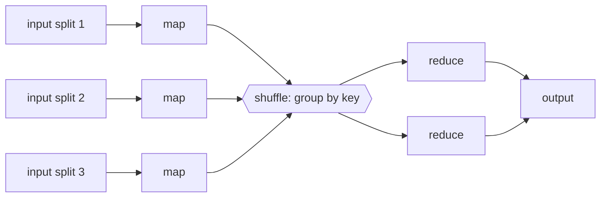

# Distributed Data Processing

**Distributed data processing** is computing over datasets too large for one machine by
spreading the work across many. The unifying idea is to *bring the computation to the
data*: rather than pull terabytes across the network to one processor, ship a small program
to the many machines that already hold slices of the input, run it in parallel, and combine
the results. It is [parallelism](../computer-science/concurrency-and-parallelism.md) at the
scale of a cluster, and it splits into two paradigms distinguished by whether the input is
*bounded* or *unbounded*.

## Batch processing: MapReduce

**Batch processing** runs over a fixed, finite dataset — yesterday's logs, a database
snapshot — producing an output and finishing. The archetype is **MapReduce**, which
expresses a computation as two pure functions the framework parallelizes for you:

- **Map** — applied to each input record independently, emitting key–value pairs. Because
  records are independent, mappers run fully in parallel, one per input partition.
- **Reduce** — applied to *all* values sharing a key, aggregating them into a result.

Between them sits the expensive part, the **shuffle**: the framework groups every emitted
pair by key and moves records across the network so that all values for a given key land on
the same reducer. Map is embarrassingly parallel; the shuffle is where the network cost and
the skew (a hot key overloading one reducer) live.

Fault tolerance is cheap here: because map and reduce are deterministic functions of their
input, a failed task is simply *re-run* on another node from the durably-stored
intermediate data — no coordination needed. That reflects the delivery/idempotence
reasoning in [fault tolerance and failure](fault-tolerance-and-failure.md).

## Dataflow: beyond one map and one reduce

Real computations are chains of joins, filters, and aggregations, so modern engines
(Spark, Flink, Dryad) generalize MapReduce into a **dataflow graph** — a DAG of operators
where each operator's output feeds the next. This lets the engine keep intermediate results
in memory between steps instead of writing to disk after every stage (MapReduce's main
inefficiency), pipeline operators, and optimize the whole plan. Map and reduce become just
two operators among many.

## Stream processing

**Stream processing** runs over an *unbounded*, never-ending input — the event log of
[messaging and event streaming](messaging-and-event-streaming.md). There is no "finish";
the job runs forever, processing each event as it arrives with low latency. Batch is really
the special case of a stream you've decided to cut into a finite window.

The complications of stream processing all stem from unboundedness:

- **Windowing** — you cannot aggregate "all" of an infinite stream, so you compute over
  finite slices: **tumbling** windows (fixed, non-overlapping — every 5 minutes),
  **sliding** windows (overlapping), and **session** windows (bounded by gaps of
  inactivity).
- **Event time vs processing time** — an event *happened* at one moment but *arrives* later,
  out of order, after network delay. Windowing by *event time* is correct but forces the
  question "have all the events for this window arrived yet?" — handled with **watermarks**
  (a heuristic estimate that event-time has advanced past a point) and a policy for
  **late-arriving** data.

## Exactly-once stream processing

A long-running stream job *will* have machines fail mid-flight, so it must recover without
double-counting an event into an aggregate. Frameworks deliver **exactly-once** semantics —
not by preventing reprocessing, but by making its *effects* atomic. The standard mechanism
is a **distributed checkpoint** (Flink's Chandy–Lamport-style snapshot): periodically,
consistent snapshots of every operator's state *and* the input offsets are saved together.
On failure the whole job rewinds to the last checkpoint — reset offsets, restore state — and
replays forward. Combined with idempotent or transactional output, each event affects the
result once. This is the same "exactly-once is at-least-once plus idempotence/atomic state"
truth established in [distributed transactions](distributed-transactions.md), applied to an
endless stream.

## Batch vs stream at a glance

| | Batch | Stream |
|---|---|---|
| Input | bounded (finite dataset) | unbounded (never ends) |
| Completion | terminates with output | runs forever |
| Latency | minutes to hours | milliseconds to seconds |
| Aggregation over | the whole dataset | windows |
| Recovery | re-run failed tasks | rewind to a checkpoint |
| Example | MapReduce, Spark batch | Flink, Kafka Streams |

## Why it matters

Distributed data processing is how organizations turn data at rest and data in motion into
answers — ETL pipelines, analytics, feature computation for
[machine learning](../ai/machine-learning.md), real-time fraud detection. The batch/stream
split is the first design fork, and the recurring hard parts — the shuffle, windowing by
event time, and exactly-once recovery — are simply the general distributed-systems problems
of network cost, ordering, and fault tolerance showing up in the data plane.

## References

- [Designing Data-Intensive Applications (Kleppmann)](designing-data-intensive-applications.md) — Chapters 10 and 11 develop batch (MapReduce, dataflow) and stream processing, windowing, and exactly-once semantics.
- [Designing Distributed Systems (Burns)](designing-distributed-systems.md) — the work-queue and scatter/gather patterns underlying parallel processing.
