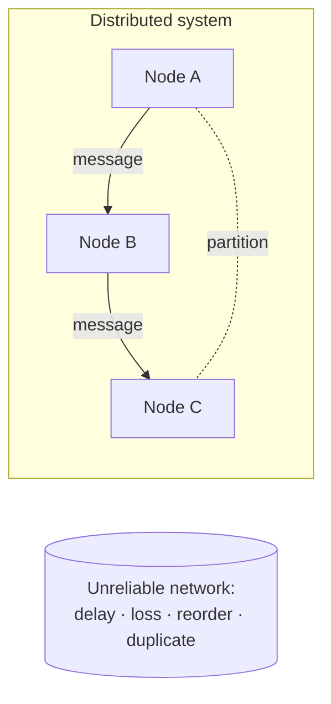

# Distributed Systems Fundamentals

A **distributed system** is a collection of independent computers ("nodes") that
communicate only by passing messages over a network, yet cooperate to present
themselves to users as a single coherent system. There is no shared memory and no
shared clock: every fact one node knows about another is stale by at least a network
round trip. This one constraint — *coordination is only possible through unreliable,
delayed messages* — is the root of nearly every hard problem in the field.

## Why it is hard

Distributed systems are qualitatively harder than single-machine programs because
several assumptions that always hold locally stop holding once a network is involved.

- **Independent failure (partial failure).** On one machine, a crash takes down the
  whole program — an all-or-nothing event you can reason about. In a distributed system
  a *part* can fail while the rest runs on. Worse, a node usually cannot tell the
  difference between a peer that has crashed, a peer that is merely slow, and a network
  link that has dropped its messages. All three look identical: silence. See
  [fault-tolerance-and-failure](fault-tolerance-and-failure.md).
- **No shared clock.** Each node has its own physical clock, and these drift relative to
  one another. You cannot use wall-clock timestamps to reliably decide which of two
  events on different machines happened first. Ordering must instead be reconstructed
  from causality — see [time-clocks-and-causality](time-clocks-and-causality.md).
- **Asynchrony.** In the asynchronous model there is no upper bound on message delay or
  processing time. Because you cannot distinguish "slow" from "dead", timeouts are a
  heuristic, not a truth — a fundamental reason strong guarantees are so expensive to
  build (formalized by the FLP result in [consensus](consensus.md)).
- **Network partitions.** Links fail, switches reboot, data centers lose connectivity.
  When the network splits into groups that cannot reach each other, each group may keep
  serving requests, and the system must choose between staying consistent and staying
  available — the tradeoff captured by [cap-theorem](cap-theorem.md). See also
  [../computer-science/computer-networks.md](../computer-science/computer-networks.md).

## The fallacies of distributed computing

A famous list (Deutsch, Gosling, and others at Sun) catalogs the false assumptions that
newcomers repeatedly bake into designs, then get burned by:

1. The network is reliable.
2. Latency is zero.
3. Bandwidth is infinite.
4. The network is secure.
5. Topology doesn't change.
6. There is one administrator.
7. Transport cost is zero.
8. The network is homogeneous.

Each fallacy names an abstraction that leaks. Robust systems are the ones built by
engineers who assume the opposite of every item on this list: messages get lost,
retried, duplicated, reordered, and delayed; links come and go; and every remote call is
an admission of trust in something you do not control. Retries themselves become a design
surface — see [../harness-engineering/hightower-the-retry.md](../harness-engineering/hightower-the-retry.md).

## Latency vs throughput

Two performance dimensions that beginners conflate:

- **Latency** is how long a single operation takes end to end — dominated in distributed
  systems by network round trips and the speed of light (a cross-continent round trip is
  tens of milliseconds no matter how fast your CPU is).
- **Throughput** is how many operations complete per unit time. It can be raised by
  adding parallel workers even when per-operation latency is fixed.

You can often trade one for the other: batching many requests raises throughput but adds
latency; pipelining hides latency to raise throughput. The two are largely independent
knobs, and confusing them ("the system is slow") produces the wrong fix.

## Why it matters

Almost every system of scale — search engines, social networks, cloud storage,
payment rails, streaming platforms — is distributed by necessity: no single machine has
the capacity, and no single machine can meet availability targets. Understanding these
fundamentals is the entry fee for reasoning about
[consistency-models](consistency-models.md), [replication](replication.md),
[partitioning-and-sharding](partitioning-and-sharding.md), and
[distributed-transactions](distributed-transactions.md), and it connects to the broader
disciplines of [../systems-thinking/resilience-and-robustness.md](../systems-thinking/resilience-and-robustness.md)
and [../software-architecture/microservice-architecture.md](../software-architecture/microservice-architecture.md),
where the same tradeoffs reappear at the application layer.

## References

- [distributed-systems-tanenbaum-van-steen](distributed-systems-tanenbaum-van-steen.md) — the standard graduate textbook treatment of the field.
- [designing-data-intensive-applications](designing-data-intensive-applications.md) — a practitioner's tour of the same problems in real data systems.
