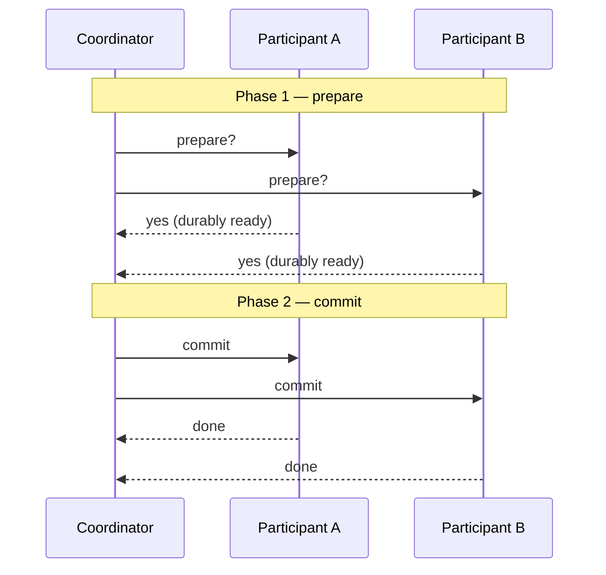

# Distributed Transactions

A **transaction** groups several operations so they succeed or fail as a unit —
classically the ACID guarantees of *atomicity*, *consistency*, *isolation*, and
*durability*. On a single node a database can enforce this with a write-ahead log and
locks. A **distributed transaction** tries to preserve the same all-or-nothing promise
when the operations touch *several* nodes — different [partitions](partitioning-and-sharding.md),
different services, or different databases — none of which shares memory or a clock, and
any of which can crash or become unreachable at the worst moment. That last fact is why
distributed atomicity is genuinely hard rather than merely fiddly.

## Two-phase commit (2PC)

The textbook protocol for atomic commit across nodes is **two-phase commit**. A
**coordinator** drives all the **participants** through two rounds:

In **phase 1 (prepare)** the coordinator asks every participant "can you commit?" A
participant that answers *yes* has made a **promise**: it has durably written the changes
and surrendered the right to abort — it *must* be able to commit later even if it crashes
and restarts. In **phase 2 (commit)** the coordinator, once *all* voted yes, records its
own commit decision durably and then tells everyone to commit; a single *no* turns it into
an abort for all.

**The blocking problem.** 2PC's fatal flaw is the window after a participant has voted yes
but before it hears the decision. If the coordinator crashes then, the participant is stuck
**in doubt**: it may not commit (the decision might have been abort) and may not abort (it
already promised), so it holds its locks and *waits*, indefinitely, for the coordinator to
recover. The coordinator is a single point of failure that can freeze the whole system.
This is why 2PC scales poorly and why practitioners avoid it across service boundaries.
(Fault-tolerant consensus protocols like Paxos/Raft — see [consensus](consensus.md) —
solve the analogous problem *without* blocking by replicating the decision, which is why
modern systems reach for those instead.)

## Sagas

Because holding locks across services for the duration of a business operation is
untenable, most microservice systems abandon distributed atomicity and use a **saga**: a
long-running operation split into a sequence of *local* transactions, each committed
independently, each paired with a **compensating transaction** that semantically undoes it.

If step 3 of 5 fails, the saga runs the compensations for steps 2 and 1 in reverse —
*refund the payment*, *release the reservation* — rather than rolling back a global lock.
The saga is not atomic and not isolated: intermediate states are visible to others, so the
compensations must be designed to be safe in the face of that. Sagas are typically driven
by [messaging and event streaming](messaging-and-event-streaming.md), and the reliable
publish of each step's event is exactly the job of the [outbox pattern](outbox-pattern.md).
They are a foundational technique in [microservice architecture](../software-architecture/microservice-architecture.md).

## Isolation in a distributed setting

Even on one node, full **serializable** isolation is expensive; distributing it is worse,
because it requires coordinating locks or timestamps across nodes. Real systems relax it —
snapshot isolation, read-committed — and accept the resulting anomalies, or they engineer
data placement so that transactions stay within a single partition and never need
cross-node isolation at all. "Keep the transaction on one shard" is the most common way to
sidestep the whole problem.

## Exactly-once is an illusion built on idempotence

Distributed systems love to promise **exactly-once** processing, but a message can always
be lost or duplicated: the network may drop an acknowledgement, so the sender cannot tell
"never delivered" from "delivered, ack lost," and its only safe move is to
[retry](../harness-engineering/hightower-the-retry.md) — which risks a duplicate. You
therefore cannot have true exactly-once *delivery*. What you *can* build is exactly-once
*effect*, and the mechanism is **idempotence**: design the operation so that applying it
twice has the same result as applying it once (attach a unique request ID and deduplicate,
or make the write naturally idempotent like "set balance to X" rather than "add X"). With
at-least-once delivery plus idempotent processing, duplicates become harmless — and
"exactly once" is the *observed behavior*, not a property of the transport. See
[fault tolerance and failure](fault-tolerance-and-failure.md) for the delivery-guarantee
hierarchy this rests on.

## Why it matters

Distributed transactions force the central tradeoff of the field into the open: strong,
coordinated atomicity (2PC) is simple to reason about but fragile and slow, while loose,
compensating consistency (sagas + idempotence) is resilient and scalable but pushes
correctness into application design. Knowing which to reach for — and knowing that
"exactly once" always cashes out as idempotent retries — is what separates a robust
distributed design from a hopeful one.

## References

- [Designing Data-Intensive Applications (Kleppmann)](designing-data-intensive-applications.md) — Chapter 9 covers two-phase commit, its blocking failure mode, and the limits of distributed transactions.
- [Enterprise Integration Patterns (Hohpe & Woolf)](enterprise-integration-patterns.md) — messaging patterns behind sagas and idempotent receivers.
- [The Outbox Pattern](outbox-pattern.md) — atomic local commit plus reliable at-least-once publish, the building block for saga steps.
