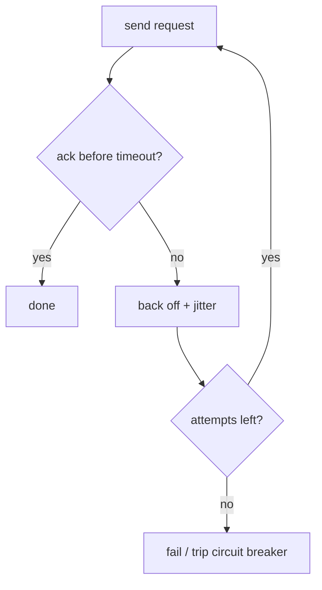

# Fault Tolerance and Failure

The defining property of a distributed system is **partial failure**: some components fail
while others keep running, and — crucially — a healthy node often *cannot tell which*. A
single program either runs or crashes; a distributed system lives permanently in a
half-broken state where a slow response is indistinguishable from a dead peer.
**Fault tolerance** is the discipline of continuing to provide correct service despite
that. It is the applied, mechanical core of
[resilience and robustness](../systems-thinking/resilience-and-robustness.md): resilience
is the property, this is how you build it into a distributed system.

A useful distinction: a **fault** is a component deviating from spec (a disk dies, a packet
drops); a **failure** is the *system* ceasing to provide service. The goal is to prevent
faults from cascading into failures. That means *expecting* faults — designing so that any
single node can vanish at any moment — rather than hoping they won't happen.

## The hard part: detecting failure

You cannot directly observe that a remote node is dead. You infer it, almost always from a
**timeout**: send a request, and if no reply arrives within some bound, declare the node
suspect. This is a **failure detector**, and it is unavoidably imperfect:

- **Timeout too short** → you declare a slow-but-alive node dead, trigger a needless
  failover, and may end up with two nodes both believing they are in charge (**split
  brain**).
- **Timeout too long** → you keep routing work to a node that is actually gone, and
  recovery is sluggish.

There is no timeout that is right in all conditions, because the network gives no upper
bound on delay. Practical detectors use **heartbeats** (periodic "I'm alive" signals) and
adaptive timeouts (e.g. phi-accrual, which outputs a *suspicion level* rather than a hard
yes/no). The impossibility of a perfect detector is a deep result — it underlies the
difficulty of [consensus](consensus.md).

## The tools: redundancy and failover

The universal remedy for a component that can fail is a *spare* — **redundancy**. Keep more
copies than you strictly need ([replication](replication.md) of data, multiple stateless
service instances) so that losing one leaves the rest to carry on. When a failure detector
flags a node, **failover** promotes a standby into its role: a follower becomes leader,
traffic drains to healthy instances, a new pod is scheduled. Failover is where the
detector's imperfection bites hardest — promoting a new leader while the old one is merely
slow is precisely how split brain arises, so real systems fence the old leader off (token
leases, STONITH) before the new one takes over.

## Delivery guarantees

When one node sends a message to another over an unreliable network, exactly what is
promised? Three levels, in increasing strength of *not* losing but increasing risk of
*duplicating*:

| Guarantee | Loses messages? | Duplicates? | How |
|---|---|---|---|
| **At-most-once** | possibly | never | send and forget — no retry |
| **At-least-once** | never | possibly | retry until acknowledged |
| **Exactly-once** | never | never (in effect) | at-least-once + idempotent processing |

The unavoidable truth is the ack ambiguity: after a timeout the sender cannot distinguish
"lost on the way there" from "delivered, ack lost on the way back." So it must choose —
give up (at-most-once) or retry (at-least-once). There is no third transport-level option.

## Retries, backoff, and idempotence

At-least-once delivery means **retrying**, and retries are both the primary tool of fault
tolerance and a primary cause of *new* failures if done naively:

- **Backoff** — wait longer between successive attempts (exponential: 1s, 2s, 4s, …) so a
  struggling node is not hammered.
- **Jitter** — randomize the wait so a thousand clients that failed together do not all
  retry in the same instant and create a **thundering herd** / **retry storm** that turns a
  blip into an outage.
- **Cap and give up** — bound the number of attempts; pair with a **circuit breaker** that
  stops calling a dependency that is clearly down, letting it recover.

Retries only make a system *more* correct if the operation is **idempotent** — safe to
apply more than once. This is the pivot on which "exactly-once" is actually built (see
[distributed transactions](distributed-transactions.md)): at-least-once delivery plus
idempotent handling yields exactly-once *effect*, the only kind you can really have. The
same retry-with-backoff-and-idempotence discipline governs
[the retry in agent harnesses](../harness-engineering/hightower-the-retry.md) — a failed
tool call is just a partial failure to survive.

## Why it matters

Every availability figure a system quotes is really a claim about how well it converts
faults into non-events. Get failure *detection*, *redundancy*, and *idempotent retry*
right and a dead node is a shrug; get them wrong and a single slow disk becomes a
cascading, correlated outage. Because faults are certain and detection is imperfect, fault
tolerance is not a feature you add at the end — it is the shape of the whole design.

## References

- [Designing Data-Intensive Applications (Kleppmann)](designing-data-intensive-applications.md) — Chapter 8 (unreliable networks, clocks, and the trouble with timeouts) and the reliability material throughout.
- [Designing Distributed Systems (Burns)](designing-distributed-systems.md) — replicated and redundant service patterns for surviving partial failure.
