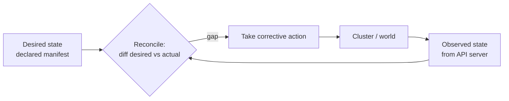

# Kubernetes: Up and Running (3rd ed.)

The standard practical introduction to Kubernetes, by Brendan Burns, Joe Beda, Kelsey Hightower, and Lachlan Evenson. Beyond the how-to of pods, deployments, and services, the book's durable conceptual contribution — and the reason it is kept here — is the **reconciler / control-loop pattern**: Kubernetes' answer to "how do you keep a distributed system in the state you asked for, continuously, without anyone babysitting it." That pattern is a direct engineering realization of the cybernetic feedback loop from [Wiener](../systems-thinking/cybernetics-wiener.md) and [Ashby](../systems-thinking/introduction-to-cybernetics.md).

## Declarative desired state

The book's first move is philosophical: you do not tell Kubernetes *what to do*, you tell it *what you want to be true*. You declare desired state — "3 replicas of this container, exposed on this port" — as data (a manifest). This is **declarative configuration**, contrasted throughout with imperative scripting. The declared state is stored, versionable, and reviewable; the system's job is to make reality match it.

## The reconciler / control loop

Every Kubernetes controller runs the same loop, forever:

1. **Observe** the current state of the world (via the API server / etcd).
2. **Diff** it against the declared desired state.
3. **Act** to close the gap — create, delete, or modify resources.
4. Repeat.

This is what the book calls **self-healing**: if a node dies and a pod vanishes, the ReplicaSet controller observes "2 replicas, wanted 3," and schedules a replacement — no human, no runbook, no imperative "restart" command. Deployments layer reconciliation on top of ReplicaSets to roll out new versions gradually while preserving the invariant. Because the loop is **level-triggered** (it acts on the *current* gap, not on a stream of edge events), it is naturally robust to missed events, restarts, and crashes: whatever the last-observed reality, the next reconcile pulls it back toward desired.

## Why it matters here

The reconciler is the most influential control-loop pattern in modern infrastructure, and it maps cleanly onto HAL's harness thesis: an AI-assisted development loop is a reconciler over a codebase — desired state is the spec plus quality bars, observed state is what the agent produced, and the "corrective action" is the next iteration or the rejected diff. The level-triggered, continuously-converging discipline is exactly why [Martin Fowler's harness framing](../harness-engineering/bockeler-harness-engineering.md) calls the harness a "cybernetic governor." It sits alongside [Designing Distributed Systems](designing-distributed-systems.md) (same authors, the pattern catalog behind these controllers) and the resilience patterns indexed in the [System Design Master Tree](../software-architecture/system-design-master-tree.md).

## References

- [Kubernetes: Up and Running, 3rd Edition — Burns, Beda, Hightower, Evenson (O'Reilly, 2022)](https://www.oreilly.com/library/view/kubernetes-up-and/9781098110192/)
