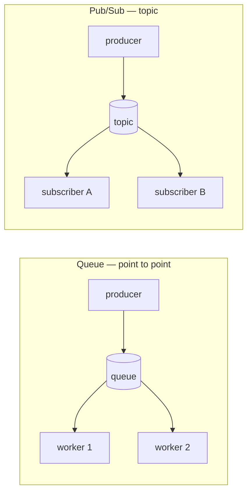

# Messaging and Event Streaming

**Messaging** is asynchronous communication between components: instead of one service
calling another and waiting for a reply, the sender hands a **message** to an intermediary
and moves on; the receiver picks it up when ready. Decoupling sender from receiver in
*time* (they need not be up at once), in *space* (they need not know each other's
addresses), and in *rate* (a fast producer does not overrun a slow consumer) is the whole
point. It is the connective tissue of [microservice architecture](../software-architecture/microservice-architecture.md)
and the subject of a large [pattern language](enterprise-integration-patterns.md).

## Brokers, queues, and topics

The intermediary is a **message broker** (RabbitMQ, ActiveMQ, SQS, Kafka). It buffers
messages so producer and consumer are never coupled directly. Two delivery shapes:

- **Message queue (point-to-point)** — each message is consumed by *one* receiver. Multiple
  workers compete for messages off the same queue, which spreads load — the **competing
  consumers** pattern, ideal for distributing tasks.
- **Publish/subscribe (topic)** — each message is delivered to *every* subscriber. A
  producer publishes to a **topic** and any number of independent consumers each get their
  own copy, so one event can fan out to many reactors.

## Two philosophies: transient brokers vs the log

There is a deep split in how brokers treat a message once delivered.

**Transient (traditional JMS/AMQP) brokers** treat a message as an in-flight task. The
consumer acknowledges it, and the broker *deletes* it. The queue is a to-do list that
drains; once done, the message is gone. Great for job dispatch; useless for replay.

**Log-based brokers** (Apache Kafka, and the idea generalizes) take the opposite stance:
messages are appended to a durable, ordered, **append-only log** and *kept* — for days,
weeks, or forever. A consumer is just a cursor (**offset**) reading forward through the
log; deleting on read is not a thing. This changes everything:

- **Replay** — a new or recovering consumer can rewind to any offset and reprocess history.
- **Multiple independent consumers** — each tracks its own offset over the same log, so
  fan-out is free.
- **Ordering** — within a partition, order is total and preserved (the log *is* the order).

The log is partitioned (see [partitioning and sharding](partitioning-and-sharding.md)) for
throughput and replicated (see [replication](replication.md)) for durability, and consumer
groups divide partitions among workers.

## The log as a source of truth

The log-based view flips the usual relationship between database and message bus. Instead
of a database being primary and events being a side effect, the **ordered log of events
becomes the authoritative record**, and every derived store — a search index, a cache, a
read-optimized view, an analytics warehouse — is a *materialization* of that log, kept in
sync by consuming it. This is **event sourcing** / **change data capture**: state is a
fold over the event history, and because the log is replayable you can rebuild any
derived view from scratch or add a new one at any time. The [outbox pattern](outbox-pattern.md)
is how a service reliably gets its state changes *into* such a log atomically. This same
"log of appends, state is a projection" structure recurs in agent design, where
[loop engineering treats the harness as ordinary software](../harness-engineering/loop-engineering-is-just-software-engineering.md)
built around an event stream.

## Delivery guarantees and backpressure

Brokers inherit the delivery hierarchy of any unreliable channel — at-most-once,
at-least-once, exactly-once-in-effect — detailed under
[fault tolerance and failure](fault-tolerance-and-failure.md). At-least-once is the common
default: the broker redelivers until acknowledged, so consumers must be **idempotent** to
tolerate duplicates.

**Backpressure** is the other guarantee messaging quietly provides. When consumers fall
behind, a transient broker's queue grows (bounded, it eventually rejects or blocks the
producer, signalling "slow down"); a log-based broker simply lets the consumer's offset lag
behind the log head, absorbing bursts in durable storage. Either way the buffer *is* the
flow-control mechanism — it converts a rate mismatch into latency instead of dropped work
or a crashed consumer, which is exactly the resilience property that synchronous request/
response lacks.

## Why it matters

Messaging is how you build systems that stay up when parts of them are down, absorb load
spikes without falling over, and evolve by adding new consumers without touching
producers. Choosing between a *transient queue* (a task disappears when done) and a
*durable log* (history is retained and replayable) is one of the highest-leverage
architectural decisions in a distributed system, because it determines whether your event
stream is a courier or a system of record.

## References

- [Enterprise Integration Patterns (Hohpe & Woolf)](enterprise-integration-patterns.md) — the canonical catalog of channels, endpoints, routers, and transformers for asynchronous messaging.
- [The Outbox Pattern](outbox-pattern.md) — atomically committing state and its event so nothing is lost between a database and a broker.
- [Designing Data-Intensive Applications (Kleppmann)](designing-data-intensive-applications.md) — Chapter 11 contrasts message brokers with log-based systems like Kafka and develops the log-as-source-of-truth idea.
