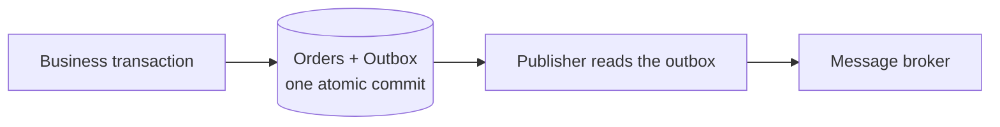

# The Outbox Pattern

A diagram (Stefan Đokić, TheCodeMan.NET) of the transactional outbox pattern — "never
lose an event."

## Problem (old way)

Save the order, then publish to the broker. If the broker is down after the DB commit,
the event is lost — a **dual-write** problem: two systems (database + broker) updated
without a shared transaction.

## Solution (outbox)

The business transaction writes the domain change (**Orders**) and an **Outbox** row in
**one transaction** — an atomic save. A separate **Publisher** then reads the outbox and
delivers to the **Message Broker**.

Guarantees: **atomic write** (DB + outbox commit together), **reliable publish** (the
publisher retries from the durable outbox), **at-least-once** delivery.

## The pattern

## Cross-links

A messaging/idempotency pattern from [System Design Master Tree](../software-architecture/system-design-master-tree.md)
(message queue, pub/sub, idempotency). The at-least-once + retry semantics are why the
"retry-masked corruption" failure mode in [Agent Harness Engineering](../harness-engineering/agent-harness-engineering.md)
demands idempotency keys.
