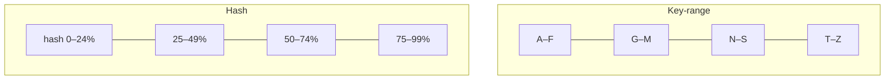

# Partitioning and Sharding

**Partitioning** (also called **sharding**) splits a dataset into disjoint pieces so that
each piece lives on a different node. Where [replication](replication.md) makes *copies*
of the same data for availability, partitioning divides *different* data across nodes for
**scalability**: it lets a dataset — and the read/write load on it — grow past what one
machine can hold or handle. The two are almost always combined: partition first, then
replicate each partition, so each shard has both its share of the data and its own set of
copies.

The whole design goal is **even distribution**. A partition scheme that piles most of the
data or most of the traffic onto one node produces a **hot spot** — a **skewed** system in
which the busiest partition, not the average one, sets the ceiling. Everything below is in
service of avoiding skew.

## How to assign keys to partitions

Two schemes dominate, each a tradeoff between range-query support and load smoothing.

**Key-range partitioning.** Sort keys and give each partition a contiguous range (A–F,
G–M, …), as in HBase and Bigtable. Range scans are cheap — reading "all keys between X and
Y" touches only the relevant partitions. The danger is skew: if keys are timestamps, all
of *today's* writes land on the last partition, making it a hot spot.

**Hash partitioning.** Apply a hash function to the key and assign by the hash value
(commonly `hash(key) mod N`, or better, a slice of the hash space). Cassandra and DynamoDB
do this. Hashing scatters even sequential keys uniformly, killing that hot spot — but it
destroys ordering, so range scans must fan out to *every* partition.

Hashing tames *key* skew but not *access* skew: a single hot key (a celebrity's record)
hashes to one partition no matter what, so extreme cases still need application help —
splitting the key with a random suffix, or caching it out of the storage layer entirely.

## Rebalancing

As data grows or nodes are added and removed, partitions must move to keep load even —
**rebalancing**. A naive `hash(key) mod N` is a trap: changing `N` remaps almost every
key, forcing a massive reshuffle. Robust schemes avoid this:

- **Fixed number of partitions** — create many more partitions than nodes up front (say
  1000 partitions on 10 nodes) and move whole partitions between nodes. The *mapping* of
  key→partition never changes; only partition→node does.
- **Dynamic partitioning** — split a partition when it grows too large and merge when it
  shrinks, so partition count tracks data size (key-range systems favor this).
- **Consistent hashing** — a hash-ring scheme where adding a node reassigns only the keys
  in its immediate neighborhood, not the whole space.

Rebalancing should move as little data as possible and ideally run without a full stop.

## Routing requests

Once data is spread out, a client's request must reach the node that holds the key —
**request routing**, an instance of service discovery. Three approaches:

1. Clients contact any node; it forwards to the right one.
2. A **routing tier** (a proxy) sits in front and forwards.
3. Clients are **partition-aware** and connect directly.

All three need current knowledge of the key→partition→node mapping, which typically lives
in a coordination service (ZooKeeper/etcd) kept consistent via [consensus](consensus.md).

## Partitioning secondary indexes

Partitioning by primary key is easy; secondary indexes (query by a non-key attribute) are
the hard part, and there are two strategies:

- **Local (document-partitioned) index** — each partition indexes only its own rows. Writes
  are cheap (one partition), but a query by the secondary attribute must **scatter-gather**
  across *all* partitions and merge — read amplification.
- **Global (term-partitioned) index** — the index itself is partitioned by the indexed
  term, so a query hits one index partition. Reads are efficient, but a single write may
  have to update index entries on several partitions, so the index is usually maintained
  asynchronously.

The choice is the same read-vs-write tradeoff seen throughout storage design in
[databases](../computer-science/databases.md).

## Why it matters

Partitioning is what makes "web scale" possible: it is the only way a dataset larger than
one machine gets served at all. But it converts every operation that spans partitions —
range scans, secondary-index lookups, cross-partition transactions — into a coordination
problem. That is why partitioned systems lean on
[distributed transactions](distributed-transactions.md) sparingly and design keys so that
the common access patterns stay within a single partition.

## References

- [Designing Data-Intensive Applications (Kleppmann)](designing-data-intensive-applications.md) — Chapter 6 covers key-range vs hash partitioning, rebalancing strategies, secondary-index partitioning, and request routing.
- [Designing Distributed Systems (Burns)](designing-distributed-systems.md) — the scatter/gather and sharded-service patterns.
