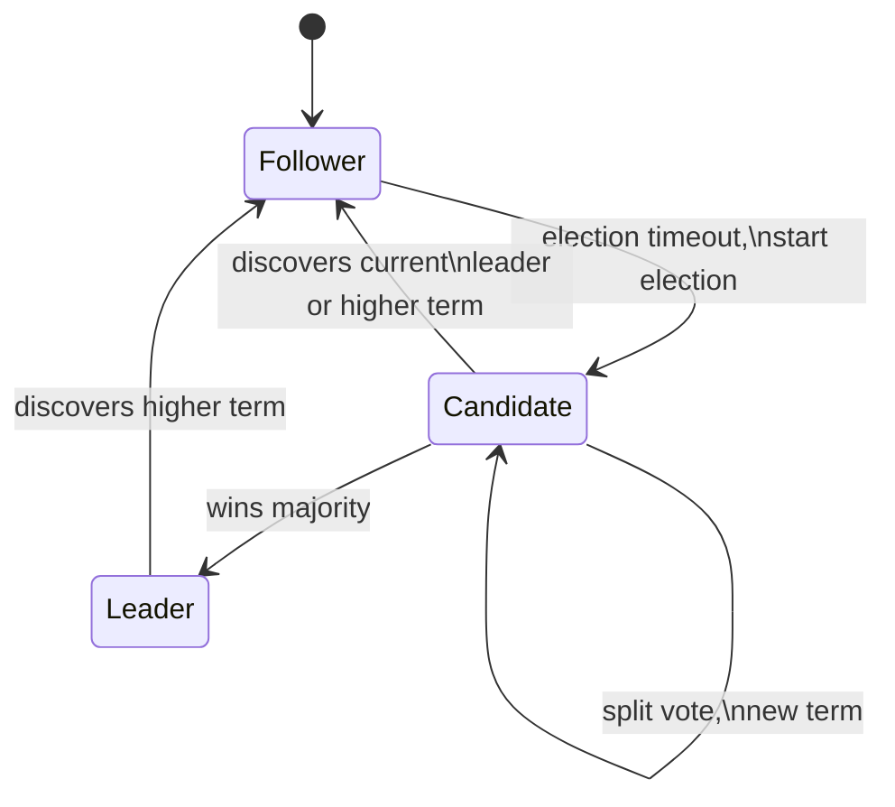

# In Search of an Understandable Consensus Algorithm (Raft)

The 2014 USENIX ATC paper by Diego Ongaro and John Ousterhout (Stanford) that
introduced **Raft**, a consensus algorithm for managing a replicated log. Raft produces
a result equivalent to (multi-)Paxos and is comparably efficient, but its structure is
different — and the difference is the whole point of the paper. Its explicit design goal
was *understandability*: Paxos is notoriously hard to teach and to implement correctly,
so Raft was engineered to be graspable by students and practitioners. A user study of 43
students who learned both algorithms found Raft significantly easier to reason about.

## The problem: replicated state machines

Consensus underpins the [replicated state machine](replication.md) approach to fault
tolerance: a cluster of servers each run the same deterministic state machine over the
same ordered log of commands, so that as long as a majority survive, the service stays
available and consistent. The hard part is keeping the logs identical despite crashes
and network partitions — that agreement problem is [consensus](consensus.md). Raft
tolerates crash (fail-stop) faults, not Byzantine ones (contrast
[reliable-secure-distributed-programming-cachin.md](reliable-secure-distributed-programming-cachin.md)),
and remains safe under network delays, partitions, packet loss, duplication, and
reordering. See [fault-tolerance-and-failure.md](fault-tolerance-and-failure.md) for the
failure-model framing.

## How Raft achieves understandability

Raft decomposes consensus into three largely independent subproblems and leans on a
**strong-leader** model that reduces the space of states the system can be in:

- **Leader election.** Time is divided into *terms*, numbered with consecutive
  integers; each term begins with an election. Servers are followers, candidates, or
  leader. A follower that hears nothing within a randomized election timeout becomes a
  candidate, increments the term, and solicits votes; a candidate that wins a majority
  becomes leader for that term. Randomized timeouts make split votes rare and resolve
  them quickly. Terms act as a logical clock (see
  [time-clocks-and-causality.md](time-clocks-and-causality.md)) that lets servers detect
  and reject stale leaders.
- **Log replication.** All client commands flow through the leader, which appends each
  to its log and replicates it to followers via AppendEntries RPCs (also the
  heartbeat). An entry is *committed* once it is stored on a majority; the leader then
  applies it to its state machine and tells followers to do the same. Log entries flow
  only leader-to-follower, which is what keeps the mechanism simple.
- **Safety.** Correctness rests on a few interlocking guarantees. The **Log Matching**
  property: if two logs hold an entry with the same index and term, that entry is
  identical and so is every entry before it. The **Leader Completeness** property: an
  entry committed in some term is present in the logs of all leaders of higher terms —
  enforced by an election restriction that only lets a candidate with a sufficiently
  up-to-date log win. Together these yield **State Machine Safety**: if any server has
  applied an entry at a given log index, no other server ever applies a different entry
  at that index.

Beyond the core, the paper specifies **membership changes** via a *joint consensus* in
which the old and new server configurations' majorities overlap during the transition,
so the cluster keeps serving requests while it reconfigures, and it describes **log
compaction** through snapshotting.

## Why it anchors the field

Raft is now the default teaching algorithm for consensus and the basis for many
production systems (etcd, Consul, and others), precisely because it made a correct,
provably-safe consensus protocol legible. It is the concrete counterpart to the abstract
consensus treatment in
[reliable-secure-distributed-programming-cachin.md](reliable-secure-distributed-programming-cachin.md)
and to the coordination/replication chapters of
[distributed-systems-tanenbaum-van-steen.md](distributed-systems-tanenbaum-van-steen.md).

## References

- [The Raft Consensus Algorithm — raft.github.io](https://raft.github.io/)
- [In Search of an Understandable Consensus Algorithm (Extended Version), PDF](https://raft.github.io/raft.pdf)
