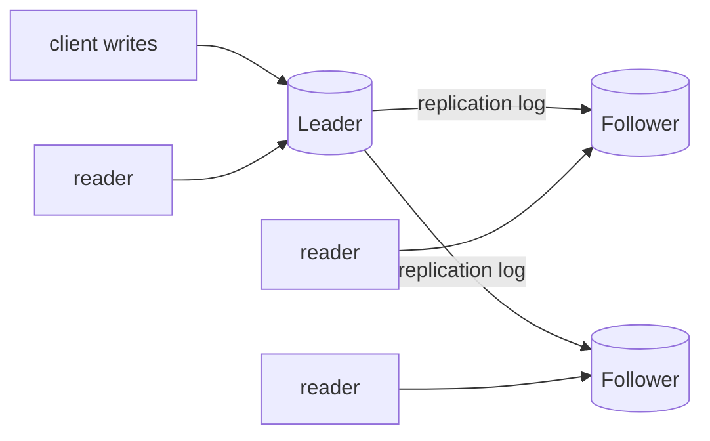
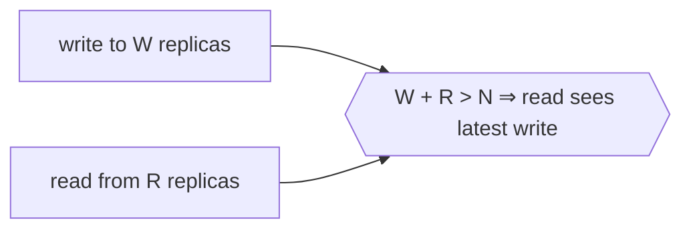

# Replication

**Replication** means keeping a copy of the same data on more than one machine. You
replicate for three reasons: to keep serving when a node dies (**availability**), to put
data near the clients that read it (**latency**), and to spread read load across many
copies (**throughput**). If the data never changed, replication would be trivial — copy
it once and forget. The entire difficulty is handling *writes*: every change has to
propagate to every copy, and copies inevitably fall out of step. Replication therefore
sits at the center of the tradeoffs described by the [CAP theorem](cap-theorem.md) and
the choices catalogued in [consistency models](consistency-models.md).

Three architectures dominate, distinguished by *which* replicas may accept writes.

## Single-leader (leader–follower)

One replica is designated the **leader** (primary/master); all writes go to it. The
leader applies each write locally and streams the change — as a **replication log** — to
its **followers**, which apply it in the same order. Reads may be served by any replica.
This is the default in PostgreSQL, MySQL, MongoDB, and most managed databases.

Its strength is simplicity: because a single node orders all writes, there are no
write–write conflicts. Its weakness is the leader itself — writes bottleneck on one node,
and losing the leader forces a **failover** (see
[fault tolerance and failure](fault-tolerance-and-failure.md)) in which a follower is
promoted, a delicate operation prone to split-brain and lost writes.

## Multi-leader

Two or more nodes accept writes and replicate to each other. This suits multi-datacenter
deployments (a leader per region, so writes stay local) and offline-capable clients (each
device is a leader that syncs later). The cost is **write conflicts**: two leaders may
concurrently modify the same record, and there is no single authority to order them.
Conflicts must be *detected* and *resolved* — by last-write-wins (lossy), by application
logic, or by [conflict-free data types](consistency-models.md) that merge deterministically.

## Leaderless (quorum)

Any replica accepts a write directly; there is no leader (the Dynamo-style design used by
Cassandra and Riak). The client (or a coordinator) sends each write to several replicas
and each read to several replicas. With **N** replicas, if writes reach **W** and reads
reach **R** nodes, then choosing **W + R > N** guarantees a read set overlaps a write set,
so at least one responding replica holds the latest value:

Stale replicas are repaired lazily during reads (**read repair**) or by a background
process (**anti-entropy**). Quorums buy availability and tunable consistency but only give
*eventual* consistency, and edge cases (concurrent writes, sloppy quorums) still permit
stale or conflicting reads. The quorum idea is the availability-first cousin of
[consensus](consensus.md), which pays more coordination for stronger guarantees.

## Synchronous vs asynchronous propagation

Orthogonal to the architecture is *when* the leader considers a write done:

| | Synchronous | Asynchronous |
|---|---|---|
| Leader waits for | follower to confirm | nobody — acks immediately |
| Durability on leader failure | write is safe on a follower | recent writes can be lost |
| Write latency | bounded by slowest follower | fast |
| If a follower stalls | writes block | unaffected |

Most systems use **semi-synchronous** replication: one follower is synchronous (so a
committed write survives on at least two nodes) and the rest are asynchronous (so one slow
node cannot halt all writes).

## Replication lag and its anomalies

Asynchronous replication is the norm, which means followers trail the leader by some
**replication lag** — usually milliseconds, occasionally much more. During that window a
reader hitting a follower sees the past, producing three classic anomalies that stronger
[consistency models](consistency-models.md) exist to prevent:

- **Read-your-own-writes** violation — a user submits a change, then reads from a lagging
  follower and their own change is missing. Fix: read-your-writes consistency (route the
  user's reads to the leader, or to a replica known to have caught up).
- **Monotonic-reads** violation — a user reads twice, the second read from a *further-behind*
  replica, and time appears to move backward. Fix: pin each user to one replica.
- **Consistent-prefix** violation — a reader sees an answer before the question it
  responded to, because causally related writes arrive on a follower out of order. This is
  a failure of causal ordering (see [time, clocks, and causality](time-clocks-and-causality.md)).

Understanding these anomalies is exactly why consistency is a *spectrum* rather than a
yes/no property.

## Why it matters

Replication is the mechanism behind nearly every claim of high availability, and its
knobs — where writes land, whether propagation waits, how big the quorum is — directly set
a system's position on the durability/latency/consistency triangle. It composes with
[partitioning and sharding](partitioning-and-sharding.md): real databases first partition
data across nodes, then replicate each partition, so replication and partitioning together
define the whole storage-layer topology.

## References

- [Designing Data-Intensive Applications (Kleppmann)](designing-data-intensive-applications.md) — Chapter 5 is the definitive treatment of leader-based, multi-leader, and leaderless replication and of replication-lag anomalies.
- [Designing Distributed Systems (Burns)](designing-distributed-systems.md) — replicated-service patterns for building available systems.
