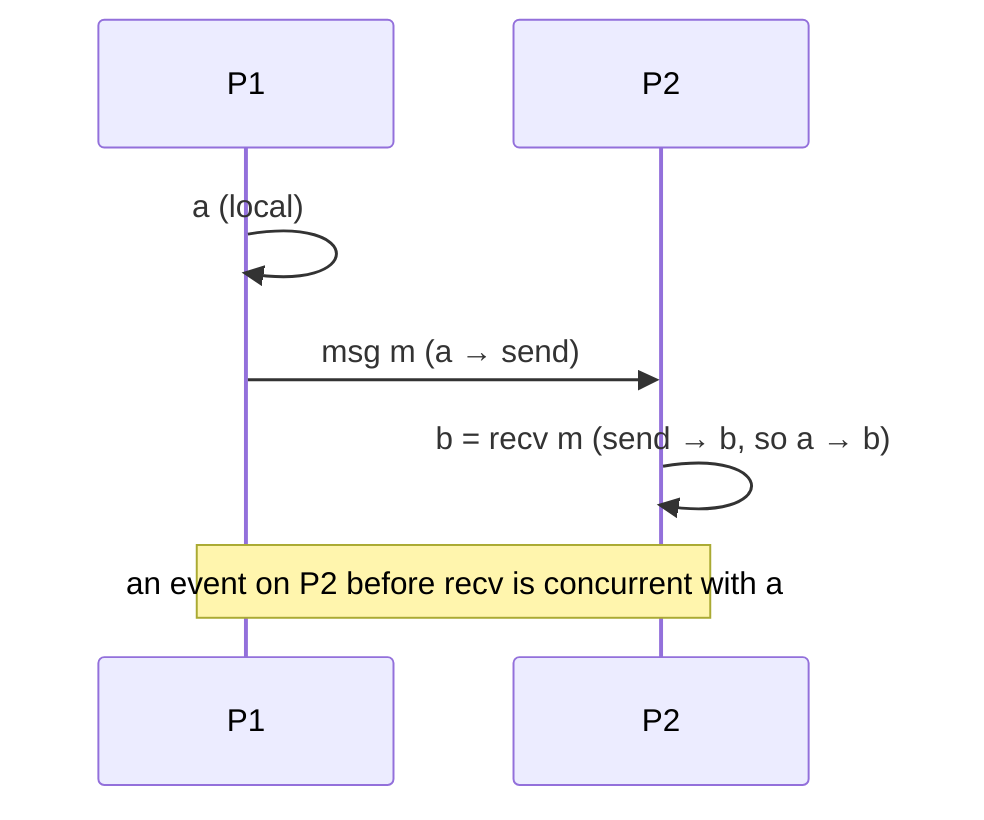

# Time, Clocks, and Causality

In a single program the order of events is obvious: they run one after another on a
shared clock. In a distributed system there is **no global clock and no global "now"**,
so the deceptively simple question "which of these two events happened first?" often has
no reliable answer from wall-clock time alone. This note covers the mechanisms used to
order events across machines — the substrate beneath
[consistency-models](consistency-models.md) and [consensus](consensus.md).

## Physical clocks and skew

Every node has a physical (quartz) clock, and no two are perfectly synchronized:

- **Clock skew** — two clocks read different values at the same instant.
- **Clock drift** — clocks tick at slightly different rates, so skew grows over time.

Protocols like **NTP** discipline clocks toward a reference, bounding but never
eliminating error; typical error is milliseconds to tens of milliseconds — larger than
many network round trips. The practical consequence: **never trust a timestamp
comparison across machines to order events**. A classic hazard is *last-write-wins*
conflict resolution keyed on wall-clock time — a lagging clock can silently discard a
newer write. (Google's Spanner tackles this by making the *uncertainty* explicit with
TrueTime and waiting it out, rather than pretending clocks agree.)

## Happens-before

Lamport's **happens-before** relation (`→`) captures *potential causality* without any
clock. Event `a → b` if:

1. `a` and `b` are on the same node and `a` occurs first; or
2. `a` is the *sending* of a message and `b` is its *receipt*; or
3. transitively: `a → c` and `c → b`.

If neither `a → b` nor `b → a`, the events are **concurrent** — no causal path connects
them, and no observer's ordering of them is "more correct" than another's. Causality, not
time, is the ground truth for ordering in a distributed system.

## Lamport logical clocks

A **Lamport clock** is a single integer counter per node that stamps events consistently
with happens-before:

- Increment the counter before each local event.
- Attach the counter to every outgoing message.
- On receipt, set the local counter to `max(local, received) + 1`.

This guarantees the one-way implication **if `a → b` then `LC(a) < LC(b)`**. It gives a
total order (break ties by node id) usable for things like distributed mutual exclusion.
Its limitation: the converse fails — `LC(a) < LC(b)` does **not** prove `a → b`; the
events might be concurrent. A single number cannot detect concurrency.

## Vector clocks

A **vector clock** fixes that. Each node keeps a vector with one counter per node:

- Increment your own entry on each local event.
- Send the whole vector with each message.
- On receipt, take the element-wise `max` with the received vector, then increment your
  own entry.

Now ordering is fully captured: `a → b` **iff** `V(a) < V(b)` element-wise, and if
neither dominates the other the events are provably **concurrent**. Vector clocks are how
eventually-consistent stores *detect* conflicting concurrent writes so they can surface
or merge them (Dynamo used them for exactly this). The cost is size: the vector grows
with the number of participating nodes.

| Mechanism | Detects order | Detects concurrency | Size |
|---|---|---|---|
| Physical clock | Unreliably (skew) | No | 1 timestamp |
| Lamport clock | One-way only | No | 1 integer |
| Vector clock | Fully (iff) | Yes | N integers |

## Hybrid logical clocks

**Hybrid logical clocks (HLC)** combine the two worlds: a value close to physical time
(so it is human-meaningful and roughly comparable across nodes) that also respects
happens-before like a logical clock. Each timestamp carries a physical component (kept
near NTP time) plus a small logical counter that advances when physical time hasn't moved
enough to preserve causal order. HLCs give causally-consistent, monotonically-increasing,
near-wall-clock timestamps in constant space — widely used in modern distributed
databases (e.g. CockroachDB) to order transactions.

## Why it matters

Ordering is the hidden dependency under almost every distributed guarantee: causal
consistency in [consistency-models](consistency-models.md) is *defined* by happens-before;
consensus in [consensus](consensus.md) exists to impose a single agreed order on a log;
conflict resolution in [replication](replication.md) needs to know which writes are
concurrent. Getting time wrong — trusting wall clocks where causality is required — is a
recurring, hard-to-debug source of lost updates and phantom orderings. The topic connects
naturally to ordering and interleaving in
[../computer-science/concurrency-and-parallelism.md](../computer-science/concurrency-and-parallelism.md).

## References

- [distributed-systems-tanenbaum-van-steen](distributed-systems-tanenbaum-van-steen.md) — thorough treatment of physical, logical, and vector clocks.
- [reliable-secure-distributed-programming-cachin](reliable-secure-distributed-programming-cachin.md) — causal order abstractions built on happens-before.
- [designing-data-intensive-applications](designing-data-intensive-applications.md) — the practical pitfalls of clocks and the case for logical ordering.
