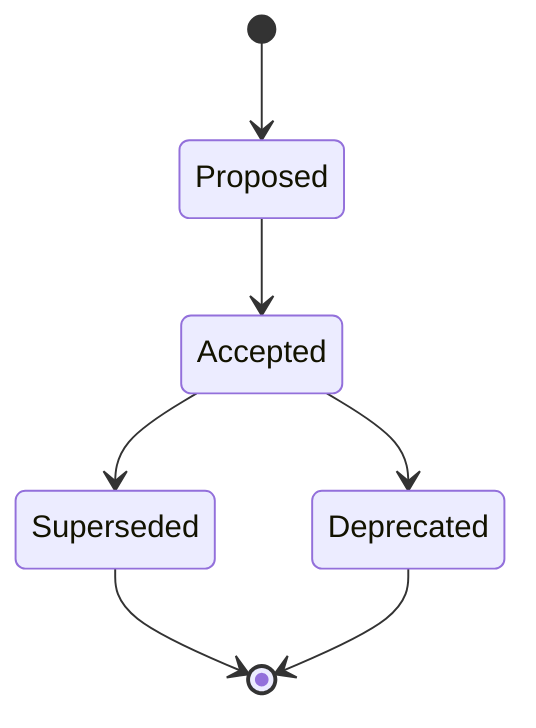

# Documenting Architecture Decisions

Michael Nygard's 2011 post introduces the **Architecture Decision Record (ADR)** — the origin
of a now-widespread practice. The problem it solves: architecturally significant decisions get
made, but the *reasons* evaporate. New team members arrive, find a structure whose rationale is
lost, and face a choice between blindly accepting it (maybe undoing a good decision by
accident) or blindly changing it (maybe repeating a mistake someone already ruled out). Undocumented
decisions rot into cargo-cult architecture. The fix is to record each decision as a short,
durable text file living **in the repo alongside the code**.

## What counts as "architecturally significant"

Record decisions that affect the **structure**, **non-functional characteristics**,
**dependencies**, **interfaces**, or **construction techniques** of the system. Each record
describes a set of forces in tension and the single decision made in response — analogous to an
Alexandrian pattern (though the decisions themselves aren't necessarily patterns).

## The format

Nygard proposes a deliberately **short** format — a few parts, so each doc is easy to digest:

- **Title** — a short noun phrase, numbered. E.g. *"ADR 1: Deployment on Ruby on Rails 3.0.10"*,
  *"ADR 9: LDAP for Multitenant Integration."*
- **Context** — the forces at play: technological, political, social, and project-local. These
  forces are usually in tension and should be stated as fact, neutrally, without judgment.
- **Decision** — the response to those forces, stated in **active voice**: "We will …".
- **Status** — *proposed*, *accepted*, *deprecated*, or *superseded*. A decision that is
  reversed is **not deleted**; it is marked *superseded* (optionally by a newer ADR) — it stays
  relevant to know it *was* the decision even though it no longer is.
- **Consequences** — the resulting context after applying the decision: the trade-offs, both
  positive and negative. All consequences are recorded, not just the good ones.

## Storage and lifecycle conventions

- Keep ADRs in the project repository, e.g. under `doc/arch/adr-NNN.md`.
- Use a **lightweight markup** (Markdown, Textile) — plain text that diffs and reviews well.
- Number them **sequentially and monotonically**; numbers are never reused.
- One ADR per decision; a given force may recur across several ADRs since the *decision* is the
  central unit, not the force.
- Because they live with the code and travel through version control, ADRs give a new engineer
  the whole decision history — what was decided, why, and whether it still holds.

## Takeaways

- ADRs capture the **"why," not the "what"** — the code already shows what; the record preserves
  the reasoning that the code can't.
- Keep them **short, numbered, immutable, and in-repo**; supersede rather than delete so history
  survives.
- The five-part shape (Title / Context / Decision / Status / Consequences) is small enough that
  writing one costs minutes and is worth doing at the moment of decision, while the forces are fresh.

Related notes in HAL: [The C4 Model](c4-model.md),
[Design It! From Programmer to Software Architect](design-it.md),
[Diátaxis](diataxis.md),
[Clean Architecture](clean-architecture.md).

## References

- [Documenting Architecture Decisions — Michael Nygard (2011)](https://cognitect.com/blog/2011/11/15/documenting-architecture-decisions)
