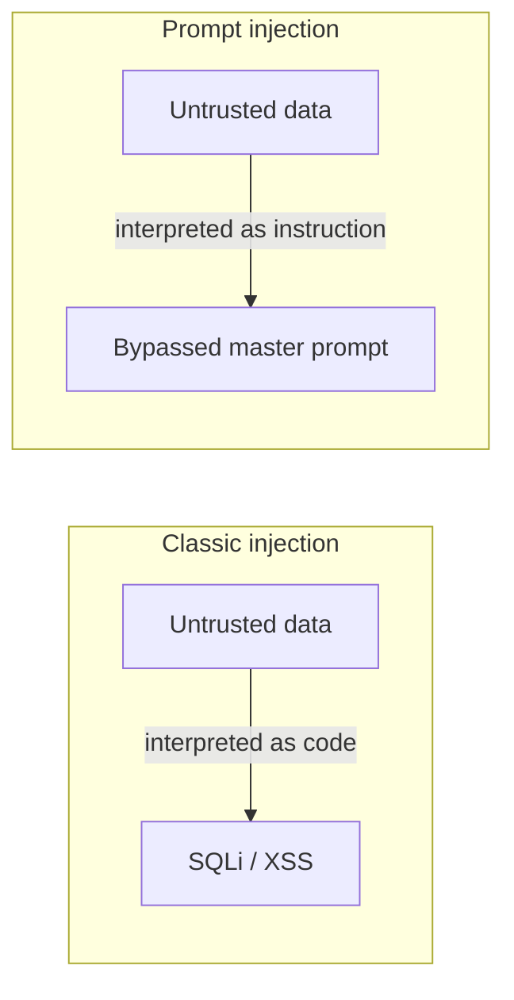

# Does AI Generate Secure Code?

Caleb Sima (founder of SPI Dynamics; ex-CISO at Databricks and Robinhood; now
investing via WhiteRabbit) on the AI Native Dev podcast. His blunt answer: **"Does
AI produce insecure code? Of course, absolutely — because that's what we mostly
produce."** Models train on the public corpus of human code, which is riddled with
historical legacy omissions and insecure patterns; the default output inherits
them. This is the same mechanical argument at the core of
[AI code security](ai-code-security.md), where Sima is also quoted.

But *does insecure-by-default mean unfixable?* No. The same models can be steered
toward secure code — the question is where the secure training signal and the
secure guidance come from (see Cisco's approach in
[Cisco CodeGuard](cisco-codeguard-security-skills.md)).

## Prompt injection is the old story with a new name

Sima's key framing: **prompt injection is a control-plane / data-plane problem** —
the same class as SQL injection and cross-site scripting. Anywhere those were
vulnerable, prompt injection is vulnerable, because the model **interprets data as
if it were instruction**. The difference: so far there is **no real mitigation**
the way parameterized queries fixed SQLi. You cannot fully separate the "command"
channel from the "data" channel in an LLM.

## Mitigations: hygiene and pass-through permissions

There is no silver bullet, so the advice is generic hygiene plus **identity/access
discipline**:

- Ask whether the system can separate control plane from data plane at all.
- **The LLM must inherit the requestor's permissions, not exceed them.** If a user
  should not be able to return the company's financial data, neither should the LLM
  acting for them — otherwise the model itself becomes the injectable path to
  bypass the restriction. This is exactly the least-privilege posture in
  [agent identity & access](agent-identity-access.md).
- **RAG is favored partly because permissions can be attached to it**: a retrieval
  table scoped to the finance team is only queried under finance's pass-through
  permissions. Retrieval-with-permissions narrows the blast radius.
- Data poisoning of training/context is the same class of problem — untrusted data
  treated as fact.

## Related

- [AI code security](ai-code-security.md) — scanning the artifact; Sima quoted there too.
- [Guardrails proxy](guardrails-proxy.md) — guarding runtime traffic, including prompt injection.
- [Agent identity & access](agent-identity-access.md) — pass-through, least-privilege permissions.
- [The hidden vulnerabilities behind AI code](hidden-vulnerabilities-ai-code.md) — the flat security-posture trend.

## References
- [Does AI Generate Secure Code? Tackling AppSec in the Face of AI Dev Acceleration & Prompt Injection (AI Native Dev)](https://www.youtube.com/watch?v=vg-svm2mT7w)
