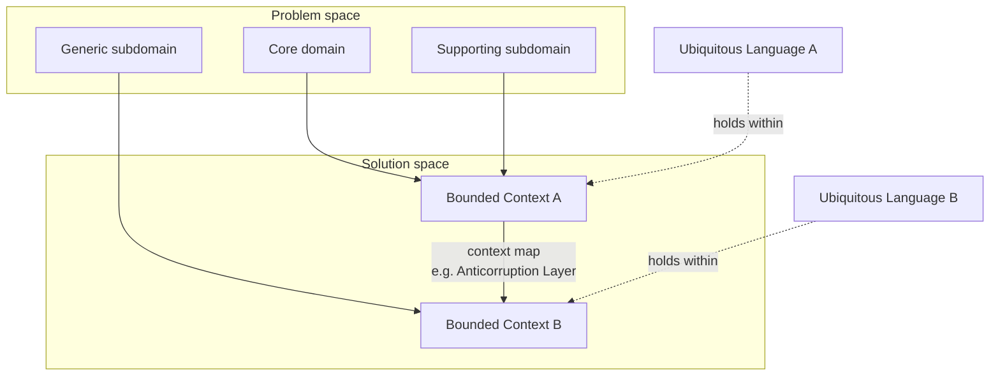

# Domain-Driven Design Distilled

Vaughn Vernon's short, accessible on-ramp to Domain-Driven Design (176 pages, 2016).
It is deliberately the *distilled* version: enough to understand what DDD is, what
problems it solves, and how to start getting value — without the depth of the two
canonical tomes. Read it as the gateway to Eric Evans's original **blue book**
([Domain-Driven Design](domain-driven-design.md)) and Vernon's own **red book**
([Implementing Domain-Driven Design](implementing-domain-driven-design.md)). Vernon
draws on twenty years of applying DDD in practice, and writes for the whole team —
developer, architect, analyst, consultant, or business customer.

The central claim: modeling software around the business domain, in close collaboration
with domain experts, delivers real results in practice and not just in theory. The book
puts **strategic design first** — deliberately, because getting the boundaries and the
language right matters more than any tactical pattern.

## Strategic design (the important half)

Strategic design decides *where the models live and what they mean*. Vernon leads with
it because most DDD failures are strategic, not tactical.

- **Bounded Context** — an explicit boundary within which a single model applies and its
  terms have one precise meaning. The same word ("account", "customer") means different
  things in different contexts; a Bounded Context is what keeps those meanings from
  bleeding into each other and corrupting the model.
- **Ubiquitous Language** — a shared, rigorous vocabulary developed *jointly* by domain
  experts and developers, spoken in conversation and written directly into the code. It
  is scoped to one Bounded Context, not global. The language and the boundary define each
  other: the context is where the language holds.
- **Subdomains** — the problem-space partitions of the business, in three flavors:
  - **Core domain** — the strategic differentiator, where the business wins or loses.
    Invest your best modeling effort here.
  - **Supporting subdomain** — necessary but not differentiating; custom-built because
    nothing off the shelf fits.
  - **Generic subdomain** — a solved problem (auth, notifications); buy or adopt, don't
    lovingly hand-craft.
  Naming subdomains this way is also how you handle legacy systems — you decide which
  areas deserve deep design and which are just plumbing.
- **Context Mapping** — the patterns describing how Bounded Contexts relate, capturing
  *both* the team relationship and the technical integration mechanism. Patterns include
  Partnership, Shared Kernel, Customer/Supplier, Conformist, Anticorruption Layer,
  Open Host Service, and Published Language. The map is an organizational picture as much
  as a technical one.

## Tactical design (inside a context)

Once the boundaries are set, tactical patterns build the model within a single Bounded
Context.

- **Entities** — objects defined by identity and continuity over time, not their
  attribute values.
- **Value Objects** — immutable objects defined entirely by their attributes, with no
  identity; prefer them, they are simpler and safer.
- **Aggregates** — consistency boundaries. An Aggregate is a cluster of Entities and
  Value Objects with a single root; the root enforces invariants and is the only entry
  point. Vernon's rules of thumb: model true invariants inside the boundary, keep
  Aggregates small, reference other Aggregates by identity only, and update one Aggregate
  per transaction (reaching others eventually via events).
- **Domain Events** — records of something meaningful that happened in the domain,
  named in past tense in the Ubiquitous Language. They are how Aggregates and Bounded
  Contexts stay consistent without sharing a transaction, and they open the door to
  **Event Sourcing** (persisting the stream of events as the system of record).

## Acceleration: EventStorming

The book's practical accelerator is **EventStorming** — a fast, low-tech, collaborative
modeling workshop. Everyone (domain experts and developers together) covers a wall with
sticky notes: Domain Events first, then commands, actors, aggregates, and policies,
arranged on a timeline. It surfaces the model, the Ubiquitous Language, and the Bounded
Contexts far faster than up-front document-driven analysis. Vernon pairs it with advice
on **managing DDD on an Agile project** and **timeboxed modeling** so the modeling effort
stays disciplined.

## Where it sits

This is the concise gateway. For the full treatment of the tactical patterns and their
implementation, go to [Implementing Domain-Driven Design](implementing-domain-driven-design.md);
for the original strategic framing and philosophy, go to
[Domain-Driven Design](domain-driven-design.md); for DDD expressed in typed functional
style, see [Domain Modeling Made Functional](domain-modeling-made-functional.md). DDD's strategic vocabulary — Bounded
Contexts, subdomains, context maps — is also the natural language for service boundaries,
which is why it recurs in [Microservice Architecture](microservice-architecture.md) and
[Building Microservices](building-microservices.md): a Bounded Context is a strong
candidate for a service boundary.

## References

- [Domain-Driven Design Distilled — InformIT](https://www.informit.com/store/domain-driven-design-distilled-9780134434421)
