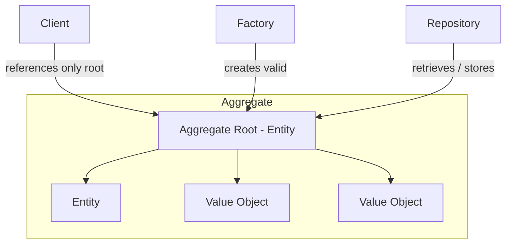
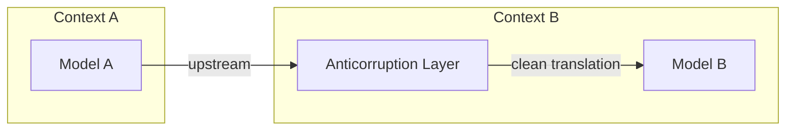

# Domain-Driven Design

Eric Evans' 2003 book (Addison-Wesley, the "blue book") argues that for software
tackling a complicated business problem, the hardest and most valuable work is not the
technology but understanding the **domain** itself. The central claim: build software
around a rich **model** of the domain, keep that model and the code tightly bound, and
let the model drive design decisions. Everything else in the book is machinery in
service of that idea.

The book is organized in four movements: putting the domain model to work, the tactical
building blocks of a model-driven design, refactoring toward deeper insight, and
strategic design for large systems and teams.

## Ubiquitous Language

A domain model is worthless if the team can't talk about it. Evans insists on one shared
language — the **ubiquitous language** — used identically by domain experts and
developers, in conversation, in documents, and in the code. When a business expert says
"a shipment is routed through a series of legs," those nouns and verbs should appear as
classes and methods. If developers speak "translation" between a business vocabulary and
a technical one, the model is leaking; the friction of translating is a signal the model
is wrong or incomplete. The language is not decoration — it *is* the model, spoken. As
understanding deepens, the language changes, and so must the code.

## Model-Driven Design

The model and the implementation must be one thing, not two. A "model-driven design"
rejects the split where analysts draw diagrams and coders write something loosely
related. The code is an expression of the model; changing the model changes the code and
vice versa. This requires **hands-on modelers** — the people shaping the model must also
touch the code, or the binding rots. To keep the model isolated and expressible, Evans
uses a **layered architecture** that separates the domain layer (where the model lives)
from UI, application, and infrastructure concerns, so domain logic isn't smeared across
the system.

## The Building Blocks (Tactical Design)

A vocabulary of patterns for expressing a model in object-oriented software:

- **Entities** (reference objects) — objects defined by a thread of **identity** that
  runs through time and different states, not by their attributes. A customer is the same
  customer even after changing name and address.
- **Value Objects** — objects defined *only* by their attributes, with no conceptual
  identity. A color, a money amount, a date range. They should be **immutable** and are
  freely shareable and copyable. Prefer value objects; they carry no lifecycle burden.
- **Services** — operations that don't naturally belong to any entity or value object.
  A service is a stateless action, named for the activity (a verb) and expressed in the
  ubiquitous language, rather than being forced onto an object where it doesn't fit.
- **Modules** (packages) — the coarse partitioning of the model into cohesive,
  loosely-coupled groups. Module names are part of the ubiquitous language and should
  tell a story about the domain, not the technical layering.
- **Aggregates** — a cluster of associated objects treated as a single unit for data
  changes, with a defined boundary and a single **aggregate root**. Outside objects may
  hold references only to the root; the root enforces all invariants for everything
  inside the boundary. This tames the tangle of object relationships and defines clear
  transactional and consistency boundaries.
- **Factories** — encapsulate the creation of complex objects and aggregates, so that
  construction logic (and the invariants it must satisfy) doesn't leak into clients. A
  factory hands back a fully valid object.
- **Repositories** — give the illusion of an in-memory collection of aggregate roots.
  Clients ask a repository for objects by criteria; the repository hides the actual
  storage and querying. Repositories exist per aggregate root, keeping persistence
  concerns out of the domain logic.

## Refactoring Toward Deeper Insight & Supple Design

Good models are not designed up front; they are *discovered* through iteration. Evans
describes chasing **breakthroughs** — moments where a refactoring surfaces a deeper,
simpler model that had been implicit and unnamed. To make a model tractable to refactor,
he advocates **supple design**: code that reveals intent, that can be recombined safely,
and that a developer can reason about without constant fear. Supporting techniques
include *intention-revealing interfaces*, *side-effect-free functions*, *assertions*,
*conceptual contours* (letting the model's natural seams guide decomposition), and
making implicit concepts (like a "policy" or a "specification") explicit as first-class
model objects. The **specification** pattern — a predicate object that states a business
rule — is a recurring example.

## Strategic Design

In a large system with multiple teams, one perfect unified model is a fantasy. Strategic
design manages models *at scale*.

- **Bounded Context** — the explicit boundary within which a particular model applies and
  its terms have a precise, consistent meaning. The same word ("account," "customer")
  means different things in different contexts; a bounded context makes that boundary
  deliberate instead of accidental. Inside it the model stays unified; across it, no
  guarantees.
- **Context Map** — a document of the actual (not idealized) landscape of bounded
  contexts and the relationships between them. You cannot integrate what you refuse to
  see; the map names the seams honestly.

The relationship patterns between contexts:

- **Shared Kernel** — two teams agree to share a small, explicitly-bounded subset of the
  model and code, with changes to it requiring mutual consultation.
- **Customer/Supplier** — an upstream team supplies a downstream team; the downstream
  (customer) gets a voice in the upstream's priorities, and shared tests protect the
  interface.
- **Conformist** — the downstream team has no leverage over the upstream, so it simply
  conforms to the upstream model wholesale, giving up translation effort in exchange for
  no influence.
- **Anticorruption Layer** — a defensive translation layer a downstream context builds so
  a messy or hostile upstream model cannot leak in and corrupt its own clean model. All
  interaction passes through adapters/translators.
- **Separate Ways** — decide two contexts have no meaningful integration and cut the tie
  entirely, freeing both to develop independently.
- **Open Host Service** — instead of custom integration for every consumer, a context
  publishes a well-defined protocol/service that many others can use, often paired with a
  **Published Language** as the shared interchange format.

## Core Domain & Distillation

Not all of a large system matters equally. **Distillation** is the discipline of
identifying the **core domain** — the part that is the reason the software exists and the
source of competitive advantage — and pouring the best talent and modeling effort there,
while treating **generic subdomains** (things any business needs, buyable or standard) as
supporting cast. Evans offers tools like the *domain vision statement*, *highlighted
core*, and *segregated core* to keep everyone's attention on what actually differentiates
the product, rather than gold-plating the periphery.

## Relationship to other notes

DDD's layered architecture and domain isolation are the direct ancestors of the
ports-and-adapters style captured in
[Hexagonal Architecture & Domain-Driven Design](hexagonal-architecture-ddd.md): keep the
domain model pure at the center and push infrastructure to the edges — the
anticorruption layer is essentially an adapter defending the model. The same
domain-at-the-center principle drives [Clean Architecture](clean-architecture.md)'s
Dependency Rule. DDD is also
foundational craft knowledge of the kind discussed in
[Learning the Craft](learning-the-craft.md): the modeling judgment it teaches is exactly
the tacit skill that gets thinned out when design work is delegated wholesale.

## References

- [Domain Language — Domain-Driven Design](https://www.domainlanguage.com/ddd/) — Eric
  Evans, *Domain-Driven Design: Tackling Complexity in the Heart of Software*
  (Addison-Wesley, 2003; ISBN 0-321-12521-5).
