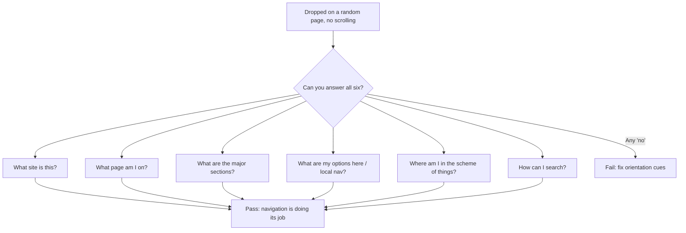

# Don't Make Me Think

Steve Krug's short, plain-spoken field guide to web usability. This synthesis is drawn
from the **"Revisited" edition** (the third edition, © 2014), which keeps the original
1999/2000 book's principles intact and refreshes the examples and mobile coverage. Krug's
argument is that usability isn't about technology; it's about people and how they
understand and use things — and while technology changes fast, people change slowly, so
the fundamentals endure.

## Krug's First Law: "Don't make me think"

The central rule: a page or screen should be **self-evident** — obvious, self-explanatory,
usable without expending conscious thought. The user should not have to puzzle over what
something is, whether it's clickable, where to start, or where they are. Every question a
design forces the user to answer ("Is that a link or just a heading?", "Where do I begin?",
"What did they call that thing?") is a small cognitive tax. Individually tiny, these taxes
compound into friction that drains goodwill and drives people away.

The bar Krug sets: self-evident is the goal; **self-explanatory** (a moment's thought, but
never confusion) is the acceptable fallback. This is the usability sibling of
[keeping code simple](code-simplicity.md) — reduce the mental load required to work with
the thing, and don't make the reader carry complexity you could have removed.

## How people really use the web

Designers imagine users reading pages carefully, weighing options, and choosing the best
path. Reality is the opposite, captured in three behaviors:

- **We scan, we don't read.** People glance over a page hunting for words or cues that
  match what they came to do, and ignore most of the rest.
- **We satisfice, we don't optimize.** Users pick the first reasonable option, not the
  best one. Evaluating every choice is slow and low-reward; guessing is fast and usually
  works, so people click the first plausible thing.
- **We muddle through.** Most people never figure out how things are *intended* to work.
  They form a rough, often wrong, mental model and get by. When something works, they
  rarely stop to understand *why* — so they keep using whatever muddled path they found.

The consequence: design must accommodate scanning, satisficing, muddling users — not the
attentive, rational reader who doesn't exist.

## Designing for scanning ("Billboard Design 101")

Build pages the way good billboards work — readable at a glance, at speed:

- **Create a clear visual hierarchy.** Make importance, grouping, and nesting visible
  through size, weight, indentation, and placement so the structure is grasped before any
  word is read.
- **Take advantage of conventions.** Familiar patterns (logo top-left, search box, cart
  icon, underlined links) let users apply prior experience instead of learning your site.
  Innovate only when the payoff clearly beats the confusion cost; otherwise, be
  conventional.
- **Make clickable things obviously clickable.** Remove ambiguity about what is a control
  and what is decoration.
- **Break pages into clearly defined areas** and **minimize visual noise** so the eye
  isn't fighting clutter.

## Omit needless words

An entire chapter reduced to a rule (a nod to Strunk & White): **get rid of half the words
on each page, then get rid of half of what's left.** Web copy should be scannable, not
prose. Cut "happy talk" (welcome-to-our-site filler) and trim instructions — well-designed
things need few instructions. Less text means less noise, more prominence for what matters,
and shorter pages. This is the writing-side echo of the simplicity theme in
[code simplicity](code-simplicity.md): the best content, like the best code, is the content
that didn't need to exist.

## Navigation and the trunk test

Navigation isn't a feature bolted on; it's a large part of *what the site is*. Persistent
navigation answers, at every moment, the user's standing questions: What site is this?
What page am I on? What are the major sections? Where can I go from here? How do I search?
Krug stresses **"You Are Here" indicators** and **breadcrumbs** to keep users oriented,
since people arrive deep-linked and rarely start at the home page.

His diagnostic is the **trunk test**: imagine being blindfolded, spun around, and dropped
onto a random page of the site (as if in the trunk of a car). Without scrolling, can you
answer — site ID, page name, major sections, local navigation, "you are here," and search?
If not, the navigation is failing.

## The humble usability test

Krug's most practical contribution is demystified, do-it-yourself usability testing —
"usability testing on 10 cents a day":

- **A few users is enough.** Testing with three (up to five) people catches the most
  important problems; you don't need a lab or statistical rigor.
- **Do it early and often.** A morning a month beats one big study at the end. Testing
  early — even on sketches or a competitor's site — is cheaper and more useful than testing
  a finished product too late to change it.
- **Watch, don't ask.** Give a user a realistic task and observe where they hesitate or go
  wrong. Their behavior, not their opinions, is the data.
- **Fix the worst first, and do less.** Resist the urge to fix everything; address the most
  serious problems, and often the fix is *removing* something rather than adding.

Testing also settles unwinnable internal debates ("The Farmer and the Cowman"): instead of
arguing whose taste is right, watch real users and let the evidence decide.

## Accessibility and goodwill

- **Accessibility** is both the right thing to do and good design — making a site work for
  people with disabilities usually makes it clearer for everyone. Krug frames it as
  reachable, not a distant burden.
- **Goodwill is a reservoir.** Every interaction adds to or drains a user's goodwill toward
  your site. Things that fill it: doing what people came to do, being upfront, saving them
  steps, admitting mistakes. Things that drain it: hiding information, burying answers,
  punishing users for not doing things your way, amateurish design. A usable site is, in
  Krug's phrase, a "mensch" — it treats the user as a person deserving courtesy.

## References

- [Don't Make Me Think, Revisited — Steve Krug](https://sensible.com/dont-make-me-think/)
