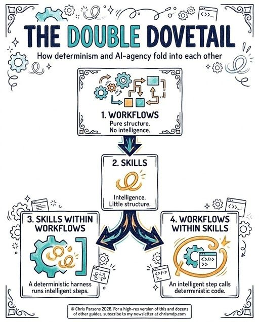

# The Double Dovetail

A diagram (Chris Parsons, 2026) on how **determinism and AI-agency fold into each
other** — the two combine in both directions.

1. **Workflows** — pure structure, no intelligence.
2. **Skills** — intelligence, little structure.
3. **Skills within workflows** — a deterministic harness runs intelligent steps.
4. **Workflows within skills** — an intelligent step calls deterministic code.

The "double dovetail": determinism and agency each nest inside the other. A rigid
workflow can invoke a smart skill at a step; a smart skill can drop into rigid code when
it needs a guaranteed operation.

## Cross-links

The nesting is the practical form of the deterministic-loop idea in
[Engineer the Loop, Not the Prompt](engineer-the-loop.md), and maps onto the
orchestration ↔ verification split in
[Agent Harness Engineering](agent-harness-engineering.md).

## References

- 
