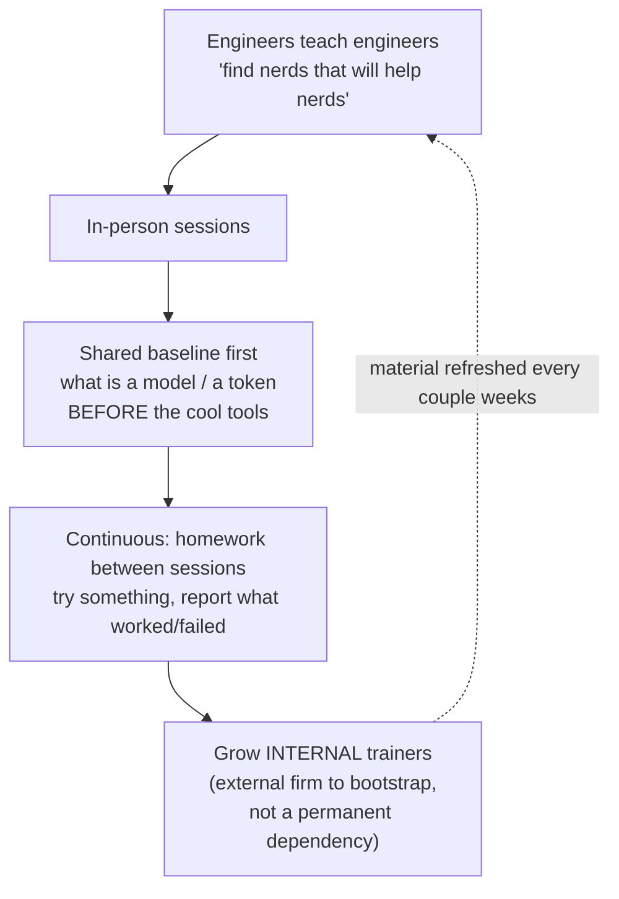

# Driving Adoption

**Buying licenses is not adoption.** Getting AI-enabled engineering to actually
take hold across an org takes **deliberate mechanisms** — engineers training
engineers, internal talks and hackathons that spread practice peer-to-peer, and
most durably **making the *supported* path the *easy* path** so the right way is
also the path of least resistance.

**Mandates underperform proof.** Meta's Ian Thomas: *"code wins argument"* becomes
*"proof wins argument"* — adoption spreads when engineers see colleagues getting
real value, not when leadership decrees it. *"A top-down mandate makes engineers
skeptical."*

## Tools without onboarding make things worse

Handing out tools without onboarding doesn't just stall — it **makes bad
practices worse, faster.** Tomasz Maj's org treated **onboarding, not
enthusiasm**, as the real problem and reached **93% adoption** (6 of ~150 devs
not using AI) by:

## Why it matters: distribution, not procurement

Tool pilots routinely **succeed then stall** — a few enthusiasts get huge value
while everyone else drifts back to old habits. **Adoption is a distribution
problem, not a procurement one.** Orgs that scale it treat enablement as **real
work**: surfacing wins, lowering activation cost, meeting teams where they are.
(Note: adoption is only *activity* — see
[rethinking performance](rethinking-performance.md) for why it's a first
indicator, not the goal.)

## Take resistance seriously

Don't route around it. Cecilia Borg (interim CTO, Acast, 110-person remote-first)
takes **senior-developer backlash seriously** — some skepticism about bloated
code and mounting tech debt is **well earned.** Her playbook — small steps +
guiding principles:

- Give people time to learn a tool that at first *"feels like eating with your
  non-dominant hand."*
- Have EMs **negotiate with product to slow velocity** so teams can run
  hackathons and explore.
- **Don't ship without taming the bots** on testing and review (see
  [automated review & verification](automated-review-verification.md)).

## Related

- [Collaborating with Agents](collaborating-with-agents.md) — norms adopt
  bottom-up; the same "can't force it top-down" lesson.
- [Rethinking Performance](rethinking-performance.md) — adoption is activity;
  contribution is the real signal.
- [Learning the Craft](learning-the-craft.md) — the teaching engine adoption
  runs on.

## References
- [Driving Adoption — Tessl Patterns](https://tessl.io/patterns/scaling-the-org/driving-adoption/)
