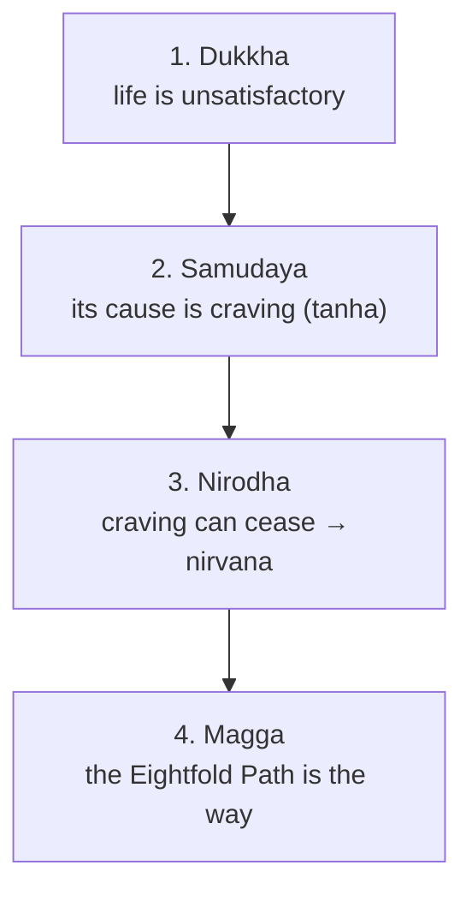

# Buddhism

Buddhism began with the awakening of **Siddhartha Gautama**, the Buddha ("awakened one"), in
northern India around the 5th century BCE. Philosophically it is a *heterodox* Indian tradition: it
keeps the framework of [karma, samsara, and moksha](karma-samsara-and-moksha.md) but rejects Vedic
authority and, most radically, the existence of a permanent self. Its core is intensely practical —
a diagnosis of suffering and a prescription for its end — organized around the **Four Noble Truths**.

## The Four Noble Truths

1. **Dukkha** — existence is marked by suffering / unsatisfactoriness. Not only pain, but the
   subtler dis-ease that even pleasures are impermanent and cannot finally satisfy.
2. **Samudaya** — the origin of dukkha is **craving** (*tanha*) and attachment, rooted in
   ignorance.
3. **Nirodha** — cessation is possible: extinguish craving and dukkha ends. This is **nirvana**.
4. **Magga** — the path to cessation is the **Noble Eightfold Path**.

The structure is famously medical: symptom, diagnosis, prognosis, cure.

## The Eightfold Path

The path is grouped into three trainings — **wisdom** (right view, right intention),
**ethical conduct** (right speech, right action, right livelihood), and **mental discipline**
(right effort, right mindfulness, right concentration). It is a "middle way" between indulgence and
harsh asceticism.

## The three marks of existence

Buddhist metaphysics rests on three characteristics of all conditioned things:

- **Anicca (impermanence)** — everything arises and passes; nothing is static.
- **Dukkha (unsatisfactoriness)** — clinging to the impermanent brings suffering.
- **Anatta (non-self)** — there is **no permanent, unchanging self or soul**. What we call a
  "person" is a bundle of five ever-changing aggregates (*skandhas*: form, sensation, perception,
  mental formations, consciousness). This is Buddhism's most distinctive and radical claim, and the
  direct denial of the Hindu [Atman](hindu-philosophy.md).

## Dependent origination

Underpinning anatta is **dependent origination** (*pratityasamutpada*): everything arises in
dependence on conditions; nothing exists independently or from its own side. There are no
self-standing substances, only a web of mutually conditioning processes. This principle — that to be
is to be *conditioned* — is the philosophical engine later schools (especially
[Madhyamaka](buddhist-schools.md)) develop into the doctrine of **emptiness**. It also explains
rebirth without a soul: a causal continuity of processes, one moment conditioning the next, like a
flame passing from candle to candle.

## Nirvana

**Nirvana** ("blowing out") is the extinguishing of the fires of craving, aversion, and delusion —
the end of suffering and of the [cycle of rebirth](karma-samsara-and-moksha.md). It is not
annihilation of a self (there was no permanent self to annihilate) nor a heavenly place, but a
transformed, unconditioned state of freedom.

## Why it matters

Buddhism is the most globally influential Eastern philosophy and its **anatta** doctrine is one of
the boldest positions in world thought: a fully worked-out account of persons, ethics, and
liberation *without* an enduring self — a live alternative in modern
[philosophy of mind](../philosophy/philosophy-of-mind.md) and cognitive science. From this common
root grew a remarkable diversity of [schools](buddhist-schools.md).

## References

- [The Dhammapada](the-dhammapada.md) — the Buddha's teaching on craving, mind, and the path, in
  verse.
