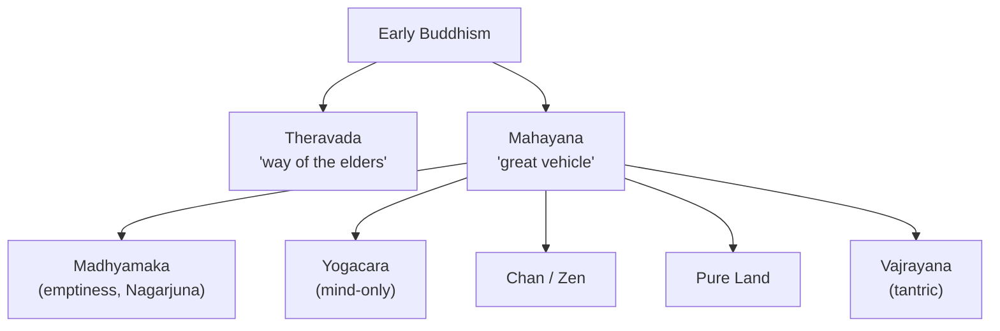

# Buddhist Schools

From the common root of [early Buddhism](buddhism.md) grew a rich diversity of schools, differing
over the goal of practice, the status of scriptures, and — most philosophically — how far to push
the logic of [non-self](buddhism.md) and dependent origination. The broadest division is between
**Theravada** and **Mahayana**, with **Vajrayana** as a third vehicle and **Chan/Zen** as Mahayana's
most distinctive East Asian form.

## The vehicles

- **Theravada** ("way of the elders") — the surviving early school, dominant in Sri Lanka and
  Southeast Asia. Conservative in scripture (the Pali Canon), it centers on the *arhat*: the
  individual who, through ethical discipline and meditation, attains [nirvana](buddhism.md) and
  escapes rebirth.
- **Mahayana** ("great vehicle") — dominant in East Asia (China, Korea, Japan) and Tibet. It
  reorients the goal from personal liberation to the **bodhisattva**: one who vows to attain
  buddhahood *for the sake of all beings*, delaying final nirvana out of compassion. It accepts a
  wider body of scripture and develops the tradition's most ambitious philosophy.
- **Vajrayana** ("diamond vehicle") — a tantric development, prominent in Tibet, using ritual,
  mantra, visualization, and a teacher-lineage as accelerated means to awakening.

## Madhyamaka: the philosophy of emptiness

The most influential Mahayana philosophy, founded by **Nagarjuna** (~2nd c. CE). Its central
concept is **shunyata (emptiness)**: all phenomena are "empty" of *svabhava* — inherent,
independent existence. Nothing exists from its own side; everything is
[dependently originated](buddhism.md), existing only in relation to conditions and to conceptual
designation. Crucially, emptiness is **not nihilism** — it does not say nothing exists, but that
things exist *conventionally*, relationally, not absolutely. Nagarjuna's method is relentlessly
dialectical, using reductio arguments to dismantle every claim to inherent existence, including the
claim of emptiness itself. This yields the **two truths**: conventional truth (the everyday world,
which functions) and ultimate truth (its emptiness).

## Yogacara: mind-only

The other great Mahayana school, **Yogacara** ("yoga practice") or **Cittamatra** ("mind-only"),
emphasizes that our experienced world is a construction of consciousness. It analyzes mind into
layers — including the *alaya-vijnana*, a "storehouse consciousness" carrying karmic seeds — and
holds that liberation involves a transformation at the root of the mind. It leans idealist where
Madhyamaka leans deflationary, and their debate is central to Buddhist philosophy.

## Chan and Zen

**Chan** (China) — from Sanskrit *dhyana*, meditation — fused Mahayana with [Daoist](daoism.md)
sensibilities and became **Zen** in Japan. It de-emphasizes doctrine and scripture in favor of
**direct experiential insight** into one's own nature, transmitted "outside the texts" from master
to student, and cultivated through meditation (*zazen*) and, in the Rinzai line, the **koan** — a
paradoxical prompt that jams discursive thought to provoke sudden awakening (*satori*). Developed
further in [Zen and Japanese philosophy](zen-and-japanese-philosophy.md).

## Why it matters

The Buddhist schools contain some of the most sophisticated metaphysics and philosophy of mind in
any tradition — Madhyamaka's emptiness is a rigorous relational anti-foundationalism, and Yogacara's
analysis of consciousness anticipates debates in [philosophy of mind](../philosophy/philosophy-of-mind.md).
Together they show how much can be built from the single seed of
[dependent origination](buddhism.md).

## References

- [The Dhammapada](the-dhammapada.md) — the shared early-Buddhist ground from which the schools
  diverged.
