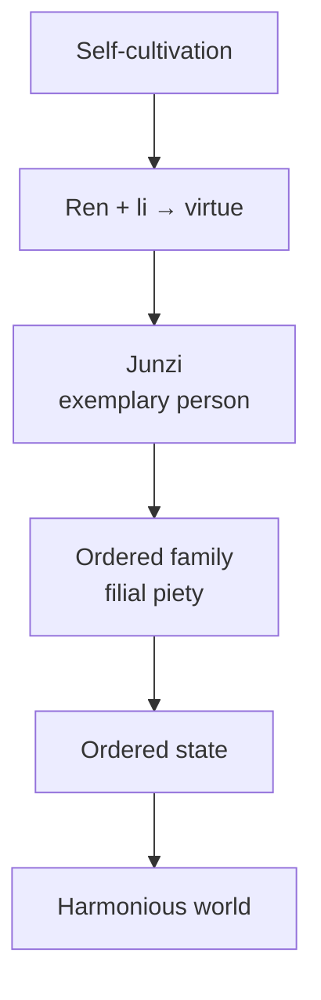

# Confucianism

Confucianism is the ethical and social philosophy founded by **Confucius (Kongzi, 551–479 BCE)** and
developed by successors such as **Mencius** and **Xunzi**. It became the dominant framework of
Chinese, Korean, and much of East Asian civilization for two millennia. Its concern is resolutely
*this-worldly*: not metaphysics or an afterlife, but how to become a good person and build a
harmonious society through the cultivation of **virtue**, **ritual**, and right **relationships**.

## Ren and li

Two concepts anchor the system:

- **Ren** (humaneness, benevolence) — the supreme virtue: a deep, active care for others, the
  full realization of one's humanity. Confucius offers an early statement of the ethic of
  reciprocity — *"do not impose on others what you do not wish for yourself"* — the "Silver Rule."
- **Li** (ritual propriety) — the vast web of rites, manners, roles, and norms that structure
  social life, from ceremony to everyday courtesy. Li is how ren is *expressed and cultivated*:
  practicing proper forms shapes inner character, so etiquette and ethics are continuous. Xunzi
  especially saw li as the civilizing discipline that refines a raw human nature.

## The junzi and self-cultivation

The Confucian ideal is the **junzi** — the "exemplary person" or "gentleman," defined not by birth
but by moral achievement. Through lifelong **self-cultivation** (study, reflection, and the
practice of li), anyone can grow toward virtue. This makes Confucianism a **virtue ethics**, close
in shape to [Aristotle's](../philosophy/ethics.md): the goal is a cultivated character from which
right action flows, not obedience to rules or calculation of outcomes. Supporting virtues include
**yi** (righteousness/appropriateness), **xin** (trustworthiness), and **zhi** (wisdom).

## The five relationships and filial piety

Confucian ethics is relational: the self is constituted by its bonds, and morality begins at home.
Society is ordered by **five key relationships**, most hierarchical and reciprocal — ruler–subject,
parent–child, husband–wife, elder–younger sibling, friend–friend. The keystone is **xiao (filial
piety)**: reverence and care for one's parents and ancestors, the training ground of all wider
virtue. Harmony arises when each party fulfills the duties of their role.

## Rectification of names

A characteristic doctrine: **zhengming**, the "rectification of names." Social disorder springs from
a gap between names and realities — when a "ruler" does not act as a ruler should, or a "father" not
as a father. Setting society right therefore requires that people *live up to the roles their names
name*: "Let the ruler be a ruler, the father a father, the son a son." Language, ethics, and
political order are bound together.

The chain — cultivate the self, then the family is ordered, then the state, then the world — is the
core of the Confucian political vision: good government flows outward from personal virtue, and
rulers should lead by moral example rather than by force (the contrast with
[Legalism](mohism-and-legalism.md)).

## Why it matters

Confucianism is the most influential ethical tradition in East Asian history and a fully developed
**relational virtue ethics** — a picture of the good life built on character, ritual, and the bonds
between people rather than on rules, rights, or utility. Its debates (is human nature good, as
Mencius held, or in need of discipline, as Xunzi held?) and its later revival as
[Neo-Confucianism](neo-confucianism.md) shaped a civilization.

## References

- [The Analects](the-analects.md) — the sayings of Confucius, the foundational Confucian text.
