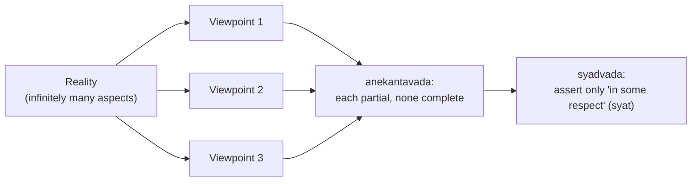

# Jainism

Jainism is an ancient [heterodox](what-is-eastern-philosophy.md) Indian tradition, systematized by
**Mahavira** (~6th–5th c. BCE, a contemporary of the Buddha) but understood by its followers as far
older, taught by a lineage of 24 *tirthankaras* ("ford-makers"). Like [Buddhism](buddhism.md) it
rejects Vedic authority and shares the [karma–samsara–moksha](karma-samsara-and-moksha.md) framework,
but it takes a strikingly different metaphysical route: a real, eternal soul weighed down by karma
conceived as literal **matter**, escaped through radical non-violence and asceticism.

## Souls, matter, and karma

Jain metaphysics is pluralist and realist. Reality contains innumerable eternal **souls (jiva)**,
each intrinsically possessing infinite consciousness and bliss, plus non-living substances
(**ajiva**) including matter, space, time, and the media of motion and rest. Uniquely, Jainism
treats **karma as a subtle physical substance**: passionate, harmful, or attached action literally
draws karmic particles that stick to the soul, obscuring its innate luminosity and binding it to
[rebirth](karma-samsara-and-moksha.md). **Liberation (moksha/kevala)** is achieved by *stopping* the
inflow of new karma and *burning off* the accumulated stock through discipline — after which the
purified, omniscient soul rises free of the cycle forever.

## The great vow: ahimsa

The supreme Jain principle is **ahimsa** — non-violence, non-harm to *any* living being, held more
stringently than in any other tradition because every jiva, down to microorganisms and (in Jain
biology) even plants and elemental beings, has a soul. Ahimsa drives Jain vegetarianism, occupations
that minimize harm, practices like sweeping one's path and filtering water, and, for ascetics,
extraordinary care not to injure life. Jain ahimsa profoundly influenced the wider Indian ethic and,
through it, **Gandhi's** philosophy of non-violent resistance.

## Anekantavada: many-sidedness

Jainism's distinctive contribution to epistemology is **anekantavada**, the doctrine of the
"many-sidedness" of reality: any object has infinite aspects, and no single, partial viewpoint
grasps the whole truth. The classic illustration is the **blind men and the elephant** — each
touches one part and mistakes it for the whole. From this follows **syadvada**, the logic of
qualified assertion: every claim should be prefixed with *syat* ("in some respect," "from a certain
standpoint"), yielding a sevenfold scheme of conditional predications (it is; it is not; it is and
is not; it is inexpressible; and combinations). This is a principled **perspectival pluralism** — a
built-in intellectual humility and non-absolutism, the epistemic counterpart of ahimsa's
non-violence toward beings.

## The path

Liberation follows the **three jewels**: right faith, right knowledge, and right conduct — the last
codified in vows (non-violence, truthfulness, non-stealing, chastity, non-attachment), practiced
moderately by laypeople and rigorously by ascetics, whose austerities aim to shed karmic matter.

## Why it matters

Jainism offers a unique combination: a *physical* theory of karma, one of the world's most rigorous
ethics of non-violence, and in **anekantavada/syadvada** a rare formal doctrine of perspectivism and
intellectual humility — the claim that truth is many-sided and every assertion standpoint-relative.
It stands beside [Buddhism](buddhism.md) as the other great heterodox alternative to
[Vedic orthodoxy](hindu-philosophy.md), agreeing on liberation but disagreeing about the self.

## References

- [The Upanishads](the-upanishads.md) — the orthodox view of the self that Jainism (like Buddhism)
  formed in dialogue and dispute with.
