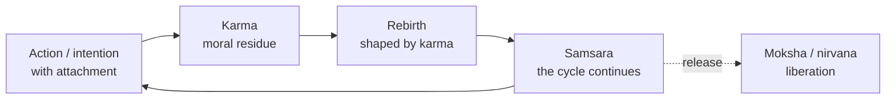

# Karma, Samsara, and Moksha

Three linked ideas form the shared framework of nearly all Indian philosophy — Hindu, Buddhist, and
Jain alike. Together they diagnose the human predicament and prescribe its cure: bound by **karma**
to the cycle of **samsara**, the goal is release, **moksha**. The traditions disagree sharply about
the metaphysics — especially about *what*, if anything, is reborn — but they inherit this common
grammar.

## The cycle

- **Karma** — literally "action." The principle that morally weighted actions (and, in most
  traditions, the *intentions* behind them) produce consequences that shape one's future, in this
  life and the next. It is not fate imposed from outside but a law of moral causation: one reaps
  what one sows. Karma is what *binds*.
- **Samsara** — the beginningless cycle of birth, death, and rebirth (transmigration). Driven by
  karma and by craving/ignorance, beings wander through countless lives across the moral hierarchy
  of existence. Samsara is characterized by impermanence and, ultimately, by unsatisfactoriness —
  even pleasant lives end and recur.
- **Moksha** (Hindu/Jain) / **nirvana** (Buddhist) — liberation: the end of the cycle, release from
  karmic bondage and rebirth. This, not a better rebirth, is the highest goal.

## Dharma: the moral order

Woven through the framework is **dharma** — cosmic and moral order, and one's duty within it. Living
according to dharma generates good karma and a better position within samsara; but dharma alone
keeps one *inside* the cycle. Liberation requires more than good conduct — it requires uprooting the
ignorance or craving that keeps the wheel turning (see the [Bhagavad Gita's](the-bhagavad-gita.md)
teaching of acting from duty *without attachment to results*).

## Where the traditions diverge

The common framework hides a deep disagreement about the self:

- **Hindu** ([Vedanta](hindu-philosophy.md)) — a permanent self, **Atman**, transmigrates;
  liberation is realizing its identity with **Brahman**.
- **Buddhist** ([anatta](buddhism.md)) — there is **no** permanent self to transmigrate. What
  continues is a causal stream of ever-changing processes; rebirth is like one flame lighting the
  next, continuity without an enduring entity. Nirvana is the extinguishing of craving.
- **Jain** ([Jainism](jainism.md)) — the soul (*jiva*) is real and literally weighed down by karma
  conceived as a **subtle matter** that clings to it; liberation is burning off that accumulated
  karmic matter through asceticism and non-violence.

## Why it matters

This framework reframes the basic ethical and existential question. Where much Western thought asks
how to live *one* life well, the Indian traditions set the individual life against a vast horizon of
many lives and ask how to get *free* altogether. Understanding karma–samsara–moksha is the key that
unlocks [Hindu](hindu-philosophy.md), [Buddhist](buddhism.md), and [Jain](jainism.md) philosophy at
once — and understanding their disagreement over the reborn self is the key to telling them apart.

## References

- [The Bhagavad Gita](the-bhagavad-gita.md) — karma yoga: right action without attachment to its
  fruits.
- [The Dhammapada](the-dhammapada.md) — the Buddhist reading of action, consequence, and release.
