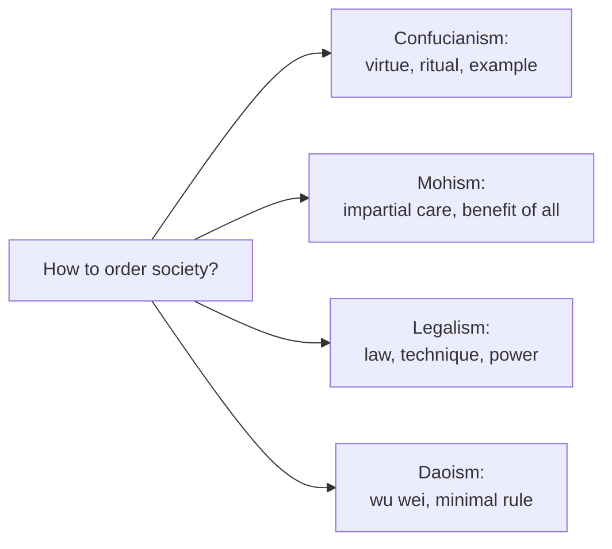

# Mohism and Legalism

[Confucianism](confucianism.md) and [Daoism](daoism.md) were only two of the **Hundred Schools of
Thought** that flourished during China's Warring States period (~475–221 BCE). Two others were, in
their day, at least as influential: **Mohism**, the great utilitarian and universalist rival to
Confucius, and **Legalism**, the hard-nosed statecraft that actually unified China. Together they
round out the classical Chinese debate over ethics and the state.

## Mohism

Founded by **Mozi (Mo Di, ~470–391 BCE)**, Mohism was Confucianism's chief early competitor. Its
central doctrine is **jian ai — "impartial care" or universal love**: one should care for all people
equally, not more for one's own family and state than for strangers. This is a direct attack on the
[Confucian](confucianism.md) idea of *graded love* (deeper obligation to kin), which Mohists blamed
for partiality, conflict, and war.

Mohism is strikingly **consequentialist and quasi-utilitarian**: actions and institutions are judged
by whether they promote the *benefit* of all — concretely, wealth, population, and order — and Mozi
condemned anything that failed this test as wasteful. On these grounds he attacked offensive warfare
(and the Mohists organized skilled *defensive* military aid to besieged states), elaborate funerals,
and expensive music and ritual as drains on the common good. Methodologically the Mohists were
unusually rigorous, developing standards ("the three tests") for evaluating doctrines and pioneering
Chinese work in logic, language, and even optics and geometry. This ethic — impartial, outcome-based,
argumentative — is the closest classical China came to Western
[utilitarianism](../philosophy/ethics.md).

## Legalism

**Legalism (fajia)**, synthesized by **Han Feizi** (d. 233 BCE) drawing on statesmen like Shang Yang
and administrators like Shen Buhai, rejected the moralism of both Confucians and Mohists. Its premise
is bleak: people are motivated by self-interest and fear, not virtue, so a state cannot rely on the
goodness of rulers or the ritual cultivation of subjects. Order must instead rest on impersonal
**institutions**:

- **Fa (law)** — clear, public, uniformly applied laws with strict rewards and (especially)
  punishments, so that behavior is shaped by predictable consequences rather than by character.
- **Shu (technique/method)** — the administrative arts by which a ruler controls officials, checks
  performance against claims, and prevents being manipulated.
- **Shi (position/power)** — the authority of the office itself; it is the position, not the
  person's virtue, that commands obedience.

Legalism explicitly *distrusts* the [Confucian](confucianism.md) faith in leading by moral example.
It provided the ideology for the **Qin** state that unified China in 221 BCE — brutally effective and
short-lived; the Qin's harshness discredited overt Legalism, but its machinery of centralized,
law-based administration was quietly absorbed into every later dynasty.

## Why it matters

Mohism and Legalism complete the classical Chinese argument about ethics and government, and they map
onto tensions still central to political philosophy: **impartial universal benefit vs. special
obligations to one's own** (Mohism vs. Confucianism), and **rule by virtue vs. rule by law and
incentive** (Confucianism vs. Legalism). Though neither survived as an independent school, Legalist
statecraft shaped the actual structure of the Chinese state, and Mohism's rigorous, impartial
consequentialism remains a road not taken in East Asian ethics — see the wider
[Western ethics](../philosophy/ethics.md) parallels.

## References

- [The Analects](the-analects.md) — the Confucian position Mohists and Legalists defined themselves
  against.
