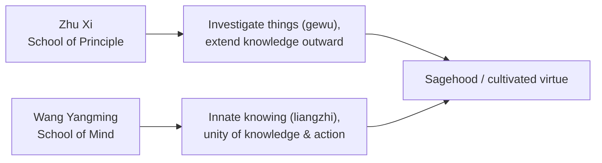

# Neo-Confucianism

Neo-Confucianism is the great revival and metaphysical deepening of [Confucianism](confucianism.md)
that took shape in the **Song dynasty (960–1279)** and dominated Chinese, Korean, and Japanese
intellectual life into the modern era. Responding to the metaphysical sophistication of
[Buddhism](buddhist-schools.md) and [Daoism](daoism.md) — which classical Confucianism lacked — it
supplied Confucian ethics with a full cosmology and theory of mind, while reasserting engagement with
the world against Buddhist "world-denial."

## The core concepts: li and qi

Neo-Confucian metaphysics rests on a pair:

- **Li** (principle/pattern) — the rational, normative structure underlying all things; the "way
  things ought to be," present in everything as its inner pattern. There is one universal Li,
  manifest in the specific principle of each thing.
- **Qi** ([vital force/material](yin-yang-and-chinese-cosmology.md)) — the stuff that things are made
  of, the energy-matter that li organizes into concrete existence.

Everything is li *embodied in* qi. Human beings share the perfect universal principle, but our
individual **qi-endowment** is more or less clear or turbid — which explains why all have the
capacity for sagehood yet differ in how easily they realize it. Moral cultivation is the work of
clarifying one's qi so the innate principle can shine through.

## Zhu Xi and the investigation of things

**Zhu Xi (1130–1200)** synthesized the tradition into the orthodoxy that anchored China's civil
service examinations for centuries. His program of self-cultivation centered on **gewu — "the
investigation of things"**: by carefully studying the principle (li) in things, texts, and affairs,
one gradually **extends knowledge** and illuminates the principle within oneself. Sagehood is reached
through disciplined study, reverent attention (*jing*), and the steady clarification of character —
an outward-looking, scholarly path.

## Wang Yangming and the unity of knowledge and action

**Wang Yangming (1472–1529)** led the rival **School of Mind (xinxue)** against Zhu Xi's **School of
Principle**. His claims:

- **Li is in the mind, not out in things.** One need not investigate external objects endlessly;
  principle is fully present in the **innate moral knowing (liangzhi)** of one's own mind. Cultivation
  is turning inward to recover and trust this innate knowledge.
- **The unity of knowledge and action (zhixing heyi).** To truly *know* the good and not *do* it is
  not real knowledge — genuine moral knowledge already contains its enactment. Knowing and doing are
  two aspects of one process, not separate steps.

## Why it matters

Neo-Confucianism gave Confucian ethics the metaphysical depth it had lacked, framing self-cultivation
as the alignment of one's embodied nature (qi) with universal principle (li). Its internal debate —
**Zhu Xi's outward investigation vs. Wang Yangming's inner knowing**, and Wang's insistence on the
**unity of knowledge and action** — is one of the richest in East Asian philosophy, with clear
parallels to Western debates over moral knowledge and *akrasia* (weakness of will). It shaped
governance, education, and ethics across East Asia and remained the reigning framework until the
twentieth century.

## References

- [The Analects](the-analects.md) — the classical Confucian source Neo-Confucians reinterpreted
  through the metaphysics of li and qi.
