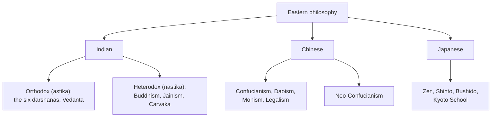

# What Is Eastern Philosophy

"Eastern philosophy" is an umbrella — coined largely from the outside — for the major
philosophical traditions that arose in Asia, principally in **India**, **China**, and **Japan**.
The label groups together traditions that differ from one another as much as any differs from the
West, so it is best treated as a rough geographic convenience, not a single system. What the
traditions do tend to share is a distinctive *orientation*: philosophy is pursued not only to know
the truth but to be **transformed** by it.

## Philosophy as a way of life

In the dominant Eastern traditions, the test of a philosophy is existential, not merely
theoretical. Indian systems aim at **liberation** (*moksha*, *nirvana*) from suffering and the
cycle of rebirth; Chinese systems aim at **sagehood** and social harmony — becoming the
[Confucian](confucianism.md) *junzi* or the [Daoist](daoism.md) sage who moves with the Way.
Argument, analysis, and rigorous debate are all present (Indian logic and
[Buddhist](buddhist-schools.md) philosophy of language are highly technical), but they serve
transformation. This is less alien to the West than it sounds — the ancient
[Stoics and Epicureans](../philosophy/index.md) also treated philosophy as a way of life — but it
is more central and more continuous in the East.

## The two great streams

- The **Indian** stream is organized by its relationship to the **Vedas**. *Astika* ("orthodox")
  schools accept Vedic authority — the six classical *darshanas*, of which
  [Vedanta](hindu-philosophy.md) became dominant. *Nastika* ("heterodox") schools reject it:
  [Buddhism](buddhism.md), [Jainism](jainism.md), and the materialist **Carvaka** (which denied
  karma, rebirth, and the soul entirely). Almost all share the framework of
  [karma, samsara, and moksha](karma-samsara-and-moksha.md) — Carvaka being the sharp exception.
- The **Chinese** stream crystallized in the "**Hundred Schools of Thought**" of the Warring
  States period — [Confucianism](confucianism.md), [Daoism](daoism.md), and
  [Mohism and Legalism](mohism-and-legalism.md) chief among them — sharing a
  [correlative cosmology](yin-yang-and-chinese-cosmology.md) of yin-yang and *qi* rather than a
  creator God, and centrally concerned with ethics, society, and how to live.
- The **Japanese** stream absorbed and reworked Chinese and Indian imports — Buddhism became
  [Zen](zen-and-japanese-philosophy.md), Confucianism shaped ethics and governance — alongside
  native Shinto and a rich tradition of aesthetics.

## Recurring themes

Across the differences, several concerns recur: the nature of the **self** (the Hindu *Atman*
versus the Buddhist *anatta*, "non-self" — see [self and non-self](eastern-and-western-philosophy-compared.md)),
**non-attachment** and the diagnosis of suffering, **harmony** with a natural or cosmic order, and
**self-cultivation** through practice (meditation, ritual, discipline) rather than doctrine alone.

## Why it matters

Eastern philosophy supplies rigorously developed alternatives to assumptions the Western canon
often takes for granted — that there is a permanent self, that reality is best carved into
substances, that ethics is primarily about rules or outcomes rather than character and harmony. Set
beside the [Western tradition](../philosophy/index.md), it widens the space of live options for the
oldest questions, which the rest of this folder explores tradition by tradition.

## References

- [The Upanishads](the-upanishads.md) — the philosophical seedbed of the Indian orthodox stream.
- [The Analects](the-analects.md) — the founding text of the Chinese ethical tradition.
