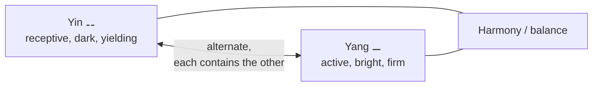

# Yin-Yang and Chinese Cosmology

Beneath the ethical debates of [Confucians](confucianism.md), [Daoists](daoism.md), and the other
Hundred Schools lies a shared background picture of how the cosmos works — a **correlative
cosmology** built on **yin-yang**, the **five phases (wu xing)**, and **qi**. Rather than a creator
God imposing order from outside, the Chinese traditions see a self-generating, self-regulating
cosmos of interacting forces, an organism rather than a mechanism.

## Yin and yang

**Yin** and **yang** are complementary, interdependent polarities whose interplay generates and
governs all change. Yin is the receptive, dark, yielding, cool, inward pole; yang the active, bright,
firm, warm, outward pole. Crucially they are **relational and dynamic**, not a dualism of good and
evil:

- **Mutually defining** — each has meaning only against the other (there is no "high" without "low").
- **Mutually generating and containing** — each carries the seed of the other (the dot of the
  opposite color in each half of the *taijitu* symbol), and at its extreme turns into its opposite:
  deepest winter yields to spring, high noon begins the decline into night.
- **Ceaselessly alternating** — reality is process, a rhythmic waxing and waning rather than static
  being. Balance, not the victory of one pole, is the ideal.

## The five phases (wu xing)

A second scheme analyzes change into **five phases** — **wood, fire, earth, metal, water** — dynamic
agents (not static "elements") that generate and overcome one another in fixed cycles: the
*generating* cycle (wood feeds fire, fire makes ash/earth, earth bears metal, metal collects water,
water grows wood) and the *overcoming* cycle (water quenches fire, fire melts metal, and so on). The
five phases were mapped onto seasons, directions, colors, organs, tastes, and emotions, producing a
vast **web of correspondences** used to make sense of nature, the body, and society as one integrated
system — the theoretical basis of traditional Chinese medicine, alchemy, and much else.

## Qi

**Qi** is the vital energy, breath, or material-force that pervades and constitutes everything;
yin-yang and the five phases are patterns of its movement and configuration. The condensation and
dispersal of qi accounts for how things form, flourish, and dissolve. Qi later becomes a central
metaphysical term in [Neo-Confucianism](neo-confucianism.md), paired with *li* (principle/pattern).

## The I Ching

The **I Ching (Yijing, "Book of Changes")** is the ancient divinatory and philosophical classic that
systematizes this worldview. It builds from broken (yin) and unbroken (yang) lines into eight
**trigrams** and their sixty-four **hexagrams**, each representing a configuration of forces and a
moment in the ceaseless flow of change. Consulted for guidance and studied as philosophy (a core
Confucian classic), it encodes the conviction that reality is *transformation* patterned by the
interplay of yin and yang.

## Why it matters

This correlative cosmology is the shared substrate of Chinese thought: it explains why so many
traditions prize **balance, timing, and harmony with a natural order** rather than domination of
nature, and why change and relationship — not fixed substances — are the basic categories. It is
the cosmological counterpart of [Daoist](daoism.md) wu wei and a striking non-Western alternative to
the substance-and-cause metaphysics of the [Greek tradition](../philosophy/metaphysics.md); it also
resonates with modern [systems thinking](../systems-thinking/index.md).

## References

- [The Dao De Jing](the-dao-de-jing.md) — the classic expression of moving with the natural
  alternation of opposites.
