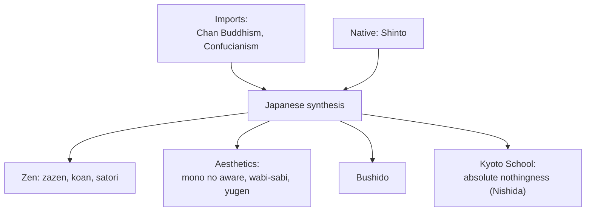

# Zen and Japanese Philosophy

Japan absorbed Chinese and Indian thought and transformed it into something distinctively its own.
The best-known result is **Zen** — the Japanese form of [Chan Buddhism](buddhist-schools.md) — but
Japanese philosophy also includes the native **Shinto** sensibility, the warrior ethic **Bushido**, a
profound tradition of **aesthetics**, and, in the twentieth century, the **Kyoto School's** original
synthesis of East and West.

## Zen

**Zen** (from Chinese *Chan*, ultimately Sanskrit *dhyana*, "meditation") is Mahayana Buddhism
stripped toward its experiential core. Its stance:

- **Direct pointing, beyond words and texts.** Awakening is a matter of *seeing* one's own true
  nature directly, not of doctrine or scripture. Truth is transmitted "mind to mind" through a
  lineage of masters.
- **Zazen** — seated meditation is the central practice, the very form of enacted awakening rather
  than a mere means to it (especially in the **Soto** school of Dogen).
- **The koan** — in the **Rinzai** school, a paradoxical question or story ("What is the sound of one
  hand?") that frustrates ordinary discursive reasoning until it gives way to **satori**, a sudden
  intuitive realization. The koan is a tool for breaking the grip of conceptual thought.

Zen fused Buddhist [emptiness](buddhist-schools.md) with [Daoist](daoism.md) naturalness and
spontaneity, and it flowered in Japanese culture far beyond the monastery — shaping the tea ceremony,
garden design, calligraphy, archery, and swordsmanship, each pursued as a discipline of presence.

## Japanese aesthetics

Japanese thought is unusually rich in **aesthetic concepts that are also existential and spiritual**:

- **Mono no aware** — the poignant, tender awareness of the impermanence of things; beauty
  intensified by transience (the falling cherry blossom).
- **Wabi-sabi** — the beauty of the imperfect, impermanent, humble, and incomplete; the weathered,
  the asymmetrical, the plain.
- **Yugen** — a profound, mysterious sense of the depth of the world, beyond what can be said.

These make [impermanence](buddhism.md) — the Buddhist *anicca* — not a problem to escape but a source
of beauty to be felt.

## Shinto and Bushido

- **Shinto** ("way of the kami") — Japan's indigenous tradition: a sensibility of reverence for
  **kami**, the sacred presences in nature, ancestors, and striking places, with an emphasis on
  purity, ritual, and harmony with the natural world rather than doctrine.
- **Bushido** ("way of the warrior") — the ethical code of the samurai, blending
  [Confucian](confucianism.md) loyalty and duty, Zen equanimity in the face of death, and Shinto
  purity into an ethic of honor, discipline, and self-mastery.

## The Kyoto School

In the twentieth century, the **Kyoto School** — led by **Nishida Kitaro** — created a rigorous
modern philosophy engaging Western thought (Kant, Hegel, phenomenology) from a Zen-Buddhist ground.
Nishida's key notion, **absolute nothingness (mu)**, reworks Buddhist [emptiness](buddhist-schools.md)
into a metaphysical starting point that contrasts with the West's grounding in **being** — arguing
that reality is best understood not from substance but from a prior "nothingness" or "pure
experience." The Kyoto School is a landmark of genuine cross-cultural philosophy.

## Why it matters

Japanese philosophy shows a tradition **receiving and transforming** rather than merely inheriting —
turning Buddhist impermanence into an aesthetics of beauty, meditation into disciplines of everyday
art, and, in the Kyoto School, staging one of the most serious East–West philosophical encounters of
the modern age. Zen in particular has become the most globally recognized face of
[Buddhist](buddhism.md) practice.

## References

- [The Zhuangzi](the-zhuangzi.md) — the Daoist spontaneity and skepticism toward language that fed
  into Chan/Zen.
