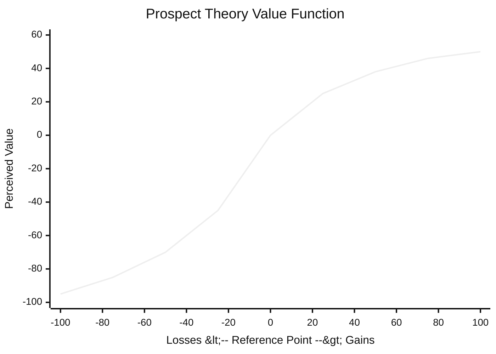

# Behavioral Economics

Behavioral economics is what happens when you take the psychology of real decision-makers
seriously instead of assuming perfect rationality. Classical
[microeconomics](microeconomics.md) models people as *homo economicus*: consistent,
self-interested, unlimited computing power, perfectly weighing costs against benefits as
in [marginal-thinking-and-incentives](marginal-thinking-and-incentives.md). Behavioral
economics keeps the tools but replaces that agent with a human one — systematically,
predictably imperfect.

## Bounded rationality

Herbert Simon's **bounded rationality** is the starting point: real agents have limited
time, attention, and cognitive capacity, so they do not optimise — they **satisfice**,
picking the first option that is good enough. Given that constraint, the mind leans on
fast mental shortcuts. Kahneman's framing of **two systems** captures it: *System 1* is
fast, automatic, intuitive; *System 2* is slow, effortful, deliberate. Most decisions run
on System 1, and that is where the predictable errors live
([kahneman-thinking-fast-and-slow](kahneman-thinking-fast-and-slow.md)).

## Heuristics and biases

Kahneman and Tversky catalogued the shortcuts (heuristics) and the systematic errors
(biases) they produce:

- **Anchoring** — an initial number contaminates later estimates, even when it is
  arbitrary. First offers, list prices, and default settings all exploit it.
- **Availability** — we judge probability by how easily examples come to mind, so vivid
  or recent events feel more likely than they are (people fear plane crashes, not car
  crashes).
- **Framing** — the *same* choice presented differently yields different decisions.
  "90% survival" and "10% mortality" are identical facts and unequal persuaders.
- **Representativeness, confirmation bias, overconfidence** — and dozens more, all
  departures from the consistency the rational model assumes.

These are not random noise. Because they are *systematic*, they are predictable, and
therefore modellable — which is what makes behavioral economics a science rather than a
list of anecdotes. The empirical study of these effects leans on the same inferential
machinery as [../statistics/index.md](../statistics/index.md).

## Prospect theory and loss aversion

Kahneman and Tversky's **prospect theory** replaced expected-utility theory as a
*descriptive* account of choice under risk. Its core departures:

- People evaluate outcomes as **gains and losses relative to a reference point**, not as
  final wealth levels.
- **Loss aversion**: losses hurt roughly twice as much as equivalent gains feel good.
- The **value function** is concave for gains and convex for losses (risk-averse when
  ahead, risk-seeking when behind), and it is steeper on the loss side.
- People **overweight small probabilities** and underweight moderate ones — why lotteries
  and insurance both sell.

The kink at the reference point is loss aversion: the curve drops far more steeply into
losses than it rises into gains.

## Nudges and choice architecture

If people rely on System 1 and defaults, then *how* choices are presented — the **choice
architecture** — shapes outcomes without restricting freedom. Thaler and Sunstein's
**nudge** is a change to that architecture that steers behaviour while leaving all options
open. The canonical example: switching retirement savings from opt-in to opt-out
(automatic enrolment) massively raises participation, because inertia now works *for*
saving instead of against it. Nudges are policy that respects the real cognitive agent.

## Why it matters — and the AI ties

Behavioral economics reshaped policy (behavioural insight teams in governments),
finance (behavioural finance explains bubbles and momentum that efficient-markets theory
cannot), and product design. For AI specifically:

- **Models trained on human data inherit human biases.** A model fit to human choices or
  text learns anchoring, framing, and stereotype-laden shortcuts along with everything
  else — the descriptive side of behavioral economics becomes a bias-audit checklist for
  ML systems.
- **Human-in-the-loop and RLHF.** When a model is tuned to human preferences, it is
  optimising a target generated by boundedly rational, loss-averse raters — their framing
  effects propagate into the model's behaviour.
- **Recommendation and interface design** are choice architecture at industrial scale;
  the defaults and framings an AI product ships are nudges whether or not they are
  designed as such. This mindset connects to the growth-vs-fixed framing in
  [../personal-development/mindset-dweck.md](../personal-development/mindset-dweck.md):
  how a situation is framed changes how an agent — human or trained-on-humans — responds.

## References

- [Thinking, Fast and Slow](kahneman-thinking-fast-and-slow.md) — Kahneman's synthesis of
  the two-system view, heuristics and biases, and prospect theory.
