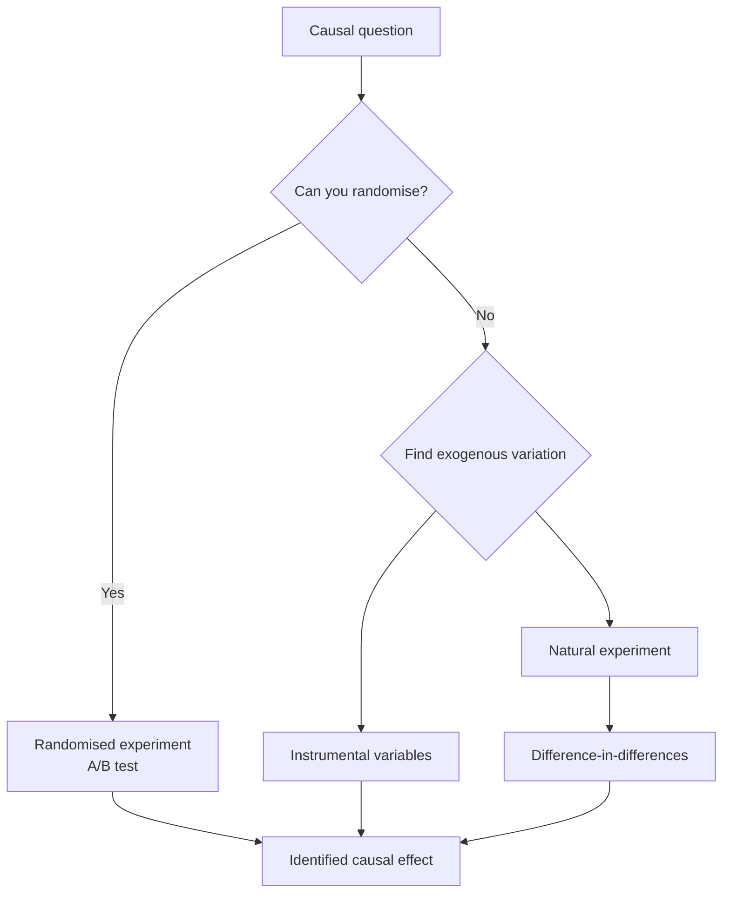

# Econometrics

Econometrics is the discipline of measuring economic relationships from data — turning
the qualitative claims of [microeconomics](microeconomics.md) and
[macroeconomics](macroeconomics.md) into numbers with error bars. But its defining
problem is not measurement; it is **causation**. Economists rarely get to run clean
experiments, yet almost every question they care about is causal: *Does* more schooling
raise wages? *Does* a minimum wage cost jobs? Econometrics is the toolkit for extracting
causal answers from observational data that was never designed to give them.

## Regression as the workhorse

The core tool is **regression**, the same machinery covered in
[../statistics/regression.md](../statistics/regression.md): fit a line (or hyperplane)
relating an outcome to explanatory variables, and read off the coefficients. In a wage
equation, the coefficient on years of schooling is the estimated change in log wage per
extra year. The mechanics are shared with statistics; what econometrics adds is a fierce
insistence on what a coefficient is *allowed to mean*.

## The identification problem: endogeneity

A regression coefficient is only the *causal* effect if the explanatory variable is
**exogenous** — uncorrelated with everything else that affects the outcome. When it is
not, the variable is **endogenous**, and the estimate is biased. Three classic sources:

- **Omitted-variable bias.** Schooling correlates with unobserved ability, which also
  raises wages, so the schooling coefficient absorbs ability's effect.
- **Reverse causality.** Do police reduce crime, or do high-crime cities hire more police?
- **Selection.** People who choose treatment differ from those who don't.

This is exactly the confounding problem of
[../statistics/causal-inference.md](../statistics/causal-inference.md). Econometrics is,
in large part, the economist's dialect of causal inference — and the reason correlation
and causation must never be conflated. The word for pinning down a genuine causal effect
is **identification**: you have *identified* an effect when the research design rules out
the alternative explanations.

## Tools of identification

- **Instrumental variables (IV).** Find an *instrument*: a variable that shifts the
  endogenous regressor but affects the outcome *only through* it. Distance to a college
  affects schooling but not wages directly, so it isolates the exogenous part of
  schooling. IV trades bias for variance to recover a causal slope.
- **Natural experiments.** Exploit an accident of history, policy, or geography that
  assigned treatment *as if* at random — a lottery, a sharp border, an eligibility
  cutoff.
- **Difference-in-differences (DiD).** Compare the *change* in a treated group to the
  *change* in an untreated control group over the same period. Card and Krueger's minimum-
  wage study — comparing New Jersey (raised wage) to neighbouring Pennsylvania (didn't) —
  is the archetype. Subtracting out the common trend nets out confounders that are stable
  over time.

## The credibility revolution

Through the 1980s, econometrics leaned on large structural models whose causal claims
rested on strong, often untestable assumptions. The **credibility revolution** (Angrist,
Card, Krueger, Imbens, and others; recognised with Nobel prizes) shifted the field toward
**design-based** identification: treat a research design like an experiment, be explicit
about the source of exogenous variation, and prefer a transparent local answer over a
fragile global one. This is the same logic that governs
[../statistics/experimental-design-and-ab-testing.md](../statistics/experimental-design-and-ab-testing.md) —
randomisation, or something that mimics it, is what licenses a causal claim.

## Why it matters — and the AI ties

Econometrics is the empirical conscience of economics: it is how a theory earns the right
to be believed, and how policy is (sometimes) held to evidence. For AI and data work:

- **Prediction is not the same as causation.** A [../ai/machine-learning.md](../ai/machine-learning.md)
  model can predict who churns with high accuracy yet be useless for deciding *what
  intervention* reduces churn — that is a causal question, and only an econometric or
  experimental design answers it. This distinction is the single most common analytical
  error in applied ML.
- **A/B testing is econometrics in production.** The experiment engines behind every large
  tech product are randomised trials whose analysis is regression with treatment dummies.
- **ML meets causal inference.** Modern methods (double/debiased machine learning, causal
  forests) use ML for flexible *nuisance* estimation while preserving econometric
  identification for the causal *parameter* — the fusion of the two fields.

## References

- [Introductory Econometrics: A Modern Approach](wooldridge-introductory-econometrics.md)
  — Wooldridge's standard text on regression, endogeneity, IV, and panel methods.
