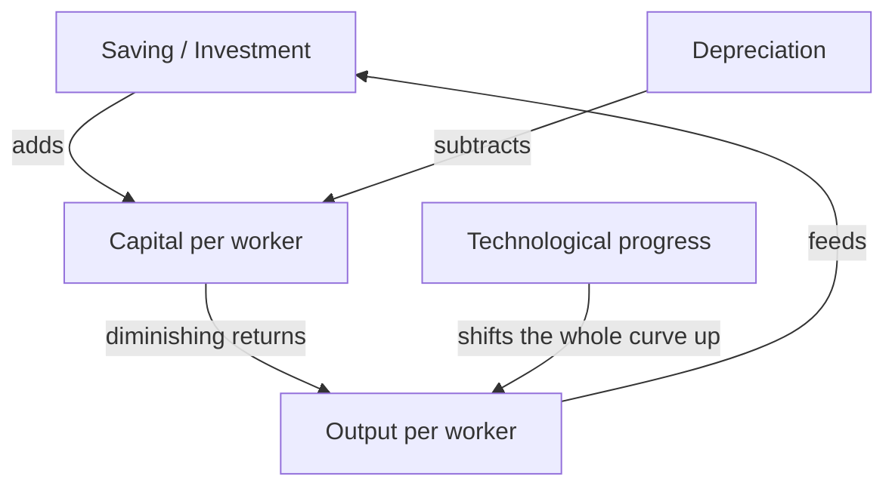

# Economic Growth

Economic growth is the sustained increase in an economy's capacity to produce goods and
services — usually tracked as growth in real GDP per person, the closest single measure of
rising material living standards. It is arguably the most consequential question in
economics: the difference between a country that grows 1% a year and one that grows 3% is,
compounded over a lifetime, the difference between stagnation and transformation. This note
covers the ingredients of growth and why the effect *compounds*. It builds on
[macroeconomics](macroeconomics.md) (growth is the trend the [business
cycle](macroeconomics.md) fluctuates around) and traces back to
[Adam Smith](smith-wealth-of-nations.md), whose division of labor was the first great theory
of productivity, and to [Mankiw's *Principles*](mankiw-principles-of-economics.md).

## Why compounding is the whole story

Growth compounds, and compounding is not intuitive. At 2% annual growth an economy doubles
in ~35 years; at 7% it doubles in ~10. The **rule of 70** (divide 70 by the growth rate to
get the doubling time) makes the point: small, sustained differences in the *rate* swamp
almost any one-time difference in the *level*. This is the same exponential dynamic studied
in [system dynamics](../systems-thinking/system-dynamics.md) — a stock (the capital and
knowledge of an economy) fed by a percentage inflow grows explosively over long horizons.

## The ingredients

Output per worker rises from three sources:

1. **Physical capital** — tools, machines, infrastructure. More capital per worker raises
   productivity.
2. **Human capital** — the skills, health, and knowledge embodied in workers.
3. **Technology / total factor productivity (TFP)** — the recipes for combining capital and
   labor. This is the residual: growth not explained by more inputs, but by using inputs
   *better*.

## The Solow model

Robert Solow's growth model formalizes how these interact. Output depends on capital and
labor; capital accumulates from saving and investment but is subject to **diminishing
returns** — the tenth machine adds less than the first. Because each additional unit of
capital adds less output while depreciation eats a constant fraction of the whole, the
economy converges to a **steady state** where investment just replaces worn-out capital and
capital per worker stops rising.

The model's punchline is profound and counterintuitive: **capital accumulation alone
cannot sustain growth**. Saving more gives a one-time bump to the steady-state level, but
diminishing returns eventually stall it. The only thing that keeps output per worker rising
*forever* is **technological progress** — the term that shifts the entire production curve
upward and never runs into diminishing returns. Long-run growth is a story about ideas, not
just accumulation.

## Technology as the long-run driver

Ideas have a special economic property: they are **non-rival** — one person using a design
or algorithm does not use it up, so a good idea can lift productivity everywhere at once.
This is the deep link to [information economics and network
effects](information-economics-and-network-effects.md): knowledge and the digital goods
built from it don't obey the scarcity that governs physical resources, which is precisely
why they can drive unbounded growth. Endogenous-growth theory (Paul Romer) makes ideas the
*output* of deliberate investment in research, so policy that funds R&D and education feeds
the engine.

## Institutions

Ingredients don't assemble themselves. The reason some countries are rich and others poor
is, in large part, **institutions**: secure property rights, enforceable contracts, the
rule of law, competitive markets, and inclusive political systems that let ordinary people
capture the returns to their effort and invention. Where institutions are extractive —
where the fruits of investment can be seized — the [incentive](marginal-thinking-and-incentives.md)
to invest, innovate, and accumulate simply isn't there, and the growth engine never starts.
Two countries with identical resources can diverge completely on institutions alone.

## Why it matters

Growth is the only durable solution to poverty. Redistribution divides a fixed pie; growth
bakes a bigger one. Compounded over decades it determines whether children live better than
their parents, whether a state can afford healthcare and defense, and whether a society has
the surplus to invest in the next generation of technology. Understanding *what* drives it —
and that the answer is ultimately ideas and institutions, not just raw saving — is what
separates policy that works from policy that merely feels productive.

## References

- [Mankiw — *Principles of Economics*](mankiw-principles-of-economics.md)
- [Adam Smith — *The Wealth of Nations*](smith-wealth-of-nations.md)
