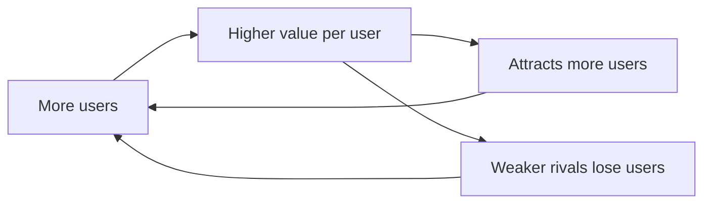

# Information Economics and Network Effects

Standard [microeconomics](microeconomics.md) assumes goods are rival (my using one denies
it to you), costly to reproduce, and traded by equally informed parties. Information goods
and digital platforms violate all three assumptions — and once they do, the tidy results
of competitive markets break down. This concept collects the economics that governs the
technology economy: why software has near-zero marginal cost, why one bad party ruins a
market, and why so many tech markets end up with a single dominant winner.

## Asymmetric information

Markets assume buyer and seller know what is being traded. When one side knows more, the
market can unravel. George Akerlof's **market for lemons** is the classic case: if buyers
cannot tell good used cars from bad ones, they will only pay an average price; good-car
owners exit, quality falls, the price falls further, and the market can collapse entirely.
This **adverse selection** is a distinct
[market-failure-and-externalities](market-failure-and-externalities.md) driven purely by
information, not by any physical spillover. Two responses evolved:

- **Signalling** — the informed party takes a costly action that is only worth taking if
  the information is favourable (a degree signals ability; a warranty signals quality).
- **Screening** — the uninformed party designs choices that make the other side reveal
  type (insurance menus, where the risky self-select into high-coverage plans).

## The economics of information goods

Information goods (software, media, data, models) have two defining properties:

- **High fixed cost, near-zero marginal cost.** The first copy of an operating system or a
  trained model costs a fortune; every copy after that is essentially free. Average cost
  falls forever as volume rises — the opposite of the rising marginal cost that
  disciplines physical production in [supply-and-demand](supply-and-demand.md).
- **Non-rival, and often non-excludable.** My using an idea doesn't consume it. This makes
  information a near-**public good**, which is why intellectual property, licensing, and
  bundling exist — artificial excludability to recover the fixed cost.

Zero marginal cost plus falling average cost means **increasing returns to scale**: bigger
is cheaper per unit, which pushes markets toward concentration rather than the many-small-
firms equilibrium of textbook competition.

## Network effects and increasing returns

A **network effect** exists when a product becomes more valuable to each user as more
users join. A telephone, a social network, or a payments system is worthless alone and
indispensable once everyone is on it.

This is a **positive feedback loop** — the economic face of the reinforcing loops studied
in [../systems-thinking/complex-adaptive-systems.md](../systems-thinking/complex-adaptive-systems.md),
and it is why these markets are best understood through
[../systems-thinking/network-science.md](../systems-thinking/network-science.md): value
scales with the connectivity of the network, not merely its size. The feedback produces:

- **Tipping and winner-take-all / winner-take-most.** Small early leads compound; markets
  tip decisively to one platform (or a duopoly). Outcomes are **path-dependent** — history
  and luck, not just quality, decide the winner (QWERTY, VHS, dominant social networks).
- **Lock-in and switching costs.** Once your data, contacts, and habits live on a
  platform, leaving is costly, which entrenches the incumbent.

## Two-sided markets and platforms

Many digital businesses are **platforms** serving two (or more) distinct groups that value
each other: riders and drivers, buyers and sellers, developers and users. Value comes from
**cross-side network effects** — more drivers make the app better for riders and vice
versa. Platform pricing is therefore lopsided by design: one side is often subsidised
(free to consumers) to attract the side that pays (advertisers, merchants). Getting both
sides on board at once is the **chicken-and-egg** problem every platform must solve to
ignite the loop.

## Why it matters — and the AI ties

This is the operating manual for the technology economy and directly shapes AI as an
industry:

- **Data and model network effects.** More users generate more data, which trains better
  models ([../ai/machine-learning.md](../ai/machine-learning.md)), which attract more
  users — the reinforcing loop applied to AI products. This is why data moats and scale
  are strategic obsessions, a recurring theme in
  [../ai-business/index.md](../ai-business/index.md).
- **Zero marginal cost of inference at scale** puts AI services squarely in the
  increasing-returns regime, pushing toward a few large model providers — the same
  concentration dynamic as earlier platform waves.
- **Information asymmetry between model and user.** Users cannot easily verify a model's
  reliability, recreating the lemons problem; evaluations, benchmarks, and provenance are
  the *signalling and screening* mechanisms the market is inventing in response.
- **Compounding returns feed growth.** Increasing returns are one microfoundation of the
  endogenous-technology story in [economic-growth](economic-growth.md): ideas are
  non-rival, so knowledge accumulation raises output without diminishing returns.

## References

- Draws on Akerlof's market-for-lemons and the Shapiro–Varian *Information Rules*
  tradition; the network-effects and increasing-returns strand traces to Brian Arthur and
  the platform-economics literature (Rochet–Tirole).
