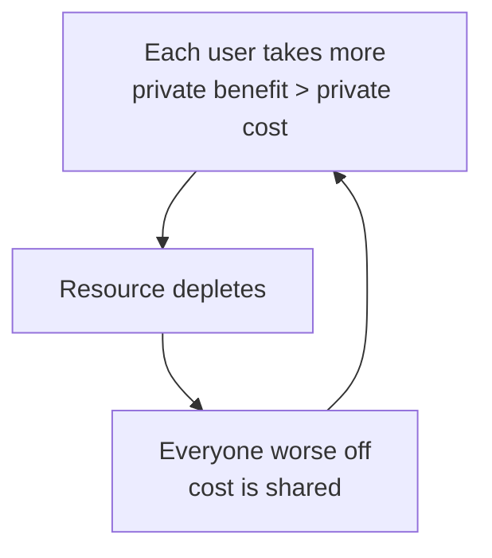

# Market Failure and Externalities

A competitive market usually allocates resources efficiently: guided by prices, buyers and
sellers reach an outcome where no one can be made better off without making someone worse
off. **Market failure** is the set of situations where that promise breaks down — where the
[supply-and-demand](supply-and-demand.md) equilibrium is *not* efficient, so there is room
for well-designed intervention to make everyone better off. This note catalogs the main
failures and weighs the case for (and against) fixing them. It refines the market model of
[microeconomics](microeconomics.md) and qualifies [Adam Smith's](smith-wealth-of-nations.md)
invisible hand: the hand guides well only under conditions that often don't hold. See also
[Mankiw's *Principles*](mankiw-principles-of-economics.md).

## Externalities

An **externality** is a cost or benefit that falls on a third party not involved in the
transaction. The market ignores it because no price captures it.

- **Negative externality** — pollution, congestion, noise. The private cost to the
  producer is less than the cost to society, so the market *overproduces* relative to the
  efficient level.
- **Positive externality** — vaccination, education, research. The private benefit to the
  buyer is less than the benefit to society, so the market *underproduces*.

The classic remedy is a **Pigouvian tax** on the harm (or subsidy for the benefit) that
makes the private actor face the full social cost — internalizing the externality so the
market's own machinery produces the right amount. Coase's insight adds a caveat: with clear
property rights and low bargaining costs, the parties can sometimes negotiate the efficient
outcome themselves, no tax required.

## Public goods

Public goods are **non-rival** (my use doesn't diminish yours) and **non-excludable** (you
can't be kept from using it) — national defense, clean air, a lighthouse, basic research.
Because no one can be excluded, everyone has an incentive to **free-ride** on others'
contributions, so the market undersupplies them badly. This is why public goods are
typically funded collectively through government. Note the connection to
[economic growth](economic-growth.md): ideas are non-rival, which is what makes basic
research a public good and a growth engine at once.

## The tragedy of the commons

A shared, rival, non-excludable resource — a fishery, a pasture, an aquifer, the atmosphere
— is overexploited because each user captures the full benefit of taking more while the cost
of depletion is spread across everyone. Individually rational choices produce a collectively
ruinous outcome: the resource is destroyed. This is a destabilizing
[feedback loop](../systems-thinking/feedback-loops.md), and the standard fixes are to
establish property rights, quotas, or collective governance so that private
[incentives](marginal-thinking-and-incentives.md) align with the resource's survival.

## Asymmetric information

Markets assume both sides know what they're trading. When one side knows more, the market
can unravel — the subject of [information economics](information-economics-and-network-effects.md).

- **Adverse selection** (hidden *type*, before the deal) — in Akerlof's "market for
  lemons," buyers can't tell good used cars from bad, so they offer only an average price,
  good sellers exit, quality falls, and the market can collapse. Insurance markets face the
  same: the sickest are keenest to buy.
- **Moral hazard** (hidden *action*, after the deal) — insured against theft, you lock your
  door less carefully; bailed out, a bank takes bigger risks.

Remedies are **signaling** (the informed side proves quality — a warranty, a degree) and
**screening** (the uninformed side designs choices that separate types — deductibles,
probationary periods).

## Monopoly power

When one seller (or a colluding few) controls a market, it restricts output and raises price
above marginal cost to capture profit — leaving mutually beneficial trades unmade, a
**deadweight loss** to society. The tools of [game theory](game-theory.md) analyze how
oligopolists collude or compete, and antitrust policy exists to break up or regulate market
power. The tension is sharpest in
[network-effect businesses](information-economics-and-network-effects.md), where scale is
genuinely valuable to users yet tips markets toward a single dominant winner.

## The case for — and limits of — intervention

| Failure | Why the market fails | Typical remedy |
| --- | --- | --- |
| Negative externality | Social cost > private cost | Pigouvian tax, cap-and-trade |
| Positive externality | Social benefit > private benefit | Subsidy, public provision |
| Public good | Free-riding | Public funding |
| Commons | Shared cost of depletion | Property rights, quotas |
| Adverse selection | Hidden type | Signaling, screening, mandates |
| Moral hazard | Hidden action | Deductibles, monitoring |
| Monopoly | Restricted output | Antitrust, regulation |

The catch: identifying a market failure does *not* prove intervention will help.
**Government failure** is real — regulators lack information, respond to their own
[incentives](marginal-thinking-and-incentives.md), get captured by the industries they
oversee, and impose costs of their own. The honest position is comparative: intervene only
when the expected improvement over the flawed market outcome exceeds the expected cost of
the flawed intervention. This same reasoning increasingly applies to emerging technology —
the externalities, information asymmetries, and concentration risks of AI systems are a live
case for the same [governance](../ai-governance/index.md) trade-offs.

## Why it matters

Market failure is where economics stops being a defense of laissez-faire and becomes a
diagnostic tool. It explains *why* pollution, financial crises, underfunded research, and
monopolies persist despite everyone's self-interest — and it gives a disciplined, case-by-case
framework for when policy can help and when it will only make things worse.

## References

- [Mankiw — *Principles of Economics*](mankiw-principles-of-economics.md)
- [Adam Smith — *The Wealth of Nations*](smith-wealth-of-nations.md)
