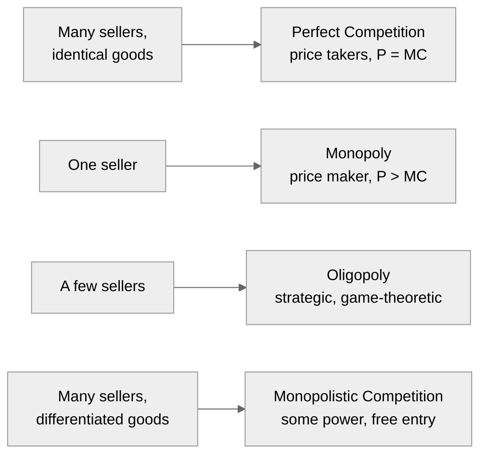

# Microeconomics

Microeconomics studies **individual economic agents** — consumers, workers, firms — and
the **markets** in which they interact. Where [macroeconomics](macroeconomics.md) looks
at aggregates (GDP, inflation, unemployment), microeconomics builds up from the single
optimising decision. Its unifying method is **constrained optimisation**: every agent
maximises something (utility, profit) subject to a limit (a budget, a technology), the
structure formalised in
[../linear-optimization/optimization-problems.md](../linear-optimization/optimization-problems.md).

## Consumer theory

A consumer has **preferences** over bundles of goods, summarised by a **utility function**,
and faces a **budget constraint** set by income and prices. The problem: choose the bundle
that reaches the highest attainable utility without exceeding the budget.

The solution occurs where the consumer's willingness to trade one good for another (the
*marginal rate of substitution*) equals the rate the market forces (the price ratio).
Equivalently: **spend so the last dollar on each good yields equal marginal utility** —
the MB = MC logic of [marginal-thinking-and-incentives](marginal-thinking-and-incentives.md).
From this drops out the downward-sloping demand curve of
[supply-and-demand](supply-and-demand.md), decomposable into a *substitution effect*
(the good got relatively cheaper) and an *income effect* (real purchasing power changed).

## Producer theory

A firm turns inputs into output via a **production function** and faces **costs** for its
inputs. Key cost concepts:

- **Fixed vs. variable costs**; **marginal cost** (the cost of one more unit).
- **Economies of scale** where average cost falls as output grows.

The firm maximises profit by producing where **marginal revenue = marginal cost**. In a
competitive market the firm is a *price taker* (marginal revenue = the market price), so
it produces where price = marginal cost — which traces out the upward-sloping supply
curve.

## Market structures

How a market behaves depends on how much *market power* sellers have:

- **Perfect competition** — the efficiency benchmark: price is driven down to marginal
  cost, total surplus is maximised.
- **Monopoly** — a single seller restricts quantity and charges a price above marginal
  cost, capturing profit but destroying some mutually beneficial trades
  (*deadweight loss*), a form of [market-failure-and-externalities](market-failure-and-externalities.md).
- **Oligopoly** — a few interdependent firms whose best move depends on rivals' moves;
  this is inherently strategic, so it is analysed with
  [game-theory](game-theory.md) (Nash equilibrium, Cournot/Bertrand competition,
  cartels and their instability).
- **Monopolistic competition** — many firms selling differentiated products (restaurants,
  brands): some pricing power, but free entry erodes long-run profit.

## General equilibrium

Partial analysis studies one market in isolation. **General equilibrium** asks whether
*all* markets can clear *simultaneously* — every consumer optimising, every firm
optimising, every price adjusting until supply meets demand everywhere at once. The
**First Welfare Theorem** gives the deep result: under idealised conditions (perfect
competition, no externalities, complete information), a competitive general equilibrium is
**Pareto efficient** — no one can be made better off without making someone worse off.
This is the rigorous modern statement of Smith's invisible hand
([smith-wealth-of-nations](smith-wealth-of-nations.md)). The theorem's *assumptions* also
map exactly the conditions under which markets fail — the agenda of
[market-failure-and-externalities](market-failure-and-externalities.md),
[behavioral-economics](behavioral-economics.md), and
[information-economics-and-network-effects](information-economics-and-network-effects.md).

## Why it matters

Microeconomics is the foundation the rest of the field stands on — even
[macroeconomics](macroeconomics.md) increasingly demands "microfoundations," building
aggregates up from optimising agents. Its claims are also empirically testable, which is
where [econometrics](econometrics.md) and [../statistics/index.md](../statistics/index.md)
enter. And its normative reach — when markets deliver efficient, "just" outcomes and when
they don't — links it to questions in
[../philosophy/index.md](../philosophy/index.md) and
[../sociology/index.md](../sociology/index.md).

## References

- [Intermediate Microeconomics](varian-intermediate-microeconomics.md) — Varian's
  standard undergraduate text; the anchor for consumer theory, producer theory, and
  market structure.
- [Principles of Economics](mankiw-principles-of-economics.md) — accessible first
  treatment of the same material.
